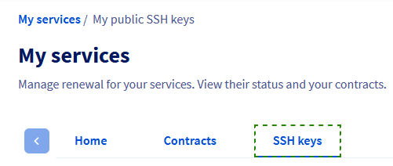

## Ziel

Schlüsselpaare werden zur Authentifizierung von SSH-Verbindungen zwischen Hosts verwendet, z.B. zwischen einem Desktop-Client und einem Remote-Server. Bei der Reinstallation eines Dedicated Servers oder VPS über Ihr Kundencenter haben Sie die Möglichkeit, einen öffentlichen Schlüssel zum Betriebssystem hinzuzufügen. Die Speicherung öffentlicher SSH-Schlüssel in Ihrem Kundencenter vereinfacht diesen Vorgang.

**Diese Anleitung erklärt, wie Sie Ihre öffentlichen SSH-Schlüssel in Ihrem Kundencenter speichern.**

## Voraussetzungen

- Sie haben einen [Dedicated Server](/links/bare-metal/bare-metal) oder einen [VPS](/links/bare-metal/vps) in Ihrem Kunden-Account.
- Sie haben Zugriff auf Ihr [OVHcloud Kundencenter](/links/manager).

> [!primary]
>
> Weitere Informationen zur Verwendung von SSH-Schlüsseln mit [Public Cloud Diensten](/links/public-cloud/public-cloud) finden Sie in unserer Anleitung:
>
> [SSH-Schlüssel mit OpenSSH für Public Cloud Instanzen erstellen](/pages/public_cloud/compute/creating-ssh-keys-pci)

## In der praktischen Anwendung

Wenn Sie noch kein SSH-Schlüsselpaar erstellt haben, lesen Sie zuerst unsere Anleitungen:

- [Erstellen und Verwenden von Schlüsseln für die SSH-Authentifizierung](/pages/bare_metal_cloud/dedicated_servers/creating-ssh-keys-dedicated)
- [Tutorial - PuTTY für SSH-Verbindungen und Authentifizierung verwenden](/pages/web_cloud/web_hosting/ssh_using_putty_on_windows)

Loggen Sie sich in Ihr [OVHcloud Kundencenter](/links/manager) ein, klicken Sie auf den Account-Namen oben rechts und öffnen Sie `Produktkatalog`{.action}.

{.thumbnail}

Klicken Sie im Kundencenter-Bereich `Meine Dienste` auf `SSH-Schlüssel`{.action}.

{.thumbnail}

Klicken Sie auf den Button `SSH-Schlüssel hinzufügen`{.action} und wählen Sie `Dedicated`{.action} aus dem Menü.

{.thumbnail}

Geben Sie im neuen Fenster im ersten Feld eine Bezeichnung für den Schlüssel ein.  
Kopieren Sie die gesamte Zeichenfolge des öffentlichen Schlüssels und fügen Sie sie in das zweite Feld ein.

{.thumbnail}

Klicken Sie auf `Bestätigen`{.action}.

Der Schlüssel ist ab sofort bei der Reinstallation eines Dedicated Servers oder VPS in Ihrem Kundencenter verfügbar.

Weitere Informationen zu diesem Thema finden Sie in unseren Anleitungen zu "Ersten Schritten":

- [Dedicated Server](/pages/bare_metal_cloud/dedicated_servers/getting-started-with-dedicated-server)
- [Dedicated Server der Reihe **Eco**](/pages/bare_metal_cloud/dedicated_servers/getting-started-with-dedicated-server-eco)
- [VPS](/pages/bare_metal_cloud/virtual_private_servers/starting_with_a_vps)

## Weiterführende Informationen

Kontaktieren Sie für spezialisierte Dienstleistungen (SEO, Web-Entwicklung etc.) die [OVHcloud Partner](/links/partner).

Wenn Sie Hilfe bei der Nutzung und Konfiguration Ihrer OVHcloud Lösungen benötigen, beachten Sie unsere [Support-Angebote](/links/support).

Treten Sie unserer [User Community](/links/community) bei.