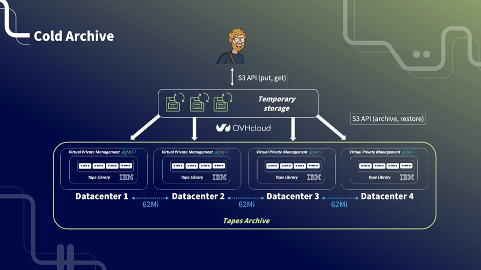

# Informations Générales

### Quels sont les cas d'usage adaptés au service de stockage Cold Archive ? 

La classe de stockage « Cold Archive » est un service de stockage objet adapté au stockage de longue durée. Il est adapaté aux cas d'usage suivants:

*   stockage long terme pour des raisons légales 
*   renforcement de plan de résilience, mise en place de stratégie 3+2+1
*   stockage volumineux de medias vidéos, photo

Cette classe de stockage, facilement accessible par API S3 est recommandée si vos données sont stockées pour une durée supérieurs à 6 mois sans besoin particulier de restoration (moins d'une restoration par an).

Son design est hautement résilient (4 datacentres), bas coût, durable (durée de vide d'une tape est de 16 ans). Il vous faudra en contrepartie patienter 48 heures lors d'une demande de restoration de la donnée.

Vous trouverez une présentation de l'offre ici : [https://docs.ovh.com/fr/storage/object-storage/cold-archive/overview/](https://docs.ovh.com/fr/storage/object-storage/cold-archive/overview/)

### Comment  utiliser le service pour la première fois ? 

Pour utiliser le service, vous avez besoin comme pre requis d'avoir un projet Pubic Cloud dans votre compte OVHcloud. Etre connecté à votre espace client OVHcloud et avoir créé un utilisateur S3.

Les documentations sont disponibles ici :

*   création d'un projet public cloud :  [https://docs.ovh.com/fr/public-cloud/create\_a\_public\_cloud\_project/](https://docs.ovh.com/fr/public-cloud/create_a_public_cloud_project/)
*   débuter avec l'object storage et créer un utilisateur S3 : [https://docs.ovh.com/fr/storage/object-storage/s3/getting-started-with-object-storage/](https://docs.ovh.com/fr/storage/object-storage/s3/getting-started-with-object-storage/)

### Quelle sont les fonctions S3 disponibles avec la classe de stockage Cold Archive ? 

L'ensemble des fonctionnalités de nos classes de stockages Object Storage - S3 API sont supportées par le service Cold Archive. Vous trouverez la liste des fonctions ici : [https://docs.ovh.com/fr/storage/object-storage/s3/s3-compliancy/](https://docs.ovh.com/fr/storage/object-storage/s3/s3-compliancy/)

Deux fonctions ont été désactivés (versioning et object lock) car, par design, un conteneur d'objets archivé a une et une seule version qui ne peut pas être modifiée.

4 fonctions de tiering sont disponibles spécifiquement pour cette classe de stockage : archivage, restoration, status du conteneur, suppression de l'archive

# Archivage et désarchivage

### Comment télécharger la donnée dans un conteneur ?

Vous créez un conteneur, plus connu sous le nom de bucket dans les standards de stockage objet.

Veuillez à utiliser le endpoint correspondant à ce service : [https://s3.rbx-roubaix](https://s3.rbx-roubaix).[io.cloud.ovh.net](http://io.cloud.ovh.net)

Après sa création, un bucket est en lecture et écriture.

Vous téléchargez  ensuite des fichiers dans ce conteneur par api S3, cli ou SDK.

### Comment archiver un conteneur 

Vous archivez le conteneur depuis votre interface utilisateur, par api S3, cli ou SDK 

Dans l'interface utilisateur, l'action est réalisée en activant le bouton "archiver", 

Après cette requête, le bucket n’est pas encore archivé. L’archivage sur les bandes prendra un certain temps. A partir de cette commande et jusqu’à une restauration, le bucket ne peut accepter aucune requête de lecture ou d’écriture sur les objets (lister les objets est toujours autorisé).

Par API les commandes sont décrites dans notre documentation ici : [https://docs.ovh.com/fr/storage/object-storage/cold-archive/getting-started/](https://docs.ovh.com/fr/storage/object-storage/cold-archive/getting-started/)

### Comment restaurer une archive?

Vous avez la possibilité de restaurer une archive afin d'avoir à disposition la donnée en lecture dans le conteneur Object Storage pour récupérer votre donnée. Cette action ne supprime pas l'archive.

Dans l'interface utilisateur, cliquez sur "restaurer une archive".  

Après cette requête, le bucket est en statut "restauring" le temps de la restoration. La restauration prendra du temps.

Une fois terminée, le conteneur est en status "restauré". L’accès aux objets sera en lecture seule (l’écriture est interdite). Lles objets sont disponibles à la lecture pendant 30 jours. Au delà de cette période le conteneur est à nouveau en status "archivé" et les objets ne sont plus accessible en lecture 

### Comment supprimer une archive ?

Dans l'interface utilisateur, vous supprimez votre archive en sélectionnant les boutons "videz l'archive".

Après cette requête, les objets du bucket ne sont pas encore supprimés.  
La suppression des objets prendra un certain temps.  
Une fois les objets supprimés, le bucket peut être supprimé en sélectionnant "supprimer le conteneur"

Par API les commandes sont décrites dans notre documentation ici : [https://docs.ovh.com/fr/storage/object-storage/cold-archive/getting-started/](https://docs.ovh.com/fr/storage/object-storage/cold-archive/getting-started/)

### Comment consulter le contenu de mon archive ?

Les metadatas sont disponibles en lecture et non facturée. Il est possible de les consulter à tout moment du cycle de vie, même lorsque le conteneur est archivé.

### Existe-t-il une limitation en volume ? 

Un conteneur ne pourra pas être archivé s'il dépasse la taille de: 100 To.

Nous n’avons pas de limitation sur le nombre d’objets. Avoir beaucoup de petits objets va impacter le temps d’archivage/restauration.

A volume équivalent, un bucket avec beaucoup de petits objets sera plus long à archiver/restaurer qu’un bucket avec de gros objets

### Combien de temps dure l'archivage et la restauration d'un conteneur ?

Le temps d'archivage et de restauration dépend du volume de données et du nombre d'objets.

Le temps de restauration dépend du volume de données et du nombre d'objets.

Pour un volume de quelques TB,  cela peut prendre quelques minutes ou quelques heures

C’est pourquoi le SLA est à 48h bien qu'en réalité le délai peut parfois être bien plus court.

# Téléchargement de volume de données

*   **Est-ce que je peux archiver mes données provenant d'un autre cloud provider ?**

Oui, vous pouvez utiliser la classe de stockage Cold Archive pour archiver vos données sauvegardées chez un autre cloud provider.

Par exemple, vous installez un serveur, vous paramétrez rclone pour synchroniser vos fichiers d'un Object Storage S3 (cloud providert tier) vers OVHCloud S3 object storage, en suivant le guide : [https://docs.ovh.com/gb/en/storage/s3/rclone/](https://docs.ovh.com/gb/en/storage/s3/rclone/)

*   **Comment télécharger de larges volumes**

Le stockage object  est conçu pour recevoir un grand volume de données à ingérer.

Comme la connexion est limitée à 1Gbps, vous devez définir un téléchargement en plusieurs parties avec 10 connexions en parallèle.

Pour télécharger 8PB par exemple, cela prendra environ 15 jours avec une bande passante disponible de 5 Gbit/s.

Bien qu'offrant une bande passante non garantie, l'internet public depuis les DC AWS vers le stockage objet OVHCloud fournit généralement une bande passante compatible avec grand volume.

*   **Est-il possible de recevoir une copie physique de l'archive ?** 

Nous n'offrons pas ce service.Les archives sont conservées dans des cassettes magnétiques off line mis à disposition dans des librairies situés dans nos 4 datacentres d'archive. 

# Facturation

### Comment est facturé le service d'archive Cold Archive ? 

La facturation  se fait au volume Go par heure.

Vos volumes de stockages pendant la phase de téléchargement sont facturés au prix de la classe de stockage "Standard object storage - S3 API"

Après archivage du conteneur (put-archive) vos volumes de données sont facturés au prix de la classe de stockage "Cold Archive"

La facturation s'arrête dès lors que l'archive est supprimé (delete-ovh-archive)

Une réduction de 7 % est appliquée pour un volume de données supérieur à 3 Po.

Les prix sont détaillés ici : [https://www.ovhcloud.com/fr/public-cloud/prices/](https://www.ovhcloud.com/fr/public-cloud/prices/)

### Il y a-t-il une durée minimum d'engagement ?

La facturation de l'archive s'accompagne d'un engagement minimum de 180 jours. 

Dans le cas où l'archive est supprimée avant les 6 mois, à une date entre 0 jours et 180 jours,  une pénalité est facturée de  : \[180 jours - date\] x 1,3€.

### Sur quel volume s'applique le discount au volume  ? 

Le volume est calculé sur la capacité totale dues buckets d'un projet public cloud (project ID) 

### Exemple de facturation

*Cas 1*

*   J'ai 10 TB de données 
*   J'uploade ma donnée dans l'object storage. 
*   7 jours après l'upload de ma donnée, je lance l'archivage (put-archive)
*   Après 8 mois je supprime mon archive
*   Facturation : 
    *   (7€ x 7/30 + 1,3 € x 21/30) x 10 TB = 25€ le premier mois
    *   puis pendant 7 mois  : 1,3 € x 10 TB = 13 € / mois

*Cas 2*

*   Volume de données: 10 TB de données 
*   J'uploade ma donnée dans l'object storage. 
*   7 jours après l'upload de ma donnée, je lance l'archivage (put-archive)
*   Après 4 mois je supprime mon archive
*   Facturation : 
    *   (7€ x 7/30 + 1,3 € x 21/30) x 10 TB = 25€ le premier mois
    *   les mois suivant  : 1,3 € x 10 TB = 13 € / mois
    *   le  denier mois (mois 4, 2 mois avant la fin de période d'engagement)   : 1,3 € x 10 TB = 13 €  + 2 mois x 1,3 € x 10 TB = 39 €

### Quel est le prix la bande passante?

Le trafic interne entrant est gratuit.

Le trafic interne sortant est gratuit (trafic d'un serveur OVHcloud vers un serveur OVHcloud, incluant les serveurs des offres public cloud, baremetal, private cloud)

La bande passante externe d'OVHcloud vers l'extérieur est facturée. Les prix sont détaillés ici : [https://www.ovhcloud.com/fr/public-cloud/prices/](https://www.ovhcloud.com/fr/public-cloud/prices/)

# Durabilité  

### Pourquoi OVHcloud a choisi la bande magnétique comme support de stockage ?

Les bandes magnétiques sont construites pour durer plusieurs décennies (contrairement à une moyenne de cinq ans pour les disques modernes). Hors phase de lecture et d’écriture, les cartouches ne consomment pas d’électricité. Cela permet une économie d’énergie de plus de 95 % par rapport à une baie de disques similaire.

### Quel est la politique de gestion des tapes?

OVHcloud offre un service managé. OVHcloud se charge du remplacement des bandes magnétiques lorsque celle ci arrivent en fin de vie ou de génération.

# Sécurité

*   **Puis-je protéger mes données en transit ?**

Pour protéger les données contre un vol, la connexion entre un object storage S3 « from » et l'object storage OVHcloud « to » est chiffrée, protégée par htpps.

En complément nous vous recommandons de chiffrer vos données avant de les envoyer.

*   **Les données sont elles encryptées ?**

Oui, les données sont encryptées à la source  au niveau du serveur Object Storage.

# Identité et gestion des rôles

*   **Quels sont les rôles pouvant être paramétrer pour contrôler l'accès aux archives .**

Vous avez à votre dispositions 3 niveaux d'identifiants

*   L'utilisateur administrateur (=NIC admin) 
*   L'utilisateur de facturation (=NIC billing)
*   L'utilisateur Openstack
*   Un utilisateurs S3

| ID | Role |
| --- | --- |
| NIC admin | Administrator Billing |
| NIC billing | Billing |
| Nic technical | Administrator |
| User Openstack | (1) Administrator (2) Object Storage |
| User S3 (credentials S3) | 4 roles (1) Administrator (2) Read only (3) Read (4) Deny  Only administrator role has access to tiering actions (archive, delete, restore) |

# Resilience

*   Quel est le niveau de résilience de la donnée ? 

Le service de stockage Cold Archive sauvegarde la donnée de manière redondante sur 4 datacentres situés à plus de 100 km les uns des autres er en France.

La redondance de la donnée est effectuée par un mécanisme d'Erasure Coding 8+4. La donnée est récupérable après la perte complète d'un datacentre et une panne matériel dans un deuxième datacentre offrant un niveau de résilience inégalable sur le marché.

*   **Quelle est le SLA du service ?**

Le SLA du service est disponible ici 

**[https://www.ovhcloud.com/fr/terms-and-conditions/contracts/](https://www.ovhcloud.com/fr/terms-and-conditions/contracts/)**

Il correspond à la disponibilité du service object storage (endpoint RBX-archive) à 99,9% et des fonctions associées (API S3 et tiering)
