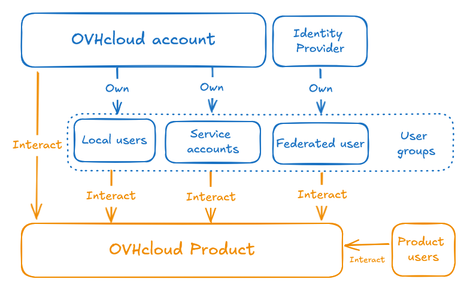

## Objective

The purpose of this guide is to present the different types of identities that can be managed in the OVHcloud account.

## Requirements

- An [OVHcloud customer account](/pages/account_and_service_management/account_information/ovhcloud-account-creation).

## Instructions

### Understanding identities

There are several types of identities that can interact with OVHcloud products:

{.thumbnail}

### OVHcloud account

This is the primary identity used to log in to the OVHcloud Control Panel. You use the OVHcloud account when you log in to the OVHcloud Control Panel with your email address or NIC handle (e.g. xx1111-ovh).

This identity acts as a root account and cannot have its rights restricted, regardless of the access policies implemented.

The OVHcloud account can also be referred to as a NIC or NIC-handle in the documentation.

### Local users

Local users are identities associated with your OVHcloud account. These accounts are designed for **human interaction** with OVHcloud products, as they are based on login/password authentication, and access rights depend on the [IAM policies](/pages/account_and_service_management/account_information/iam-policy-ui) implemented.

The configuration of local users is detailed in the [dedicated documentation](/pages/account_and_service_management/account_information/ovhcloud-users-management).

You can also use them to log in to the OVHcloud API by [generating a token associated with the user](/pages/manage_and_operate/api/first-steps). The rights of this token can be limited to a specific scope in addition to IAM policies.

In order for an application based on a token linked to a local user to use an OVHcloud API, it is therefore necessary for the token to integrate it within its scope **AND** that the user who created the token has rights on this API.

Local users can also be referred to as *sub-users* in the documentation.

We recommend to use local users as soon as more than one person connects to your OVHcloud account in order to assure traceability of the actions.

### Service accounts

Service accounts are identities associated with your OVHcloud account. These accounts are designed for **machine interactions** with OVHcloud products, as they are based on client/token authentication, and access rights depend on the [IAM policies](/pages/account_and_service_management/account_information/iam-policy-ui) implemented.

The creation of service accounts is covered in a [dedicated documentation](/pages/manage_and_operate/api/manage-service-account).

A service account can then be used for [login on OVHcloud APIs](/pages/account_and_service_management/account_information/authenticate-api-with-service-account) as well as on third-party APIs such as those exposed by [OpenStack](/pages/manage_and_operate/iam/authenticate-api-openstack-with-service-account).

### Federated users

These are user accounts from an [identity federation](/products/manage-operate-user-federation). These users come from a third-party directory, and are therefore not managed directly by OVHcloud. Their access rights depend on the [IAM policies](/pages/account_and_service_management/account_information/iam-policy-ui) implemented.

Federated users are represented by user groups in rights management.

We recommend to use identity federation as soon as the number of persons that connect to your OVHcloud account becomes large enough, or if you want to centralize your access to a third-party directory used for other services than OVHcloud.

### User groups

The different identities can be associated in user groups to make them easier to manipulate.
Configuring user groups is covered in the [local users management documentation](/pages/account_and_service_management/account_information/ovhcloud-users-management).

### Users of OVHcloud products

Some products offered by OVHcloud can also propose their own users, such as OpenStack, VMware vSphere or Object Storage.
Those users are independent from the OVHcloud account and are managed directly through the products concerned.

For the products allowing to choose to use an OVHcloud identity (local user, service account, federated user) or a specific user, if you would like to maintain the reversibility of it and limit the dependency on OVHcloud, we recommend to use those specific users.
On the other hand, if you want to have centralized management across all your products, we suggest to use OVHcloud identities.

## Go further

Identity management can be automated via the [OVHcloud APIs](/pages/manage_and_operate/api/first-steps) or via the [provider Terraform OVHcloud](/pages/manage_and_operate/terraform/terraform-at-ovhcloud).

Join our [community of users](/links/community).