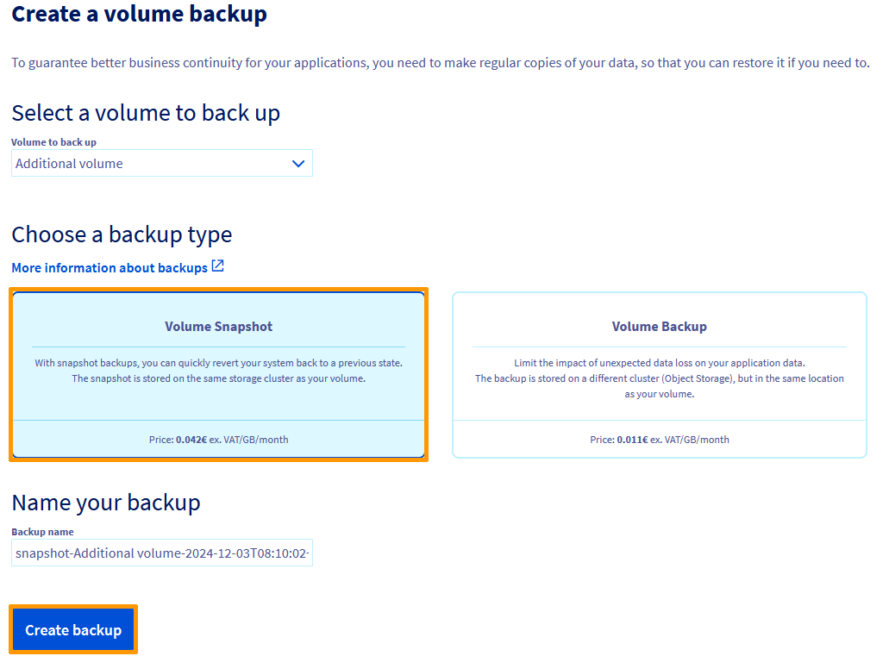

## Objetivo

Um **Volume Snapshot** é um ponto de recuperação armazenado no mesmo cluster de armazenamento que o volume original. As operações de criação e de restauro são rápidas, mas em caso de incidente no cluster, o volume e o Volume Snapshot podem estar indisponíveis. 
A criação de um Volume Snapshot não requer que o volume seja desassociado da instância.

Isto não deve ser confundido com um **Volume Backup** é uma imagem criada a partir do seu volume, que é armazenado no cluster Object Storage da localização do volume de origem.
Este nível de resiliência é ideal e permitir-lhe-á reagir rapidamente a qualquer incidente no seu volume, criando um outro volume a partir do backup. 
A criação de um backup de volume requer que o volume seja desassociado da instância. Para mais informações sobre esta opção, consulte por favor este [guia](/pages/public_cloud/compute/volume-backup).

Criar uma snapshot com um volume adicional corresponde geralmente a dois objetivos:

- efetuar backups em apenas alguns cliques e mantê-los durante o tempo necessário;
- utilizar a snapshot como modelo para volumes idênticos.

**Este manual explica-lhe como criar uma snapshot de um volume a partir da Área de Cliente OVHcloud.**

## Requisitos

- Ter acesso à [Área de Cliente OVHcloud](/links/manager)
- Um volume [Block Storage](/pages/public_cloud/compute/create_and_configure_an_additional_disk_on_an_instance) criado no seu projeto [Public Cloud](/pages/public_cloud/compute/create_a_public_cloud_project)

## Instruções

Aceda à [Área de Cliente OVHcloud](/links/manager), aceda à secção `Public Cloud`{.action} e selecione o projeto Public Cloud em questão. A seguir, clique em `Block Storage`{.action} na barra de navegação da esquerda, na **Storage**.

{.thumbnail}

À direita do volume em causa, clique no botão `...`{.action} e, a seguir, em `Criar uma cópia de segurança`{.action} (não é necessário desassociar primeiro o volume da sua instância). No entanto, se pretender desassociar o seu volume, sugerimos que consulte a secção "Desassociar um volume"de [este manual](/pages/public_cloud/compute/create_and_configure_an_additional_disk_on_an_instance).

De seguida, selecione `Volume Snapshot`{.action}, dê-lhe um nome e clique em `Criar o backup`{.action}.

{.thumbnail}

Na nova janela, pode atribuir um nome diferente à snapshot. Leia as informações tarifárias e clique em `Criar uma snapshot`{.action}.

O tempo de criação da snapshot depende da quantidade de dados presentes no volume, da utilização dos recursos da instância no momento da snapshot e de outros fatores específicos ao host.

Recomendamos que efetue as suas snapshots fora das horas de produção.

Eis algumas outras boas práticas:

- evite criar snapshots nas horas de ponta (entre as 04h00 e as 22h00, hora de Paris);
- instale o agente qemu se não o fez ou tente desativá-lo se necessário;
- tente não "solicitar" demasiado o servidor durante a fase de criação da snapshot (limitação de I/O, consumo de RAM, etc.).

Uma snapshot de volume é um clone do conjunto do disco, pelo que terá o tamanho máximo do volume de origem, independentemente da atribuição real de espaço em disco.

{.thumbnail}

Abra a secção `Volume Snapshot`{.action} na barra à esquerda. Depois de criada a snapshot, esta será adicionada à tabela.

Clique no botão `...`{.action} para eliminar uma snapshot ou `Criar um volume`{.action} a partir da snapshot correspondente. Para mais informações, consulte [este guia](/pages/public_cloud/compute/create-volume-from-snapshot).

## Quer saber mais?

[Criar uma cópia de segurança de um volume](/pages/public_cloud/compute/volume-backup)

[Criar um volume a partir de um backup](/pages/public_cloud/compute/create-volume-from-snapshot)

[Criar e configurar um disco suplementar numa instância](/pages/public_cloud/compute/create_and_configure_an_additional_disk_on_an_instance)

[Aumentar o tamanho de um disco suplementar](/pages/public_cloud/compute/increase_the_size_of_an_additional_disk)

Fale com nossa [comunidade de utilizadores](/links/community).