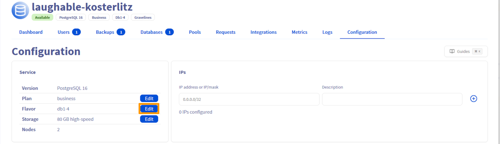
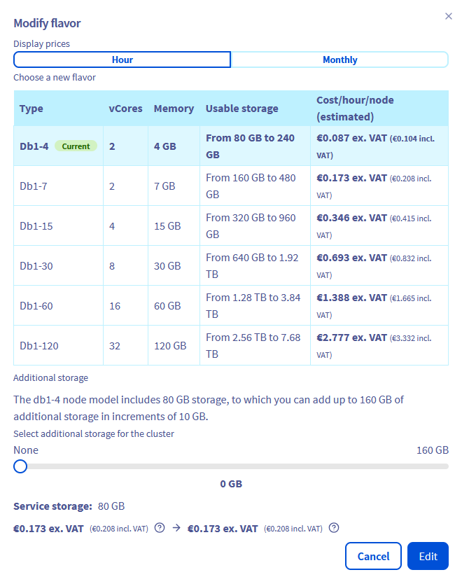

## Objective

Learn how to adjust the flavor of your cluster according to your needs.

## How to upgrade your flavor

This option is available through the OVHcloud [API](/links/api) and [Control Panel](/links/manager).

### Requirements

- Access to your [OVHcloud Control Panel](/links/manager) or to the [API](/links/api)
- A [Public Cloud project](/links/public-cloud) in your OVHcloud account

### Instructions

To adjust the flavor of your cluster, log in to the OVHcloud Control Panel and open your Public Cloud project. Click `Databases`{.action} in the left navigation bar, select your engine instance then click the `Configuration`{.action} tab.

Click `Edit`{.action} on the "Flavor" line and adjust the flavor of your cluster.

## How to downgrade your flavor

This option is currently available via the OVHcloud [API](/links/api).

### Requirements

- Access to the OVHcloud [API](/links/api){.external} (create your credentials by consulting [this guide](/pages/manage_and_operate/api/first-steps))
- A [Public Cloud project](/links/public-cloud) in your OVHcloud account

### Instructions

In order to be able to downgrade your flavor, you must have a threshold of 20% between your current disk space used (base storage + additional storage) and the maximum storage space allowed for the flavor.

For instance, if you have a PostgreSQL cluster with db1-15 as flavor and less than 384 GB (80% of 480GB) of disk space used, you can decrease the flavor to db1-7 on that endpoint:

> [!api]
>
> @api {v1} /cloud PUT /cloud/project/{serviceName}/database/mongodb/{clusterId}

## We want your feedback!

We would love to help answer questions and appreciate any feedback you may have.

If you need training or technical assistance to implement our solutions, contact your sales representative or click on [this link](/links/professional-services) to get a quote and ask our Professional Services experts for a custom analysis of your project.

Are you on Discord? Connect to our channel at <https://discord.gg/PwPqWUpN8G> and interact directly with the team that builds our databases service!