## Objectif

Dans le paysage numérique actuel en constante évolution, la sécurisation de l'infrastructure cloud est devenue une priorité absolue pour les organisations de toutes tailles. Alors que les entreprises dépendent de plus en plus des solutions cloud pour leurs opérations, assurer la protection des données sensibles et maintenir l'intégrité du réseau est une tâche critique. **S**tormshield **N**etwork **S**ecurity (SNS) est une solution de sécurité complète conçue pour protéger les environnements cloud contre un large éventail de menaces. Ce guide fournit des instructions pas à pas pour déployer et configurer SNS sur le Public Cloud d'OVHcloud avec le vRack et le routage IP public, couvrant les fonctionnalités clés telles que les pare-feu réseau, les VPN IPSec et les VPN SSL/TLS. En suivant ce guide, vous renforcerez la sécurité de votre infrastructure Public Cloud OVHcloud et assurerez la sécurité de vos opérations.

**Ce guide explique comment sécuriser votre infrastructure OVHcloud avec Stormshield Network Security déployé sur Public Cloud.**

> [!warning]
> Ce tutoriel vous explique comment utiliser une ou plusieurs solutions OVHcloud avec des outils externes et décrit les actions à effectuer dans un contexte spécifique. Vous devrez peut-être adapter les instructions en fonction de votre situation.
>
> Si vous éprouvez des difficultés à appliquer ces instructions, nous vous recommandons de faire appel à un [prestataire spécialisé](/links/partner) et/ou discuter du problème avec notre communauté. Pour plus d'informations, consultez la section [Aller plus loin](#gofurther) de ce tutoriel.
>

## Prérequis

- Un [projet Public Cloud](/pages/public_cloud/compute/create_a_public_cloud_project) dans votre compte OVHcloud.
- Être connecté à l'[espace client OVHcloud](/links/manager).
- Un [utilisateur OpenStack](/pages/public_cloud/compute/create_and_delete_a_user) (facultatif).
- Des connaissances de base en réseau.
- Un compte Stormshield créé via le [site Stormshield](https://www.stormshield.com/fr/){.external}.
- S'assurer que le vRack est activé et configuré pour permettre une communication sécurisée entre les composants de l'infrastructure.
- Une adresse [Additional IP](/links/network/additional-ip) pour permettre le failover et la configuration de la haute disponibilité.
- Une licence Stormshield Network Security BYOL (**B**ring **Y**our **O**wn **L**icence), obtenue auprès de [partenaires ou revendeurs tiers](https://www.stormshield.com/partner/partner-finder/){.external}, que vous devrez fournir lors de l'installation et de la configuration.

## En pratique

En plus de l'installation et de la configuration de Stormshield Network Security, ce tutoriel présente différents cas d'usage en fonction de vos besoins :

- [Installer et configurer Stormshield Network Security sur votre environnement Public Cloud](#step1)
- [Cas d'usage 1 : configurer Stormshield Network Security pour une utilisation en tant que passerelle](#step2)
- [Cas d'usage 2 : configurer un NAT (**N**etwork **A**ddress **T**ranslation) pour accéder à un service HTTP privé de l'extérieur](#step3)
- [Cas d'usage 3 : tunnel IPsec (site à site)](#step4)
- [Cas d'usage 4 : VPN SSL/TLS (client à site)](#step5)

### Installer et configurer Stormshield Network Security sur votre environnement Public Cloud <a name="step1"></a>

> [!primary]
> Dans ce tutoriel, l'installation et la configuration de Stormshield Network Security (SNS) s'effectuent principalement via la ligne de commande. Ouvrez un terminal pour exécuter les instructions.
>
> Veuillez noter que toutes les rubriques relatives à la « Haute disponibilité » ou à « Stormshield-2 » sont facultatives, de même que l'utilisation du réseau vRack avec Additional IP. Ils sont inclus pour montrer comment mettre en place le système avec deux instances en mode actif/passif pour une haute disponibilité. Dans une version minimale, il peut également fonctionner avec une seule instance si cela suffit à vos besoins.

> [!primary]
> Dans ce scénario, nous utiliserons deux machines virtuelles configurées pour l'appliance de sécurité afin d'atteindre la haute disponibilité (**H**igh **A**vailability ou HA), ainsi qu'une machine virtuelle supplémentaire pour l'administration et la gestion de l'appliance de sécurité. Cette configuration garantit la protection contre les pannes et la disponibilité continue du service. Pour plus d'exemples et de conseils détaillés sur les options d'évolutivité, veuillez consulter la [documentation de Stormshield](https://documentation.stormshield.eu/HOME/Content/Website_Topics/Root-HomePage-FR.htm){.external}.

#### Configurer votre vRack

Dans cette étape, nous configurons le vRack, un réseau virtuel privé fourni par OVHcloud. Le vRack vous permet d'interconnecter plusieurs instances ou serveurs au sein d'un environnement Public Cloud, assurant ainsi l'isolation du réseau tout en maintenant une communication sécurisée. En ajoutant votre projet Public Cloud et votre bloc Additional IP au même vRack, vous pouvez permettre à vos instances SNS de communiquer de manière sécurisée, tout en gardant le contrôle total de la gestion des adresses IP. Le réseau privé vRack vous permet également de sécuriser des serveurs Bare Metal Cloud ou des VM Private Cloud avec des appliances de sécurité déployées sur le Public Cloud.

**Ajouter votre projet Public Cloud et votre bloc Additional IP au même vRack.**

A des fins d'exemple pour ce guide, le bloc IP est `147.135.161.152/29`.<br>
Nous utilisons la première IP utilisable `147.135.161.153` pour la première instance de SNS et nous utilisons temporairement la seconde IP utilisable `147.135.161.154` pour le second SNS.<br>
L'adresse de la passerelle est `147.135.161.158`.

Reportez-vous au guide « [Configurer un bloc IP dans un vRack](/pages/bare_metal_cloud/dedicated_servers/configuring-an-ip-block-in-a-vrack) » pour plus d'informations.

Voici ci-dessous l'architecture que nous allons mettre en place.

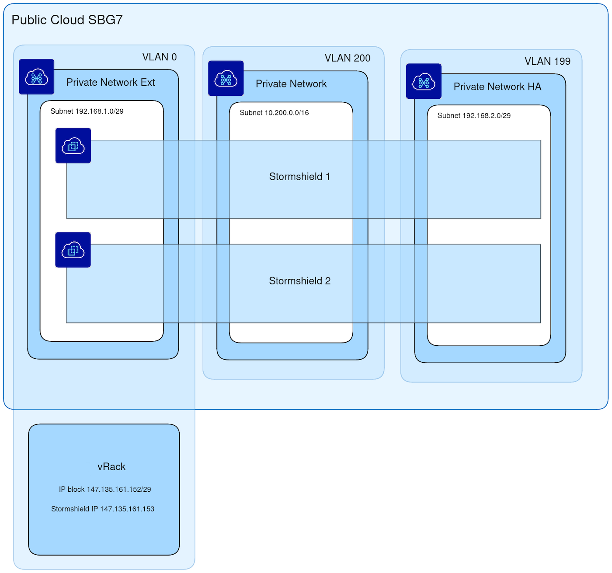{.thumbnail}

#### Configurer le réseau OpenStack

Créez le réseau privé pour les interfaces externes SNS :

```bash
openstack network create --provider-network-type vrack --provider-segment 0 --disable-port-security stormshield-ext
```

```bash
openstack subnet create --network stormshield-ext --subnet-range 192.168.1.0/29 --dhcp stormshield-ext
```

Créez le réseau privé pour les interfaces internes du SNS :

```bash
openstack network create --provider-network-type vrack --provider-segment 200 --disable-port-security stormshield-vlan200
```

```bash
openstack subnet create --network stormshield-vlan200 --subnet-range 10.200.0.0/16 --dhcp --dns-nameserver <dns_address_ip> stormshield-vlan200
```

Créez le réseau privé pour les interfaces SNS HA (**H**igh **A**vailability) :

```bash
openstack network create --provider-network-type vrack --provider-segment 199 --disable-port-security stormshield-ha
```

```bash
openstack subnet create --network stormshield-ha --subnet-range 192.168.2.0/29 --dhcp --gateway none stormshield-ha
```

#### Déployer les instances SNS

Rendez-vous dans la section `download` du [site officiel de Stormshield](https://documentation.stormshield.eu/SNS/v4/fr/Content/PAYG_Deployment_Guide/Downloading_installation_file.htm){.external}. Connectez-vous à votre compte Stormshield et suivez les instructions pour télécharger l'image Stormshield OpenStack.

Rendez-vous dans le dossier où vous avez téléchargé votre image SNS Openstack et importez l'image (pour ce tutoriel, nous utilisons l'image `utm-SNS-EVA-4.8.3-openstack.qcow2`) :

```bash
openstack image create --disk-format raw --container-format bare --file ./utm-SNS-EVA-4.8.3-openstack.qcow2 stormshield-SNS-EVA-4.7.6
```

Créez les instances SNS (dans cet exemple, nous les avons appelées `stormshield-1` et `stormshield-2`) :

```bash
openstack server create --flavor b3-32 --image stormshield-SNS-EVA-4.7.6 --network stormshield-ext --network stormshield-vlan200 --network stormshield-ha stormshield-1
```

```bash
openstack server create --flavor b3-32 --image stormshield-SNS-EVA-4.7.6 --network stormshield-ext --network stormshield-vlan200 --network stormshield-ha stormshield-2
```

> [!primary]
> Pour des raisons de performances, nous vous suggérons d'utiliser les versions de machines virtuelles répertoriées pour des types de licence SNS EVA donnés :
>
> - EVA1 : versions B3-16 ou B3-32
> - EVA2 : B3-32
> - EVA3 : B3-32 ou B3-64
> - EVA4 : B3-128
> - EVAU : B3-256
>

#### Configurer les instances SNS

Connectez-vous à l'[espace client OVHcloud](/links/manager), rendez-vous dans la section `Public Cloud`{.action}, puis sélectionnez le projet Public Cloud concerné. Dans le menu de gauche, cliquez sur `Instances`{.action} sous l'onglet **Compute**, puis retrouvez vos deux instances SNS.

Accédez à la console VNC pour les deux instances SNS et configurez la disposition du clavier ainsi que le mot de passe.

Configurez la passerelle par défaut sur le premier SNS avec notre passerelle de bloc IP :

```console
vi /usr/Firewall/ConfigFiles/object

[Host]
Firewall_out_router=147.135.161.158,resolve=static
...
```

Configurez l'interface réseau externe sur le premier SNS avec la première adresse IP utilisable de notre bloc IP et l'interface réseau interne avec l'adresse IP `10.200.0.1` :

```console
vi /usr/Firewall/ConfigFiles/network

...
[ethernet0]
...
Address=147.135.161.153
Mask=255.255.255.248

[ethernet1]
...
Address=10.200.0.1
Mask=255.255.0.0
...
```

Appliquez la nouvelle configuration réseau :

```bash
ennetwork
```

Effectuez la même configuration pour le second SNS mais avec la seconde adresse IP `147.135.161.154` de notre bloc IP pour l'interface externe au lieu de `147.135.161.153`.

Ajoutez une licence différente sur les deux instances SNS en suivant la [documentation officielle](https://documentation.stormshield.eu/SNS/v4/fr/Content/Installation_and_first_time_configuration/Firewall_license_installation.htm){.external}.

Créez une règle de pare-feu similaire à celle-ci sur les deux SNS dans l'interface graphique Web :

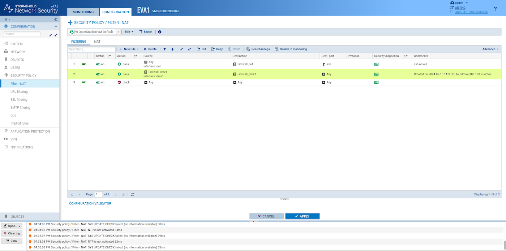{.thumbnail}

Sur le premier SNS, créez un groupe de pare-feu (`Configuration` > `System` > `High Availability`). Concernant l'adresse IP, vérifiez quelle IP a été assignée à l'interface HA par le DHCP OpenStack.

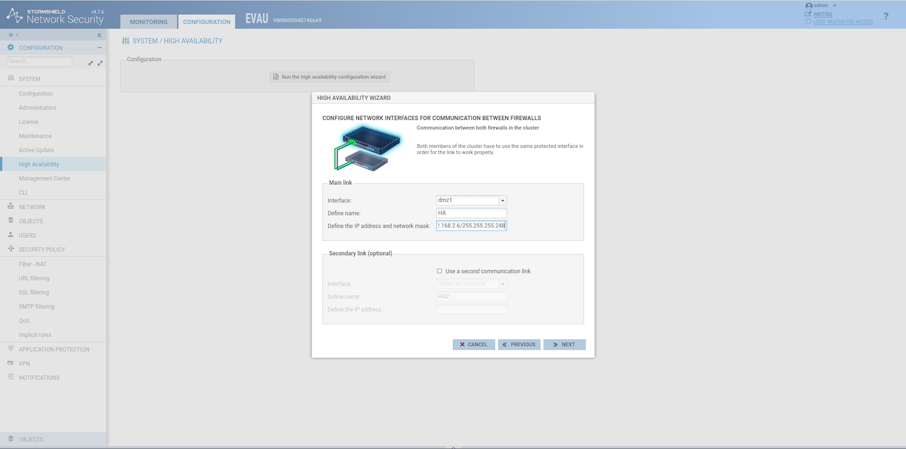{.thumbnail}

{.thumbnail}

Lorsque la configuration de la HA est terminée sur le premier SNS, rejoignez le groupe de pare-feu sur le second :

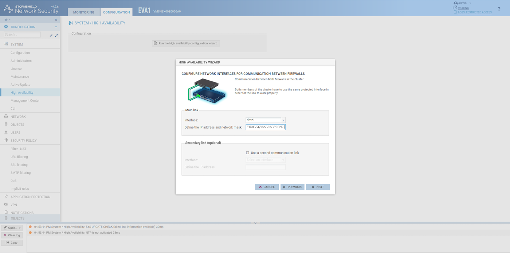{.thumbnail}

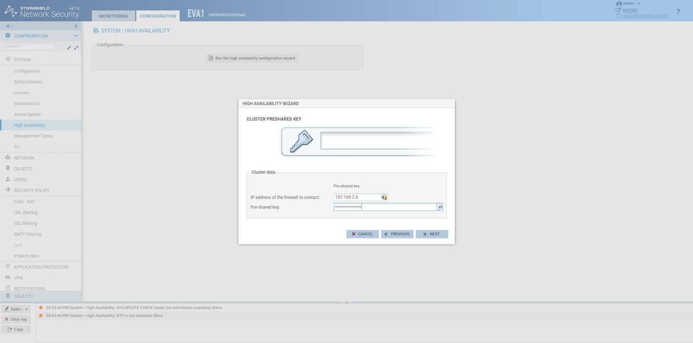{.thumbnail}

La seconde interface externe du SNS utilisera désormais la même adresse IP que la première. Par conséquent, l'adresse IP `147.135.161.154` peut dorénavant être utilisée à d'autres fins.

Si tout est configuré correctement, après le redémarrage du second SNS, vous devriez voir quelque chose de similaire dans les indicateurs d'intégrité du lien HA :

{.thumbnail}

#### Configurer et sécuriser la gestion du SNS

> [!tabs]
> **Étape 1**
>>
>> Récupérez votre adresse IP publique :
>>
>> ```console
>> curl ipinfo.io/ip
>> <adresse_ip>
>> ```
>>
> **Étape 2**
>>
>> Créez un objet hôte pour votre adresse IP publique :
>>
>>{.thumbnail}
>>
> **Étape 3**
>>
>> Limitez l'accès à l'interface graphique à votre adresse IP publique et activez le SSH :
>>
>> 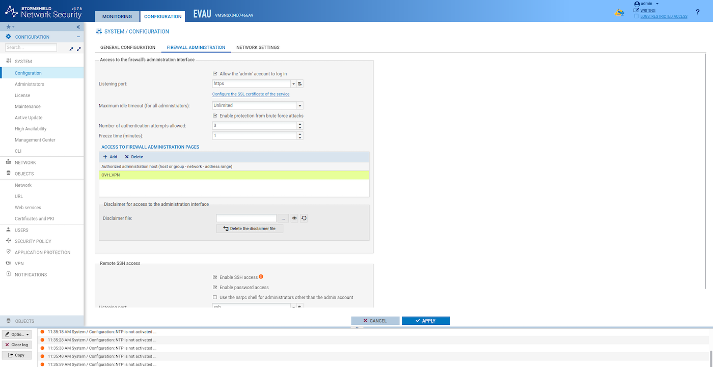{.thumbnail}
>>
> **Étape 4**
>>
>> Limitez l'accès au SSH à votre adresse IP publique :
>>
>> 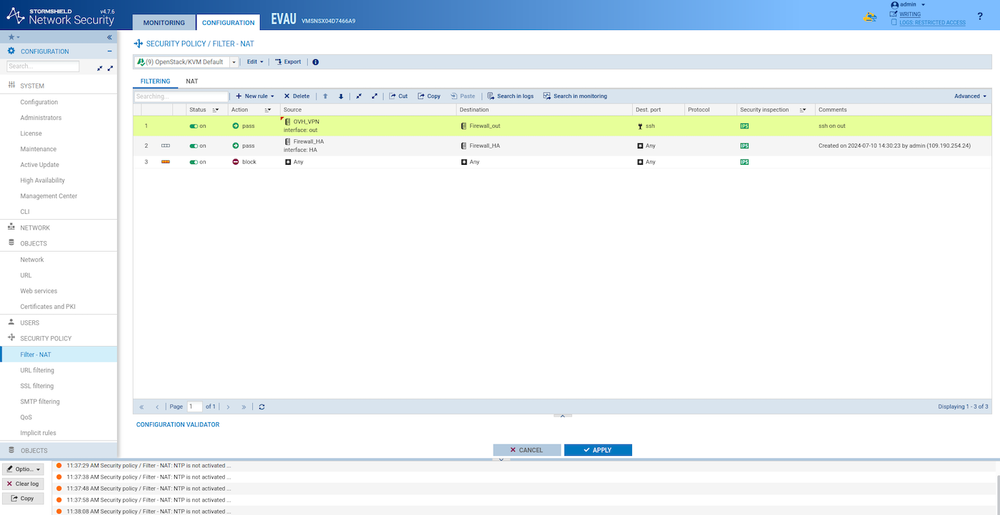{.thumbnail}

#### Resynchroniser la configuration HA

La synchronisation entre les deux instances SNS est cruciale pour s'assurer que les deux pare-feux sont toujours à jour avec la même configuration. À ce stade, les deux instances SNS ne doivent plus être synchronisées, car nous avons configuré un grand nombre de paramètres sur la première instance dont la seconde n'a pas connaissance.

Connectez-vous en SSH à l'instance SNS active :

```bash
ssh admin@<adresse_ip>
```

Synchronisez les deux SNS :

```bash
hasync
```

Cette manipulation est nécessaire à chaque mise à jour de la configuration.

### Configurations de cas d'usages

Après avoir déployé le firewall SNS **E**lastic **V**irtual **A**ppliance (EVA), il peut être utilisé dans plusieurs scénarios de sécurité avancés tels que VPN IPsec, VPN SSL/TLS, passerelles réseau (IN ou OUT) comme décrit ci-dessous.
Grâce au réseau privé vRack, les VLAN listés peuvent également être utilisés en dehors de l'environnement Public Cloud : sur les produits BareMetal ou Private Cloud.

#### Cas d'usage n°1 : configurer Stormshield Network Security pour une utilisation en tant que passerelle <a name="step2"></a>

Dans cet exemple, le pare-feu virtuel agira comme une passerelle sécurisée pour les instances privées (ou tout autre serveur) au sein du VLAN200 du réseau vRack donné. Ce type de trafic peut faire l'objet d'un filtrage d'URL sur le pare-feu.

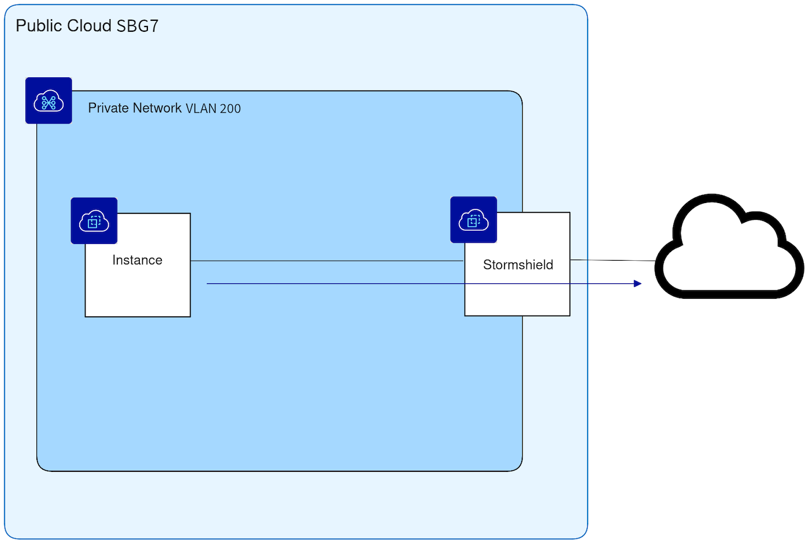{.thumbnail}

- Créez un objet réseau pour le VLAN200 en suivant [cette partie de la documentation officielle de Stormshield](https://documentation.stormshield.eu/SNS/v4/fr/Content/Stormshield_Network_SSO_Agent_Linux/Configure_Firewall_Objects.htm){.external}.

- [Créez une nouvelle règle de filtrage](https://documentation.stormshield.com/SNS/v4/fr/Content/HowTo_-_IPSec_VPN_-_Authentication_by_certificate/Setup-Main-Site-30-Creating-Filtering-policy.htm){.external} similaire à celle-ci pour permettre au trafic provenant du VLAN200 de sortir :

{.thumbnail}

- [Créez une règle NAT](https://documentation.stormshield.eu/SNS/v4/fr/Content/SNS_for_Cloud_-_VMWare_NSX/NAT-Rules.htm){.external} similaire à celle-ci :

{.thumbnail}

Synchronisez les deux instances HA SNS :

```bash
ssh admin@<adresse_ip>
hasyn
```

##### Vérifier si une instance peut atteindre Internet depuis le  VLAN200

[Importez votre clé publique SSH](https://docs.openstack.org/python-openstackclient/pike/cli/command-objects/keypair.html){.external} :

```bash
openstack keypair create --public-key ~/.ssh/id_rsa.pub <name>
```

Créez une instance sur le VLAN200 :

```bash
openstack server create --flavor b2-7 --image "Ubuntu 22.04" --network stormshield-vlan200 --key-name <name> ubuntu-webserver
```

Connectez-vous en SSH à l'instance SNS :

```bash
ssh -A admin@<ip_instance>
```

Depuis l'instance SNS, connectez-vous en SSH au serveur web Ubuntu. Vérifiez quelle adresse IP a été assignée à votre instance de serveur web Ubuntu par le DHCP OpenStack :

```bash
ssh ubuntu@<adresse_ip>
```

Testez si vous pouvez atteindre un site web public :

```bash
curl -I https://www.ovh.com/manager/
HTTP/2 200
```

#### Cas d'usage n°2 : configurer un NAT (**N**etwork **A**ddress **T**ranslation) pour accéder à un service HTTP privé depuis l'extérieur <a name="step3"></a>

Dans cet exemple, Internet doit pouvoir atteindre le serveur web privé installé sur le VLAN200. Le but de cette configuration est de protéger le serveur web avec un pare-feu réseau.

{.thumbnail}

> [!tabs]
> **Étape 1**
>>
>> Installez Nginx sur l'instance ubuntu-webserver :
>>
>> ```bash
>> sudo apt-get update
>> sudo apt-get install -y nginx
>> ```
>>
> **Étape 2**
>>
>> Créez un objet hôte pour l'instance ubuntu-webserver :
>>
>>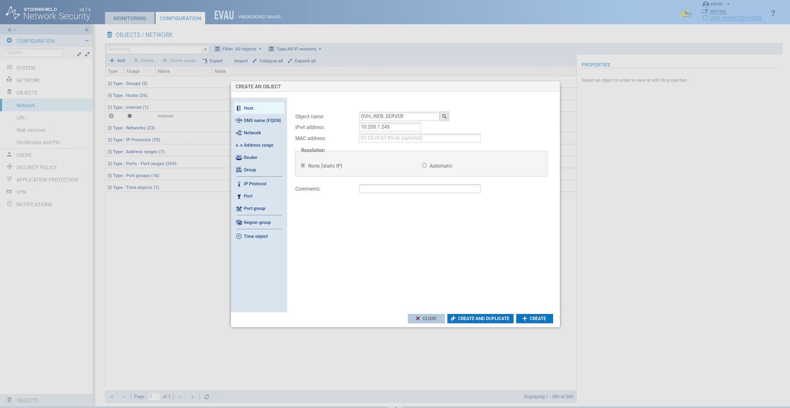{.thumbnail}
>>
> **Étape 3**
>>
>> Créez une règle NAT similaire à celle-ci :
>>
>> 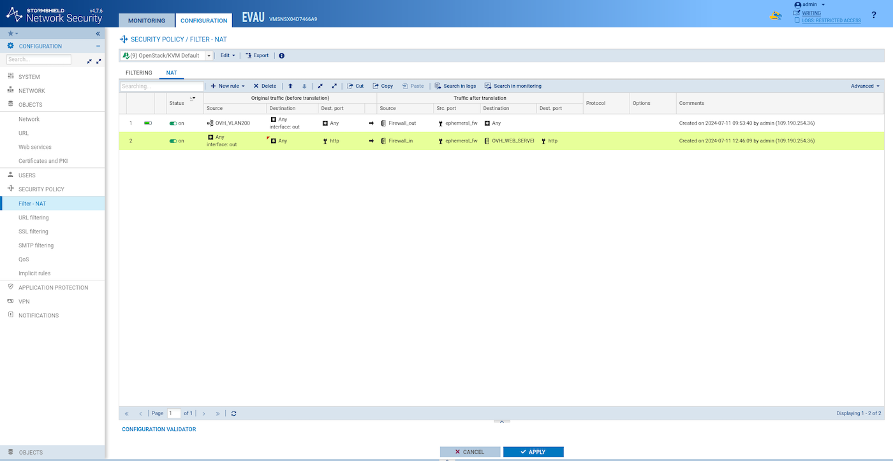{.thumbnail}
>>
> **Étape 4**
>>
>> Créez une règle de filtrage similaire à celle-ci :
>>
>> {.thumbnail}
>>

Testez l'accès au site web depuis l'extérieur :

```bash
curl -I http://<adresse_ip>
HTTP/1.1 200 OK
```

Synchronisez les deux instances HA SNS :

```bash
ssh admin@<adresse_ip>
hasyn
```

#### Cas d'usage n°3 : tunnel IPsec (de site à site) <a name="step4"></a>

Dans cet exemple, le tunnel IPsec est configuré pour interconnecter deux régions PCI différentes : SBG7 (réseau VLAN200) et GRA11 (réseau VLAN201), mais chacun de ces sites peut être un site distant tel qu'un bureau ou un datacenter.

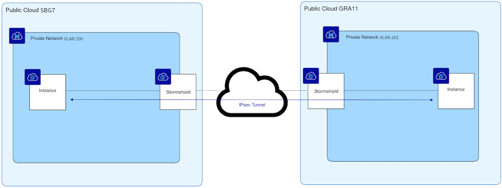{.thumbnail}

Répétez toutes les étapes dans une autre région en utilisant le VLAN 201 au lieu du VLAN 200 et des plages d'IP différentes pour les sous-réseaux Stormshield-ext et Stormshield-ha.

##### **Configurer le premier site**

- [Ajoutez un objet hôte](https://documentation.stormshield.eu/SNS/v4/fr/Content/Stormshield_Network_SSO_Agent_Linux/Configure_Firewall_Objects.htm){.external} pour le SNS distant et ajoutez un objet réseau pour le réseau privé distant VLAN201.

- [Créez un tunnel de site à site standard](https://documentation.stormshield.eu/SNS/v4/fr/Content/User_Configuration_Manual_SNS_v4/IPSec_VPN/Encryption_policy-Tunnels_tab-Site_to_Site-Creating.htm){.external}.

> [!tabs]
> **Étape 1**
>>
>> Ajoutez le réseau privé local et le réseau privé distant :
>>
>>{.thumbnail}
>>>
> **Étape 2**
>>
>> Créez la passerelle distante :
>>>
>>{.thumbnail}
>>
> **Étape 3**
>>
>> Choisissez une clé pré-partagée :
>>
>>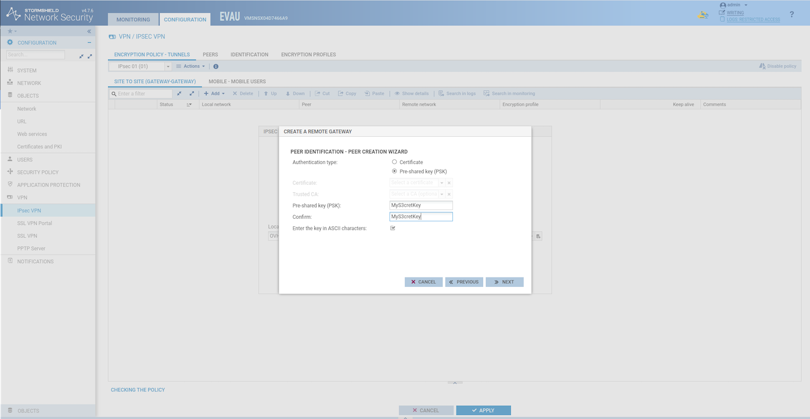{.thumbnail}
>>
> **Étape 4**
>>
>> Créez et activez le tunnel :
>>
>>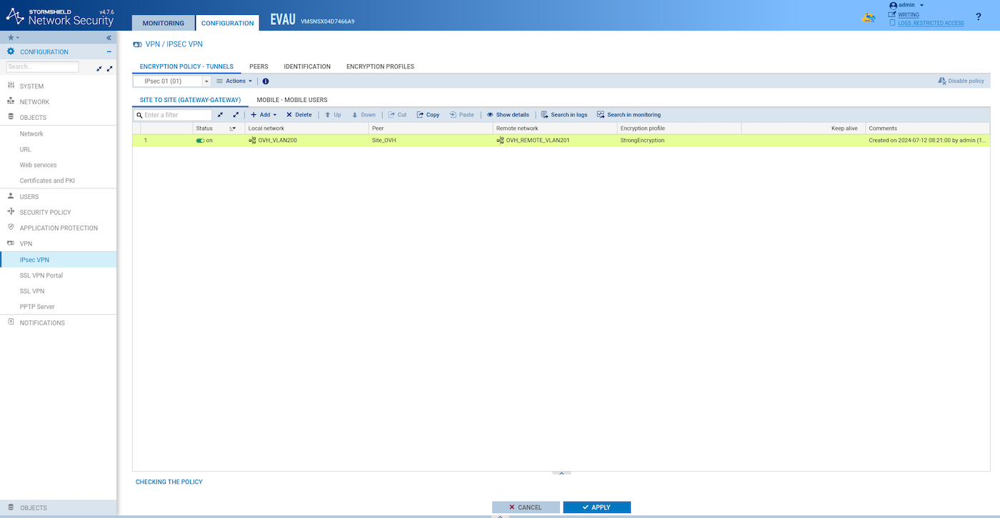{.thumbnail}
>>
> **Étape 5**
>>
>> Ajoutez une règle de filtrage comme celle-ci pour autoriser le trafic à travers le tunnel :
>>
>>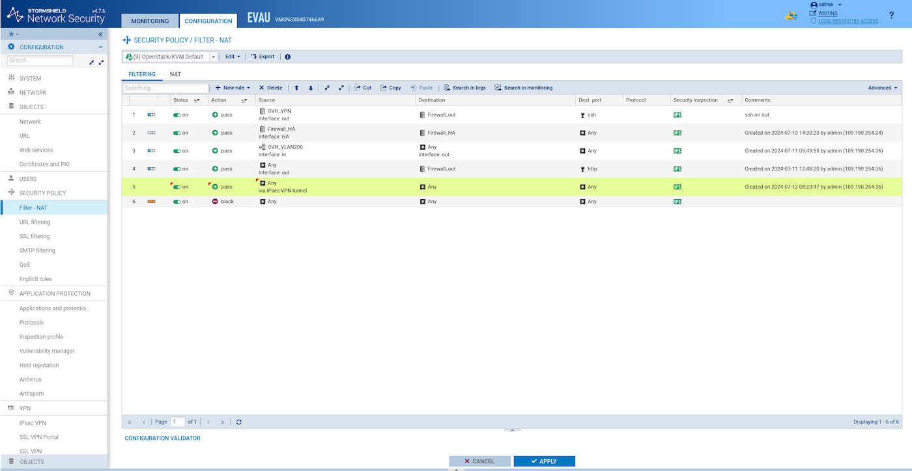{.thumbnail}
>>

Synchronisez les deux instances HA SNS :

```bash
ssh admin@<adresse_ip>
hasync
```

##### **Configurer le second site**

Procédez exactement de la même manière que pour le premier site, mais utilisez VLAN200 pour le réseau privé distant et l'adresse IP appropriée pour OVH_REMOTE_FW.

##### **Testez le tunnel VPN IPsec**

Depuis la première instance de serveur web privé du site :

```console
ssh -A admin@<adresse_ip>
ssh ubuntu@<adresse_ip>
ping <adresse_ip>
PING <adresse_ip>(<adresse_ip>) 56(84) bytes of data.
64 bytes from <adresse_ip>: icmp_seq=1 ttl=64 time=15.2 ms
64 bytes from <adresse_ip>: icmp_seq=2 ttl=64 time=14.0 ms
```

Depuis la deuxième instance de serveur web privé du site :

```console
ssh -A admin@<adresse_ip>
ssh ubuntu@<adresse_ip>
ping <adresse_ip>
PING <adresse_ip> (<adresse_ip>) 56(84) bytes of data.
64 bytes from <adresse_ip> : icmp_seq=2 ttl=64 time=16.9 ms
64 bytes from <adresse_ip> : icmp_seq=3 ttl=64 time=16.4 ms
```

#### Cas d'usage n°4 : VPN SSL/TLS (de client à site) <a name="step5"></a>

Dans cet exemple, un client OpenVPN distant se connectera au réseau privé à l'intérieur du VLAN200.

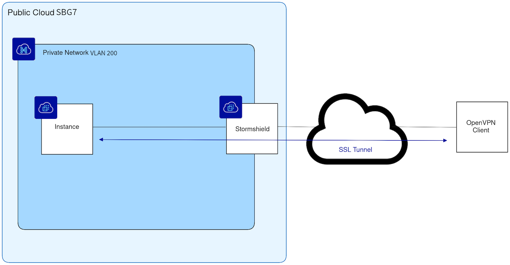{.thumbnail}

##### **Configuration du répertoire LDAP**

- [Créez un annuaire LDAP interne](https://documentation.stormshield.eu/SNS/v4/fr/Content/User_Configuration_Manual_SNS_v4/Directory_configuration/Creating_an_internal_LDAP.htm){.external} pour gérer les utilisateurs VPN.

Dans un scénario de production, ce LDAP/AD doit être distant et non local.

{.thumbnail}

- Créez l'annuaire des utilisateurs :

{.thumbnail}

- Ajoutez un utilisateur à notre annuaire local :

{.thumbnail}

- Choisissez un mot de passe pour le nouvel utilisateur :

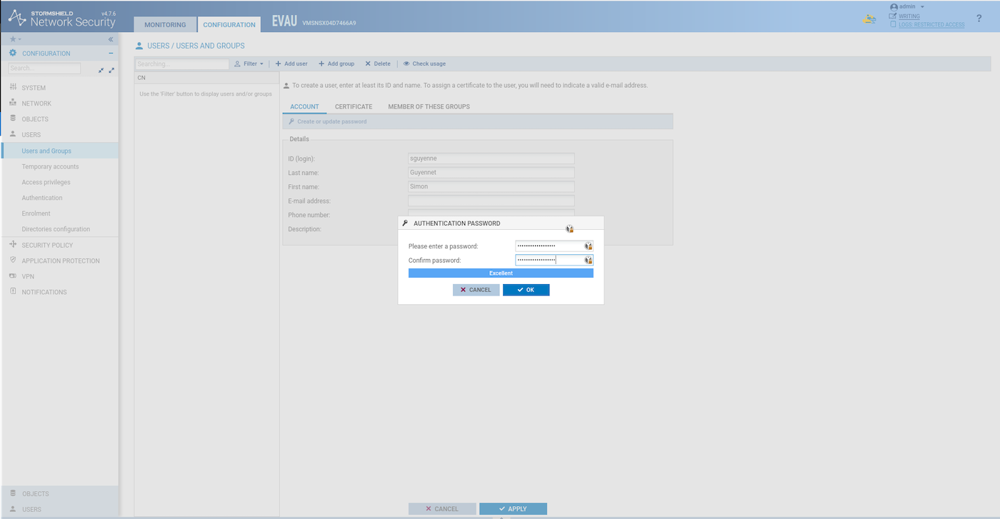{.thumbnail}

##### **Configuration des objets réseau VPN**

Créez deux objets réseau pour le client VPN SSL.

Réseau client UDP :

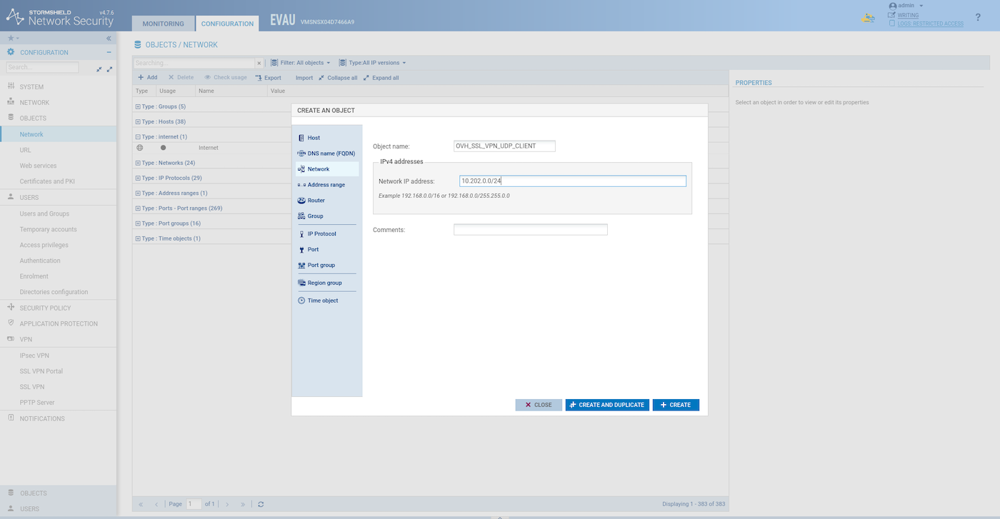{.thumbnail}

Réseau client TCP :

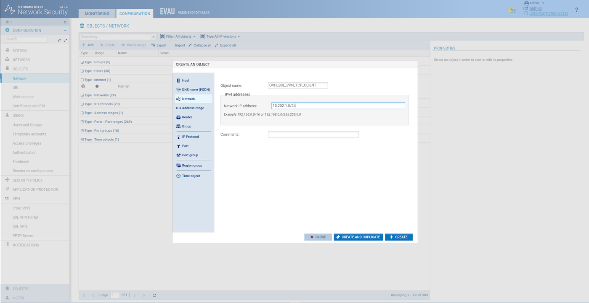{.thumbnail}

##### **Configuration du serveur VPN SSL**

Configurez le serveur VPN SSL :

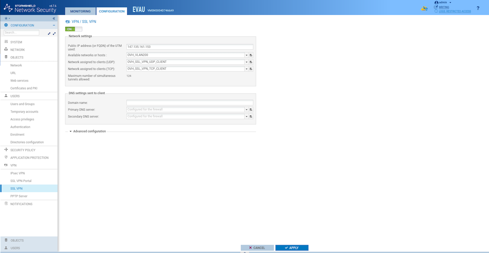{.thumbnail}

##### **Gestion des droits des utilisateurs**

Ajoutez à votre utilisateur l'autorisation d'utiliser le serveur VPN SSL (`Configuration` > `Users` > `Access privileges` > `Detailed Access` > `Add`)

Recherchez votre utilisateur :

{.thumbnail}

Autorisez VPN SSL :

{.thumbnail}

##### **Configuration des règles de filtrage**

Ajoutez une règle de filtrage comme celle-ci pour permettre au client VPN d'accéder au VLAN200 :

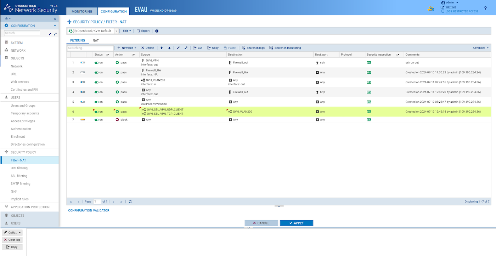{.thumbnail}

##### **Synchronisation des instances SNS**

Synchronisez les deux instances HA SNS :

```bash
ssh admin@<adresse_ip>
hasync
```

##### **Tester le VPN SSL/TLS**

> [!primary]
> Pour tester la connectivité SSL/TLS, utilisez n'importe quel appareil sur lequel OpenVPN est installé. Cet exemple inclut le test d'un client OpenVPN au-dessus d'une instance OpenStack dans une autre région.
>

Téléchargez le fichier de configuration VPN (`Configuration` > `VPN` > `SSL VPN` > `Advanced configuration` > `Export the configuration file`).

Créez une instance client OpenVPN publique dans la région de votre choix :

```bash
openstack server create --flavor b2-7 --image "Ubuntu 22.04" --network Ext-Net --key-name sguyenne ubuntu-vpn-client
```

Vérifiez l'adresse IP attribuée à l'instance et copiez-y le fichier de configuration :

```bash
scp ~/Download/openvpn_mobile_client.ovpn ubuntu@<adresse_ip>:~
```

Connectez-vous à l'instance :

```bash
ssh ubuntu@<adresse_ip>
```

Installez le client OpenVPN :

```bash
sudo apt-get update
sudo apt-get install -y openvpn
```

Connectez-vous au VPN :

```bash
sudo openvpn --config openvpn_mobile_client.ovpn 
Enter Auth Username: address@stormshield.ovh
🔐 Enter Auth Password: ******************
```

Test de ping de l'instance privée du serveur web :

```console
ssh ubuntu@<adresse_ip>
ping <adresse_ip>

PING <adresse_ip> (<adresse_ip>) 56(84) bytes of data.
64 bytes from <adresse_ip>: icmp_seq=1 ttl=64 time=14.1 ms
64 bytes from <adresse_ip>: icmp_seq=2 ttl=64 time=13.1 ms
```

## Aller plus loin <a name="gofurther"></a>

Si vous avez besoin d'une formation ou d'une assistance technique pour la mise en oeuvre de nos solutions, contactez votre commercial ou cliquez sur [ce lien](/links/professional-services) pour obtenir un devis et demander une analyse personnalisée de votre projet à nos experts de l'équipe Professional Services.

Échangez avec notre [communauté d'utilisateurs](/links/community).