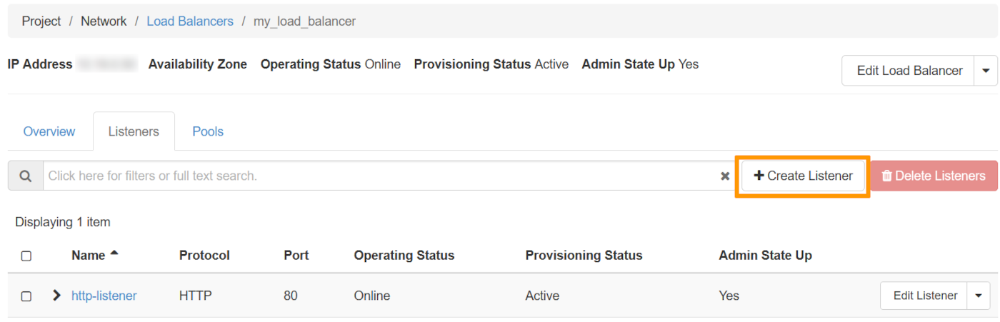
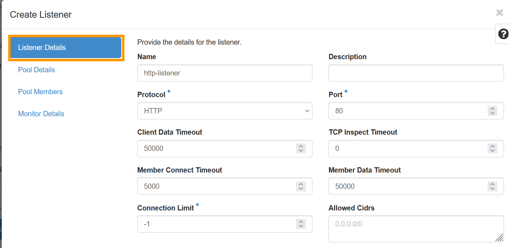
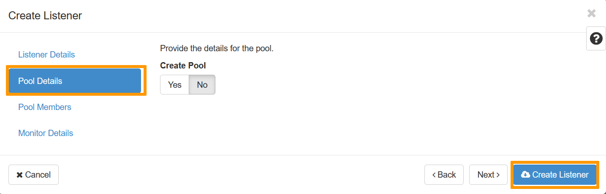
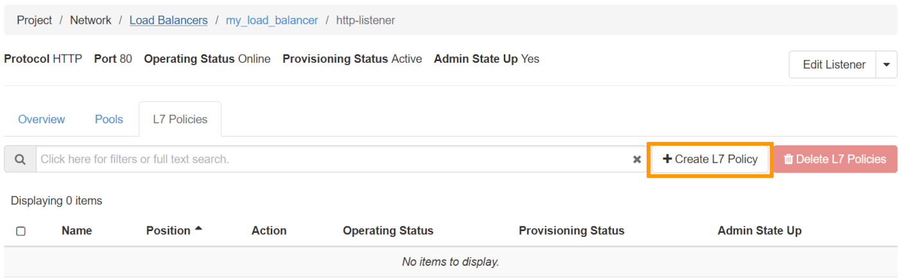
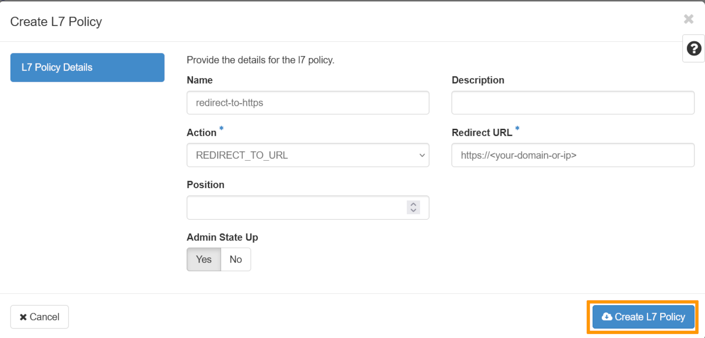
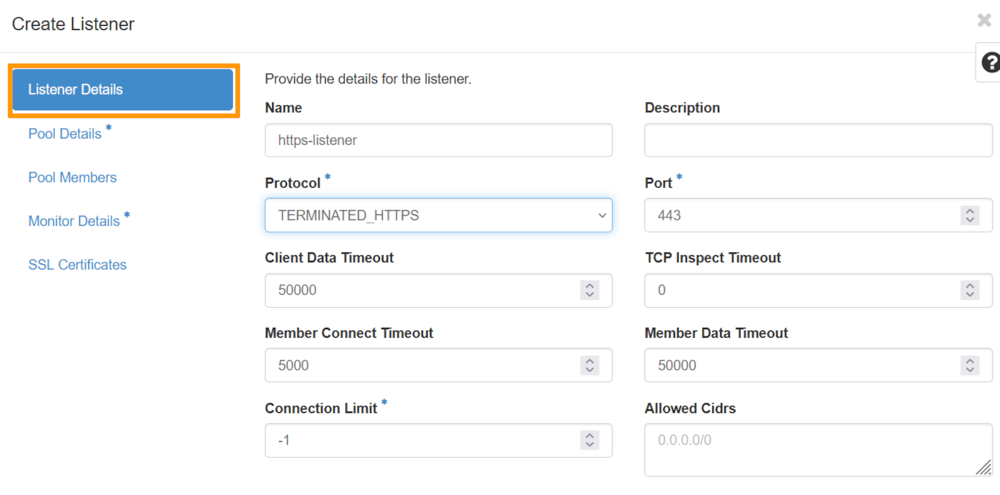
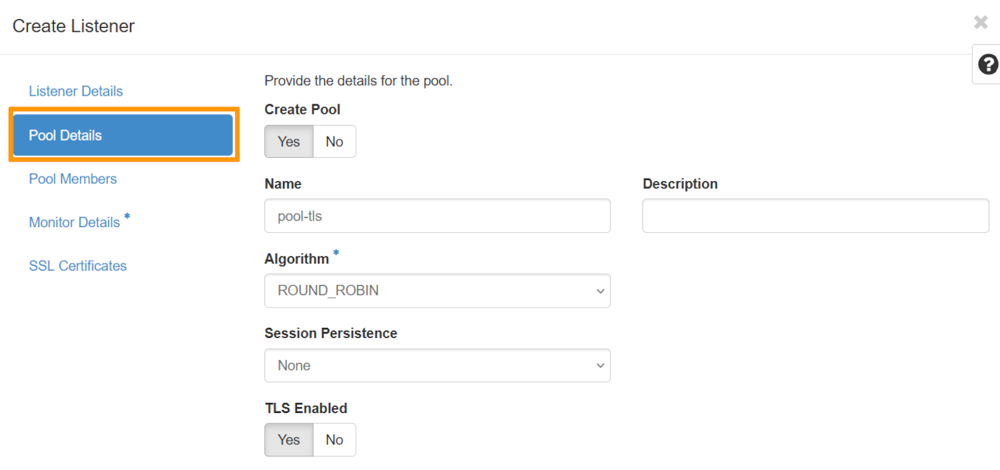
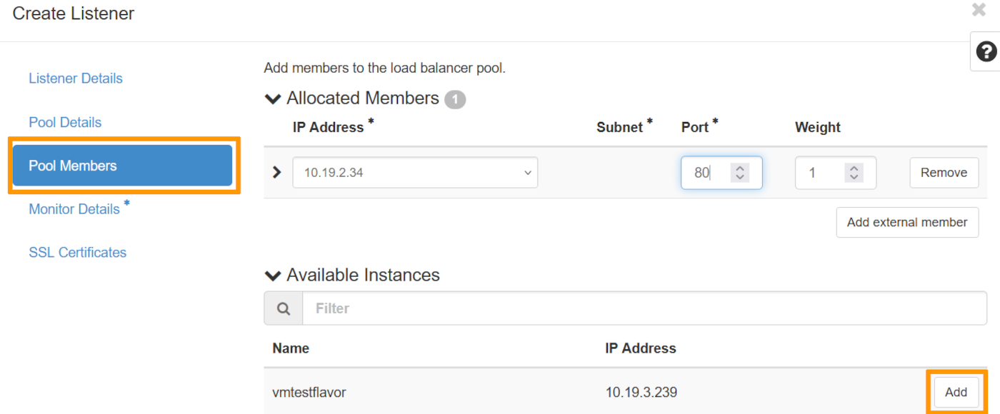
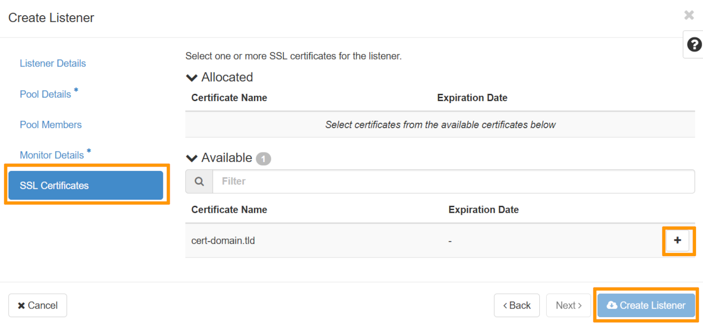

<style>
details>summary {
    color:rgb(33, 153, 232) !important;
    cursor: pointer;
}
details>summary::before {
    content:'\25B6';
    padding-right:1ch;
}
details[open]>summary::before {
    content:'\25BC';
}
</style>

## Objective

Our Public Cloud Load Balancer is based on [OpenStack Octavia](https://wiki.openstack.org/wiki/Octavia){.external} and is fully integrated into the Public Cloud universe. 

After setting up your Load Balancer, you can configure it with a certificate in order to process HTTPS connections.

**This tutorial explains how to configure a secure Public Cloud Load Balancer.**

## Requirements

- A [Public Cloud project](/pages/public_cloud/compute/create_a_public_cloud_project) in your OVHcloud account
- [Preparing your environment for using the OpenStack API](/pages/public_cloud/compute/prepare_the_environment_for_using_the_openstack_api)
- [OpenStack Octavia client](https://docs.openstack.org/python-octaviaclient/latest/install/index.html) and [OpenStack Barbican](https://docs.openstack.org/python-barbicanclient/latest/install/index.html) set up
- A certificate from a third-party supplier

If you are not yet familiar with creating a Load Balancer, please follow our guide on [Getting started with Load Balancer on Public Cloud](/pages/public_cloud/public_cloud_network_services/getting-started-01-create-lb-service) before you continue with this tutorial.

## Instructions

### Attaching a Floating IP address to a Load Balancer

You can find the instructions for this part in this [documentation](/pages/public_cloud/public_cloud_network_services/tutorials-01-secure-lb-letsencrypt) in the section bearing the same name.

### Preparing the certificate <a name="preparingcertificate"></a>

For this stage, we need a certificate, which has already been generated. 

When your certificate is generated by your supplier, you generally receive 2 or 3 files, described as follows:

- Main certificate (.crt or .pem file).
- Private key (.key file) generated during the CSR request.
- Intermediate certificate or complete chain (.crt file), if supplied. Some suppliers already include the intermediate chain in the main certificate, in which case you will only receive 2 files.

> [!warning]
>
> If you have obtained 3 files, you will need to merge the main certificate with the intermediate certificate to create a complete certificate. If your supplier already provides a complete certificate incorporating the intermediate chain, this merging step should be omitted.
>

```bash
sudo cat <certificate.crt> <intermediate_chain.crt> > main_certificate.pem
```

You need to create a PKCS#12 package with your certificate inside:

```bash
sudo openssl pkcs12 -export -inkey <private_key.key> -in <main_certificate.pem> -out domain.tld.p12
```

You must download this file directly onto your computer in order to be able to send it to Openstack Barbican (‘Secret as a Service’).

```bash
openstack secret store --name='cert-domain.tld' -t 'application/octet-stream' -e 'base64' --payload="$(base64 < domain.tld.p12)"
```

### Configuring your Load Balancer


/// details | Via Horizon

In the [Horizon interface](https://horizon.cloud.ovh.net/auth/login/), open the `Network`{.action} section, then click `Load Balancers`{.action}

Select your Load Balancer by clicking on it.

Next, click on the `Listeners`{.action} tab, then on `Create Listener`{.action}: 

{.thumbnail}

**Listener Details**

{.thumbnail}

|Information|Details|
|---|---|
|Name|Specify a name for your listener.|
|Protocol|Select the HTTP protocol|
|Port|Select `80`|

**Pool Details**

{.thumbnail}

Under ‘Create a Pool’, click `No`{.action}, then at the bottom, click on `Create Listener`{.action}.

Once the listener has been created, click on it, then on the `L7 policies`{.action} tab and click on `Create L7 Policy`{.action}.

{.thumbnail}

|Information|Details|
|---|---|
|Name|Specify a name for your L7 Policy|
|Action|choose the value REDIRECT_TO_URL|
|Redirect URL|Enter the domain name|

Once done, click on `Create L7 policy`{.action}.

{.thumbnail}

///

/// details | Via the OpenStack API or via the OVHcloud Control Panel

To create a listener via the OpenStack API or via the OVHcloud Control Panel you can consult the relevant section in [this guide](/pages/public_cloud/public_cloud_network_services/getting-started-01-create-lb-service), in the ‘Configuring your Load Balancer’ section.

Then configure the redirection of HTTP requests to HTTPS:

```bash
openstack loadbalancer l7policy create --action REDIRECT_TO_URL --redirect-url https://<your-domain-or-ip> --name redirect-to-https http-listener
```

///

### Configuring the secure Listener on the Load Balancer

Now that you have managed your certificate, you can add a secure Listener and associate a pool and its members with it:

/// details | Via Horizon

In the Horizon interface, open the `Network`{.action} section, then click on `Load Balancers`{.action}

Select your Load Balancer by clicking on it.

You can now click on the `Listeners`{.action} section, then on `Create Listener` as follows: 

{.thumbnail}

**Listener Details**

{.thumbnail}

|Information|Details|
|---|---|
|Name|Specify a name for your listener.|
|Protocol|Select the TERMINATED_HTTPS protocol|
|Port|Select `443`|

**Pool Details**

Under ‘Create Pool’ select `Yes`{.action}.

Choose a name for your Pool, in the ‘Algortihm’ field, choose the value `ROUND_ROBIN`{.action} and select `Yes`{.action} under ‘TLS Enabled’.

{.thumbnail}

**Pool Members**

Select the corresponding instance and click on `Add`{.action}. Once this has been done, select port `80.`{.action} as the ‘Port’.

{.thumbnail}

**Monitor Details**

We're going to select `No`{.action} as we won't be demonstrating this part in this guide.

**SSL Certificates**

Select the certificate that was previously added to Openstack Barbican, [in this section](#preparingcertificate).

Once done, click on `Create Listener`{.action} to create your configured Load Balancer.

{.thumbnail}

///

/// details | Via the OpenStack API

```bash
openstack loadbalancer listener create --protocol-port 443 --protocol TERMINATED_HTTPS --name https-listener --default-tls-container=$(openstack secret list | awk '/ cert-domain.tld / {print $2}') my_load_balancer

openstack loadbalancer pool create --name pool-tls --lb-algorithm ROUND_ROBIN --listener https-listener --protocol HTTP

openstack loadbalancer member create --subnet-id my_subnet --address <private_ip_instance> --protocol-port 80 pool-tls
```

///

You can now access your Load Balancer securely. However, you will need to renew your certificate. Check the renewal policy with your certificate provider.

## Go further

[Official documentation of OpenStack Octavia](https://docs.openstack.org/octavia/latest/)

[Cookbook OpenStack Octavia](https://docs.openstack.org/octavia/latest/user/guides/basic-cookbook.html)

[Getting started with Load Balancer on Public Cloud](/pages/public_cloud/public_cloud_network_services/getting-started-01-create-lb-service)

If you need training or technical assistance to implement our solutions, contact your sales representative or click on [this link](/links/professional-services) to get a quote and ask our Professional Services experts for assisting you on your specific use case of your project.

Join our [community of users](/links/community).
