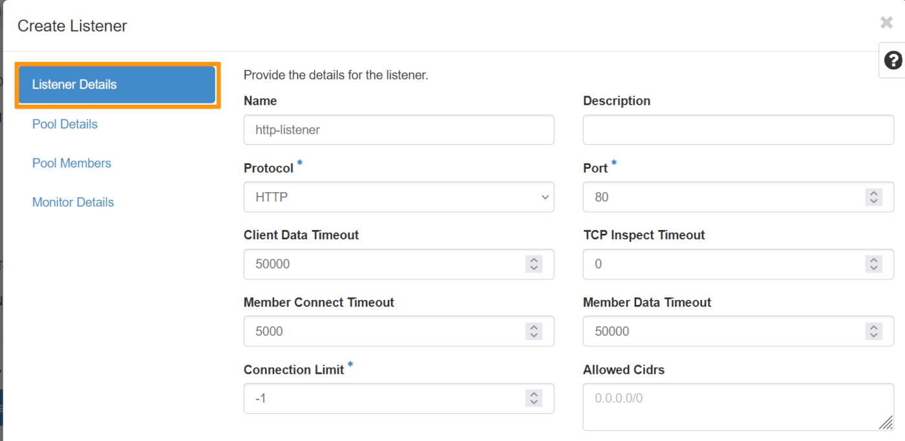

<style>
details>summary {
    color:rgb(33, 153, 232) !important;
    cursor: pointer;
}
details>summary::before {
    content:'\25B6';
    padding-right:1ch;
}
details[open]>summary::before {
    content:'\25BC';
}
</style>

## Objectif

Notre Load Balancer Public Cloud est basé sur le service [Openstack Octavia](https://wiki.openstack.org/wiki/Octavia){.external} et est entièrement intégré dans l'univers Public Cloud.

Une fois votre Load Balancer mis en place, vous pouvez le configurer avec un certificat afin de traiter les connexions HTTPS.

**Découvrez comment configurer un Load Balancer Public Cloud sécurisé**

## Prérequis

- Un [projet Public Cloud](/pages/public_cloud/compute/create_a_public_cloud_project)
- Utiliser l'environnement de commande d'Openstack ([Tutoriel](/pages/public_cloud/compute/prepare_the_environment_for_using_the_openstack_api))
- Avoir installé le [client Openstack Octavia](https://docs.openstack.org/python-octaviaclient/latest/install/index.html) et [Openstack Barbican](https://docs.openstack.org/python-barbicanclient/latest/install/index.html)
- Un Load Balancer actif dans votre projet
- Un certificat provenant d'un fournisseur tiers

Si vous n'êtes pas encore familier avec la création du Load Balancer, veuillez consulter notre guide « [Premiers pas avec le service Load Balancer Public Cloud](/pages/public_cloud/public_cloud_network_services/getting-started-01-create-lb-service) » avant de poursuivre la lecture de ce guide.

## En pratique

### Attacher une adresse Floating IP à un Load Balancer

Vous trouverez les instructions pour cette partie dans cette [documentation](/pages/public_cloud/public_cloud_network_services/tutorials-01-secure-lb-letsencrypt) dans la section portant le même nom.

### Préparation du certificat <a name="preparingcertificate"></a>

Nous aurons pour cette étape besoin d'un certificat, généré au préalable. 

Lors de la génération de votre certificat auprès de votre fournisseur, vous recevez généralement 2 ou 3 fichiers, décrits comme suit :

- Certificat principal (fichier au format .crt ou .pem).
- Clé privée (fichier .key) générée lors de la requête CSR.
- Certificat intermédiaire ou chaîne complète (fichier .crt), si fourni. Certains fournisseurs intègrent déjà la chaîne intermédiaire au certificat principal, auquel cas vous ne recevrez que 2 fichiers.

> [!warning]
>
> Si vous avez obtenu 3 fichiers, il vous faudra fusionner le certificat principal avec le certificat intermédiaire pour créer un certificat complet. Si votre fournisseur fournit déjà un certificat complet intégrant la chaîne intermédiaire, cette étape de fusion doit être omise.
>

```bash
sudo cat <certificate.crt> <intermediate_chain.crt> > main_certificate.pem
```

Vous devez créer un package PKCS#12 avec votre certificat à l'intérieur :

```bash
sudo openssl pkcs12 -export -inkey <private_key.key> -in <main_certificate.pem> -out domain.tld.p12
```

Vous devez télécharger ce fichier directement sur votre ordinateur afin de pouvoir l'envoyer dans Openstack Barbican ("Secret as a Service").

```bash
openstack secret store --name='cert-domain.tld' -t 'application/octet-stream' -e 'base64' --payload="$(base64 < domain.tld.p12)"
```

### Configurer le Load Balancer

/// details | Depuis l'interface Horizon

Dans l'[interface d'Horizon](https://horizon.cloud.ovh.net/auth/login/),  cliquez sur `Network`{.action} puis sur `Load Balancers`{.action}.

Sélectionnez votre Load Balancer en cliquant dessus.

Ensuite, cliquez sur l'onglet `Listeners`{.action}, puis sur `Create Listener`{.action} : 

{.thumbnail}

**Listener Details**

{.thumbnail}

|Information|Détails|
|---|---|
|Name|Spécifiez un nom pour votre listener|
|Protocol|Sélectionnez protocole HTTP|
|Port|Sélectionnez `80`|

**Pool Details**

{.thumbnail}

Sous « Create Pool », cliquez sur `No`{.action}, puis en bas, cliquez sur `Create Listener`{.action}.

Une fois le listener créé, cliquez dessus. Ensuite, cliquez sur l'onglet `L7 policies`{.action}, puis sur `Create L7 Policy`{.action}.

{.thumbnail}

**L7 Policy Details**

{.thumbnail}

|Information|Détails|
|---|---|
|Name|Spécifiez un nom pour la L7 Policy|
|Action|Choisissez la valeur REDIRECT_TO_URL|
|Redirect URL|Entrez son nom de domaine|

///

/// details | Depuis l'API OpenStack ou l'espace client OVHcloud

Pour créer un listener via l'API OpenStack ou via l'espace client OVHcloud, vous pouvez consulter la section correspondante dans [ce guide](/pages/public_cloud/public_cloud_network_services/getting-started-01-create-lb-service), dans la section « Configurer votre Load Balancer ».

Puis configurer la redirection des requêtes HTTP vers HTTPS :

```bash
openstack loadbalancer l7policy create --action REDIRECT_TO_URL --redirect-url https://<your-domain-or-ip> --name redirect-to-https http-listener
```

///

### Configurer le Listener sécurisé sur le Load Balancer

Maintenant que vous avez géré votre certificat, vous pouvez ajouter un Listener sécurisé et y associer un pool et ses membres :

/// details | Depuis l'interface Horizon

Dans l'interface d'Horizon, ouvrir la section `Network`{.action} puis cliquer sur `Load Balancers`{.action}.

Sélectionnez votre Load Balancer en cliquant dessus.

Vous pouvez désormais cliquer sur la section `Listeners`{.action}, puis sur `Create Listener`{.action} comme suit : 

{.thumbnail}

**Listener Details**

{.thumbnail}

|Information|Détails|
|---|---|
|Name|Spécifiez un nom pour votre listener|
|Protocol|Sélectionnez le protocole TERMINATED_HTTPS|
|Port|Sélectionnez `443`|

**Pool Details**

{.thumbnail}

Sous « Create Pool », sélectionnez `Yes`{.action}.

|Information|Détails|
|---|---|
|Name|Spécifiez un nom pour votre Pool|
|Algorithm|Sélectionnez la valeur ROUND_ROBIN|
|TLS Enabled|Sélectionnez `Yes`|

**Pool Members**

{.thumbnail}

Sélectionnez l'instance correspondante et cliquez sur `Add`{.action}. Une fois cette opération effectuée, sélectionnez `80`{.action} comme « Port ».

**Monitor Details**

Nous allons sélectionner `No`{.action} car nous ne ferons pas la démonstration de cette partie dans ce guide.

**SSL Certificates**

{.thumbnail}

Sélectionnez le certificat qui à été ajouté préalablement sur Openstack Barbican, [dans cette partie](#preparingcertificate).

Ensuite, cliquez sur `Create Listener`{.action} pour créer votre Load Balancer configuré.

///

/// details | Depuis l'API OpenStack

```bash
openstack loadbalancer listener create --protocol-port 443 --protocol TERMINATED_HTTPS --name https-listener --default-tls-container=$(openstack secret list | awk '/ cert-domain.tld / {print $2}') my_load_balancer

openstack loadbalancer pool create --name pool-tls --lb-algorithm ROUND_ROBIN --listener https-listener --protocol HTTP

openstack loadbalancer member create --subnet-id my_subnet --address <private_ip_instance> --protocol-port 80 pool-tls
```

///

Vous pouvez maintenant accéder à votre Load Balancer de manière sécurisée. Attention toutefois, il faudra renouveler le certificat. Vérifiez la politique de renouvellement auprès de votre fournisseur de certificat.

## Aller plus loin

[Premiers pas avec le service Load Balancer pour Public Cloud](/pages/public_cloud/public_cloud_network_services/getting-started-01-create-lb-service)

[Documentation officielle d'Openstack Octavia](https://docs.openstack.org/octavia/latest/)

[Cookbook Openstack Octavia](https://docs.openstack.org/octavia/latest/user/guides/basic-cookbook.html)

Si vous avez besoin d'une formation ou d'une assistance technique pour la mise en oeuvre de nos solutions, contactez votre commercial ou cliquez sur [ce lien](/links/professional-services) pour obtenir un devis et demander une analyse personnalisée de votre projet à nos experts de l’équipe Professional Services. 

Échangez avec notre [communauté d'utilisateurs](/links/community).