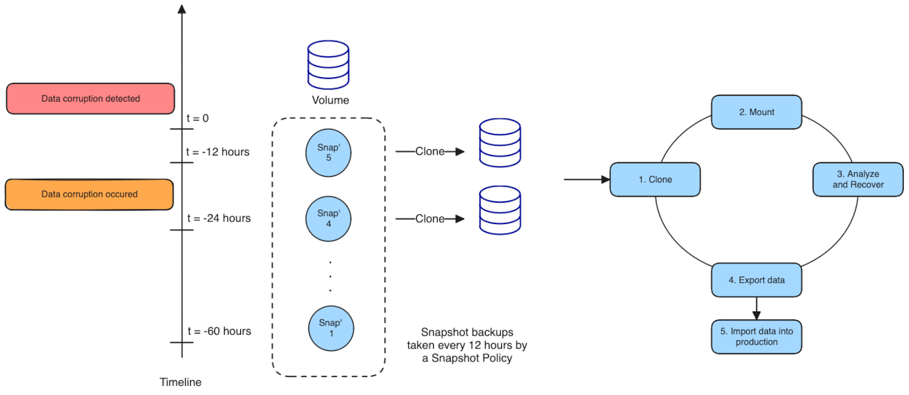

## Objective

A **volume clone** is a duplicate of an existing volume that can be used as any standard volume.
It is created from a snapshot of an active volume. 

Changes made to the parent volume after the clone is created will not be reflected on the cloned volume.

> [!primary]
> In this guide, a volume is also called “share” as in the OVHcloud API.

**Discover the volume clone feature and learn how to clone a volume from your Enterprise File Storage offer using the OVHcloud API.**

## Use cases

Volume clones may be created for a variety of reasons. Below are some examples.

### Allow access to up-to-date data for dev, QA or training environments

Training, QA or development environments may need to be updated with data from a production environment to ensure that development and training are performed with the current dataset. 

Using volume clone feature, automated operations can be put in place to ensure that data for this environments stays up to date without giving access to production data.

{.thumbnail}

## Address and remedy logical data corruption

Logical data corruptions can be caused by software errors, human errors or malicious activity. 

Unfortunately, logical data corruptions often cannot be addresses with standard high-availability and disaster recovery solutions. By creating Snapshots at a regular interval using a [Snapshot Policy](/pages/storage_and_backup/file_storage/enterprise_file_storage/netapp_snapshot_policy) and with the help of the volume clone feature it is possible to restore the system to a point in time before the corruption occurred. 

It is also possible to isolate the corrupted data to try to fix the cause of the corruption by analyzing the problem in a separate system.

{.thumbnail}

## Requirements

- An active OVHcloud [Enterprise File Storage](/links/storage/enterprise-file-storage) service 
- Access to the [OVHcloud API](/links/api)
- An Enterprise File Storage volume with a `manual` snapshot

> [!primary]
>
> You can create a volume and a `manual` snapshot through the [OVHcloud API](/links/api) or the [OVHcloud Control Panel](/links/manager).

> [!success]
> If you are not familiar with using the OVHcloud API, please refer to our guide on [Getting started with the OVHcloud API](/pages/manage_and_operate/api/first-steps).

## Limitations

- Only `manual` snapshots can be used to create a new volume.
  However, if you want to clone a volume using an `automatic` snapshot, you can hold the snapshot to make it a `manual` snapshot using the `/hold` API endpoint before using it. 
  Please refer to the [hold snapshot guide](/pages/storage_and_backup/file_storage/enterprise_file_storage/netapp_hold_automatic_snapshot) for more information.

- Creating volumes from `system` snapshots is not supported.

- Cloned volume size should be **equal or greater** than the snapshot used for cloning.

## Instructions

1\. Identify the `id` of the snapshot that will be used with the following API call:

> [!api]
>
> @api {GET} /storage/netapp/{serviceName}/share/{shareId}/snapshot
>

**Parameters:**
 
- `serviceName`: is the service unique ID 
- `shareId`: is the share to clone from

{.thumbnail}

2\. Clone the volume from the snapshot by using the `/share` API route: 

> [!api]
>
> @api {POST} /storage/netapp/{serviceName}/share
>

**Parameters:**

- `serviceName`: is the service unique ID
- `size`: is the share size. It should be **equal or greater** than the snapshot size.
- `protocol`: is the share protocol. Only NFS is allowed.
- `snapshotID`: is the snapshot ID to use when creating the share
- `name`: (Optional) is the share name
- `description`: (Optional) is the share description

{.thumbnail}

The OVHcloud API will return an HTTP 201 (Created) code along with volume information. 

The volume status will be set to `creating_from_snapshot` and then will change to `available` once the volume creation is complete. 
Depending on snapshot size, volume creation may take some time.

**A new volume is now created from it's parent volume snapshot.**

## Go further

If you need training or technical assistance to implement our solutions, contact your sales representative or click on [this link](/links/professional-services) to get a quote and ask our Professional Services experts for assisting you on your specific use case of your project.

Join our [community of users](/links/community).