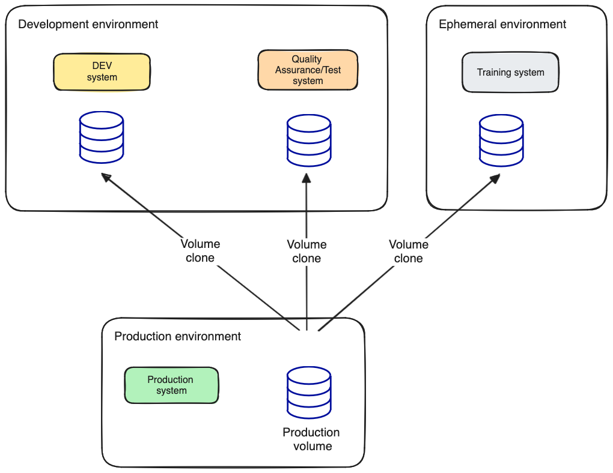

## Cel

Sklonowany wolumin zawiera wszystkie dane woluminu nadrzędnego z danej chwili. Posiada wszystkie funkcje woluminu i może być używany jako wolumin klasyczny. 

Klonowany wolumin jest tworzony na podstawie snapshota (migawki) aktywnego woluminu. Po utworzeniu zmian w woluminie nadrzędnym nie będą odzwierciedlane w klonie.

> [!primary]
> W tym przewodniku wolumen jest również nazywany "*share*", tak jak w API OVHcloud.

**Poznaj funkcję klonowania wolumenów i dowiedz się, jak sklonować wolumin z rozwiązania Enterprise File Storage za pośrednictwem API OVHcloud.**

## Przykłady zastosowania

Scenariusze użycia sklonowanego woluminu są wielorakie. Poniżej znajdują się przykłady.

### Pozwól na dostęp do danych w celach jakościowych, testowych lub szkoleniowych

Systemy szkolenia, kontroli jakości i testowania mogą wymagać regularnej aktualizacji przy użyciu danych ze środowiska produkcyjnego. 

Dzięki klonowaniu wolumenów można wdrożyć automatyzację w celu szybkiego tworzenia opartych na danych zbiorów danych bez udostępniania dostępu do danych produkcyjnych.

{.thumbnail}

### Walka z korupcją danych

Uszkodzenie logiczne danych może być spowodowane błędem oprogramowania, błędem ludzkim lub złośliwym działaniem. 

Tworzenie regularnych punktów kopii zapasowych za pomocą [Polityka snapshotów](/pages/storage_and_backup/file_storage/enterprise_file_storage/netapp_snapshot_policy) i korzystanie z funkcji klonowania woluminów umożliwia łatwą analizę przyczyn uszkodzenia danych poprzez utworzenie nowego wolumenu z istniejących danych.

{.thumbnail}

## Wymagania

- Wykupienie usługi OVHcloud [Enterprise File Storage] (/links/storage/enterprise-file-storage)
- Połączenie z [API OVHcloud](/links/api)
- Posiadanie wolumenu Enterprise File Storage z kopią zapasową `manual`

> [!primary]
>
> Możesz utworzyć wolumen i snapshot typu `manual` za pomocą [API OVHcloud](/links/api) lub w [panelu klienta OVHcloud](/links/manager).

> [!success]
> Jeśli nie wiesz, jak korzystać z API OVHcloud, zapoznaj się z naszym przewodnikiem "[Pierwsze kroki z API OVHcloud](/pages/manage_and_operate/api/first-steps)".

## Ograniczenia funkcjonalności

- Do klonowania woluminu można używać tylko snapshotów typu `manual`.
Jeśli jednak chcesz sklonować wolumen za pomocą snapshota typu `automatic`, możesz zachować ten snapshot i przekształcić go w snapshot typu `manual`.
[Przewodnik na temat zachowywania automatycznych snapshotów] (/pages/storage_and_backup/file_storage/enterprise_file_storage/netapp_hold_automatic_snapshot) zawiera więcej informacji.

- Tworzenie sklonowanego wolumenu z poziomu snapshota typu `system` nie jest obsługiwane.

- Rozmiar klonowanego woluminu musi być **większy lub równy** rozmiarowi snapshota używanego podczas operacji klonowania.

## W praktyce

1\. Zidentyfikuj identyfikator snapshota, którego chcesz użyć, za pomocą następującego wywołania API:

> [!api]
>
> @api {GET} /storage/netapp/{serviceName}/share/{shareId}/snapshot
>

**Ustawienia:**

- `serviceName`: to unikatowy identyfikator usługi
- `shareId`: jest identyfikatorem woluminu, do którego należy snapshot

{.thumbnail}

2\. Utwórz wolumin z kopii zapasowej snapshot za pomocą następującego wywołania API:

> [!api]
>
> @api {POST} /storage/netapp/{serviceName}/share
>

**Ustawienia:**

- `serviceName`: to unikatowy identyfikator usługi
- `size`: jest rozmiarem wolumenu. Musi być większy lub równy rozmiarowi snapshota.
- `protocol`: jest protokołem wolumenu. Obsługiwany jest tylko protokół NFS.
- `snapshotID`: jest identyfikatorem snapshota używanym do utworzenia wolumenu
- `name`: (Opcjonalnie) to nazwa wolumenu
- `description`: (Opcjonalnie) to opis wolumenu

{.thumbnail}

API OVHcloud zwróci kod HTTP 201 wraz z informacjami odpowiadającymi utworzonemu wolumenowi. 

Stan woluminu zostanie zaktualizowany do `creating_from_snapshot`, po czym zmieni się na `available` po zakończeniu tworzenia wolumenu. 
W zależności od użytego rozmiaru snapshota operacja tworzenia wolumenu może zająć trochę czasu.

**Nowy wolumen jest teraz tworzony w kopii zapasowej snapshot woluminu nadrzędnego.**

## Krok w przyszłość

Jeśli potrzebujesz szkolenia lub pomocy technicznej w zakresie wdrażania naszych rozwiązań, skontaktuj się z przedstawicielem handlowym lub kliknij na [link](/links/professional-services), aby uzyskać wycenę i poprosić naszych ekspertów z zespołu Professional Services o indywidualną analizę Twojego projektu.

Przyłącz się do [społeczności użytkowników](/links/community).