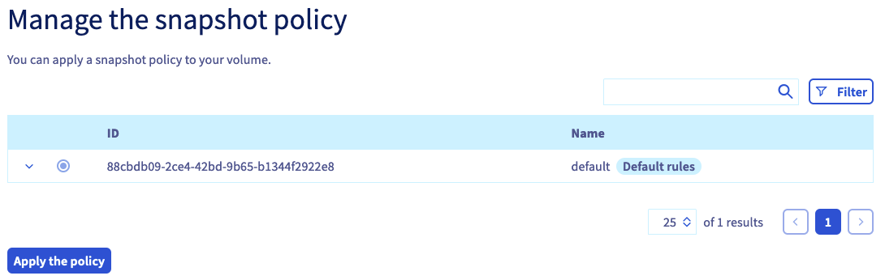
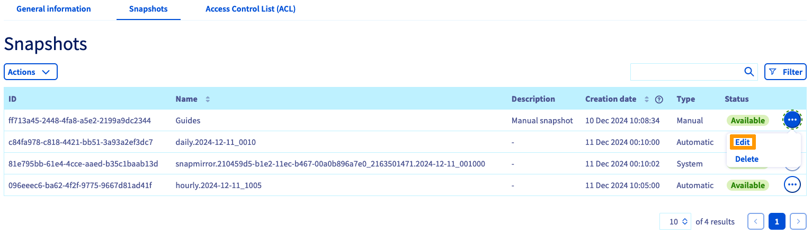
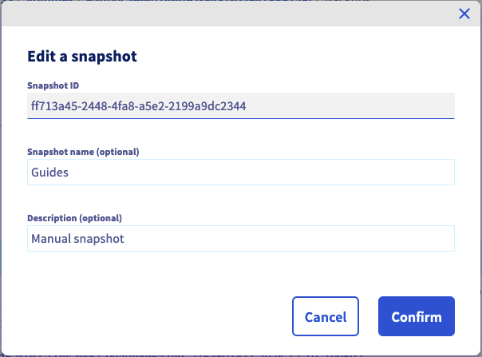
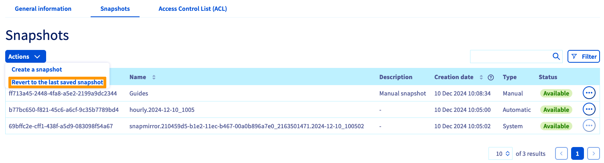

## Ziel

Enterprise File Storage Dienste können über die [OVHcloud API](/pages/storage_and_backup/file_storage/enterprise_file_storage/netapp_quick_start) oder in Ihrem OVHcloud Kundencenter verwaltet werden.

**In dieser Anleitung erfahren Sie, wie Sie Enterprise File Storage Volumes und Snapshots in Ihrem Kundencenter verwalten.**

## Voraussetzungen

- Sie haben einen Enterprise File Storage Dienst in Ihrem Kunden-Account. Der Dienst kann über die [Produktseite](/links/storage/enterprise-file-storage) oder das [OVHcloud Kundencenter](/links/manager) bestellt werden.
- Sie haben Zugriff auf Ihr [OVHcloud Kundencenter](/links/manager).

## In der praktischen Anwendung 

Loggen Sie sich in Ihr [OVHcloud Kundencenter](/links/manager) ein und wählen Sie `Bare Metal Cloud`{.action} in der oberen Navigationsleiste aus. Öffnen Sie `Storage und Backup`{.action}, dann `Enterprise File Storage`{.action} im linken Menü und wählen Sie Ihre Dienstleistung in der Liste aus.

{.thumbnail}

Im Tab `Allgemeine Informationen`{.action} werden technische Informationen zu Ihrem Dienst, allgemeine Details zum Abonnement sowie ein Shortcut zur [Erstellung eines Volumes](#create_volume) angezeigt.

> [!primary]
> Detaillierte Informationen zu den technischen Eigenschaften der Enterprise File Storage Lösung finden Sie auf der Seite [Enterprise File Storage - Konzepte](/pages/storage_and_backup/file_storage/enterprise_file_storage/netapp_concepts).
>

### Verwaltung der Volumes 

Klicken Sie auf den Tab `Volumes`{.action}. Die Tabelle listet alle für den ausgewählten Dienst erstellten Volumes auf. Klicken Sie auf eine Volume-Kennung, um dessen[Verwaltungsseite](#modify_volume) zu öffnen.

{.thumbnail}

Sie können diverse Aktionen durchführen, indem Sie auf den Button `...`{.action} in der entsprechenden Zeile der Tabelle klicken.

- **Volume bearbeiten**: öffnet den Bereich "[Allgemeine Informationen](#modify_volume)" des Volumes.
- **Snapshot erstellen**: öffnet den Bereich "[Snapshots](#snapshots)", um eine manuelle Volume-Sicherung durchzuführen.
- **Letzten Snapshot wiederherstellen**: Öffnet den Abschnitt „[Snapshots](#snapshots)“ und ein Fenster zur Wiederherstellung des Volumes.
- **Die Snapshots verwalten**: öffnet den Bereich "[Snapshots](#snapshots)" des Volumes.
- **IP-Zugang verwalten (ACL)**: öffnet den Bereich "[Zugriffskontrolle](#access_control)", um den Zugriff auf das Volume zu verwalten.
- **Größe ändern**: Öffnet ein Fenster, in dem Sie die Größe des Volumes ändern können.
- **Volume löschen**: löscht dieses Volume, nachdem die Aktion im Popup-Fenster bestätigt wurde.

#### Erstellung eines Volumes 

Klicken Sie auf den Button `Volume erstellen`{.action}. Geben Sie im neuen Fenster den Namen und die Beschreibung des Volumes ein. Legen Sie die Größe in GB fest und klicken Sie auf `Volume erstellen`{.action} um die Aktion zu bestätigen.

{.thumbnail}

#### Volume bearbeiten 

Klicken Sie in der Tabelle auf eine Volume-ID, um die Verwaltungsseite dieses Volumes zu öffnen.

Im Tab `Allgemeine Informationen`{.action} werden die Details Ihres Volumes sowie detaillierte Anweisungen zur Verbindung mit dem Volume angezeigt, einschließlich der individuellen Verbindungsparameter.

{.thumbnail}

In diesem Tab können Sie auch den Namen und die Beschreibung des Volumes ändern.

### Volume löschen 

Sie können ein Volume löschen, indem Sie auf den Button `...`{.action} in der Tabelle im Tab `Volumes`{.action} und dann auf `Volume löschen`{.action} klicken.

{.thumbnail}

Geben Sie `DELETE` ein, und klicken Sie auf `Bestätigen`{.action}, um den Löschvorgang zu bestätigen.

#### Erstellung und Verwaltung von Volume Snapshots 

> [!primary]
>
> Snapshots nutzen die Speicherkapazität Ihrer Enterprise File Storage-Lösung. Standardmäßig sind 5 % der Größe eines Volumes immer für Snapshots reserviert.
>

Im Tab `Snapshots`{.action} finden Sie alle für das ausgewählte Volume erstellten Snapshots.

{.thumbnail}

Im gleichen Tab können Sie auch alle für den Dienst erstellten [Snapshot-Policys](#snapshot_policy) einsehen und auf dieses Volume anwenden.

{.thumbnail}

Klicken Sie auf die entsprechende Policy-Zeile, um die Details der Snapshot-Planung anzuzeigen. Wählen Sie eine Regelung über den speziellen Auswahlknopf und klicken Sie dann auf `Regelung anwenden`{.action} unter der Tabelle.

Um Ihre [Snapshot-Regeln](#snapshot_policy) zu konfigurieren, gehen Sie in den Bereich [Volume-Verwaltung](#instructions) Ihres Dienstes und öffnen Sie den Tab `Snapshot-Regeln`{.action}.

### Erstellung eines Snapshots 

Um einen neuen Snapshot eines Volumes im aktuellen Zustand zu erstellen, klicken Sie auf `Aktionen`{.action} und dann auf `Snapshot erstellen`{.action}.

{.thumbnail}

Im neu geöffneten Fenster können Sie einen Namen und eine Beschreibung eingeben.

Klicken Sie auf `Snapshot erstellen`{.action}, um die Erstellung zu starten.

{.thumbnail}

#### Snapshot bearbeiten 

Sie können den Namen oder die Beschreibung eines Snapshots ändern, indem Sie auf den Button `...`{.action} in der Tabelle klicken und dann auf `Bearbeiten`{.action} klicken. Es wird ein Fenster geöffnet, in dem Sie einen neuen Namen und/oder eine Beschreibung auswählen können.

{.thumbnail}

Klicken Sie auf `Bestätigen`{.action}, um Ihre Änderungen zu bestätigen.

{.thumbnail}

### Löschen eines Snapshots 

> [!warning]
>
> Snapshots vom Typ `system` können nicht gelöscht werden.
> Diese sind für das reibungslose Funktionieren Ihres Enterprise File Storage Angebots unerlässlich.
>

Sie können einen Snapshot löschen, indem Sie auf den Button `...`{.action} in der Tabelle und dann auf `Löschen`{.action} klicken.

{.thumbnail}

Klicken Sie auf `Snapshot löschen`{.action}, um die Löschung zu bestätigen.

{.thumbnail}

### Wiederherstellung des Volumes mit einem Snapshot 

> [!warning]
>
> Bitte beachten Sie, dass alle später erstellten Dateien oder Snapshots verloren gehen, sobald ein Volume mit einem Snapshot wiederhergestellt wurde.
> Wenn ein Volume wiederhergestellt wird, werden alle darin enthaltenen Daten durch die Snapshot-Daten ersetzt. Diese Aktion kann nicht rückgängig gemacht werden.
>

Sie können ein Volume mit dem neuesten Snapshot `Manuell` wiederherstellen. Klicken Sie auf `Aktionen`{.action} und dann auf `Letzten Snapshot wiederherstellen`{.action}.

> [!primary]
>
> Um das Volume mit einem Snapshot vor dem letzten Snapshot wiederherzustellen, müssen die Snapshots gelöscht werden, bis der für die Wiederherstellung zu verwendende Snapshot der aktuellste ist.
>

{.thumbnail}

### Automatisches Backup eines Snapshots 

Die von den [Snapshot-Richtlinien](#snapshot_policy) erstellten `automatischen` Snapshots können gesichert werden, indem Sie auf den Button `...`{.action} in der Tabelle und dann auf `Sichern`{.action} klicken.

{.thumbnail}

Wenn Sie einen Snapshot sichern, der `automatisch` ist, wird er `manuell`, was seine Rotation durch die Snapshot-Richtlinie und somit seine automatische Löschung verhindert.

#### Verwaltung der Volume-Zugriffe (ACL) 

Die Zugriffskontrolle auf Volumes funktioniert über IP-Adressbeschränkungen. Da keine vorkonfiguriert sind, besteht der erste Schritt bei der Erstellung von Volumes in der Definition von IP-Adressen oder IP-Bereichen, denen Zugriff erlaubt werden soll.

Klicken Sie im Tab `Zugriffskontrolle (ACL)`{.action} auf den Button `+ Einen neuen Zugang hinzufügen`{.action}.

{.thumbnail}

Diese Aktion erzeugt eine neue Zeile in der Tabelle, in die Sie eine IP-Adresse oder einen Adressblock (CIDR) eingeben können. Wählen Sie `Lesen und schreiben` oder `Nur Lesen` als Zugriffstyp im Drop-down-Menü aus und klicken Sie dann auf den Haken bei diesem Eintrag, um ihn zur ACL hinzuzufügen.

Um einen Zugang zu löschen, klicken Sie in der Tabelle auf das entsprechende Abfalltonnensymbol.

### Verwaltung der Snapshot-Policys 

> [!primary]
>
> Standardmäßig ist jedes Volume durch eine Snapshot Policy mit dem Namen `default` geschützt, die in regelmäßigen Abständen Snapshots des Volumes erstellt.
>

Mit dem Hinzufügen von Regeln können Sie die Erstellung von Snapshots für alle Ihre Volumes planen.

Klicken Sie auf den Tab `Regeln für Snapshots`{.action}. Die Tabelle listet alle für den ausgewählten Dienst erstellten Regeln auf.

Eine Standardrichtlinie ist bereits vorhanden und kann nicht geändert werden. Um eine eigene Snapshot-Regel hinzuzufügen, klicken Sie auf den Button `Snapshot-Regel erstellen`{.action}.

{.thumbnail}

Geben Sie in der neuen Ansicht einen Namen und eine Beschreibung für die Policy ein. Verwenden Sie anschließend den Button `Eine neue Regel erstellen`{.action}, um eine oder mehrere Regeln zur Policy hinzuzufügen.

{.thumbnail}

Füllen Sie die Felder aus, um die Kriterien für die Erstellung des Snapshots festzulegen. Sie müssen auch einen Präfix für die Snapshots eingeben, der für deren Benennung benötigt wird.

Weitere Informationen zu jedem Wert erhalten Sie, indem Sie jeweils auf das `?`{.action} klicken. Wenn Sie den Bereich `Beispiel`{.action} erweitern, werden exemplarisch zwei Policy-Regelsätze mit Erläuterung ihrer Ergebnisse angezeigt.

Klicken Sie rechts auf den Haken, um die Regel hinzuzufügen. Wenn Sie alle Regeln hinzugefügt haben, klicken Sie unten auf `Eine neue Regel für Snapshots erstellen`{.action}.

[Wählen Sie ein Volume aus](#manage_volume) und gehen Sie zum Tab `Snapshots`{.action}, um [Ihre Policys anzuwenden](#snapshots).

Um eine Policy zu löschen, klicken Sie in der Tabelle auf das entsprechende Abfalltonnensymbol.

### Erste Schritte 

Wenn Sie mit der Enterprise File Storage Lösung nicht noch nicht vertraut sind, können Sie diesen Schritten folgen:

- [Volume erstellen](#create_volume)
- [Zugangskontrolle konfigurieren](#access_control)
- [Snapshot-Policy konfigurieren](#snapshot_policy) (optional)
- [Snapshot-Policy auf das Volume anwenden](#snapshots) (optional)
- [Auf Snaphots zugreifen](#access_snapshots) (optional)
- [Sich anhand der Anweisungen in "Allgemeine Informationen" mit dem Volume verbinden](#modify_volume)
- [Sich mit der Nutzung von Enterprise File Storage über die API vertraut machen](#gofurther) (optional)

## Weiterführende Informationen 

[Enterprise File Storage - Quickstart API](/pages/storage_and_backup/file_storage/enterprise_file_storage/netapp_quick_start)

[Enterprise File Storage - Verwaltung der Volumes](/pages/storage_and_backup/file_storage/enterprise_file_storage/netapp_volumes)

[Enterprise File Storage - Verwaltung der Volume ACL](/pages/storage_and_backup/file_storage/enterprise_file_storage/netapp_volume_acl)

[Enterprise File Storage - Verwaltung der Volume Snapshots](/pages/storage_and_backup/file_storage/enterprise_file_storage/netapp_volume_snapshots)

Wenn Sie Schulungen oder technische Unterstützung bei der Implementierung unserer Lösungen benötigen, wenden Sie sich an Ihren Vertriebsmitarbeiter oder klicken Sie auf [diesen Link](https://www.ovhcloud.com/de/professional-services/), um einen Kostenvoranschlag zu erhalten und eine persönliche Analyse Ihres Projekts durch unsere Experten des Professional Services Teams anzufordern.

Wenn Sie Hilfe bei der Nutzung und Konfiguration Ihrer OVHcloud Lösungen benötigen, beachten Sie unsere [Support-Angebote](/links/support).

Treten Sie unserer [User Community](/links/community) bei.