## Objetivo

Los servicios Enterprise File Storage pueden administrarse [a través de la API de OVHcloud](/pages/storage_and_backup/file_storage/enterprise_file_storage/netapp_quick_start) o desde el área de cliente de OVHcloud.

**Esta guía explica cómo gestionar los volúmenes y los snapshots de Enterprise File Storage desde el área de cliente.**

## Requisitos

- Tener un servicio Enterprise File Storage en su cuenta de OVHcloud. El servicio puede contratarse desde la [página del producto](/links/storage/enterprise-file-storage) o desde el [área de cliente de OVHcloud](/links/manager).
- Tienes acceso a tu [Panel de configuración de OVHcloud](/links/manager).

## Procedimiento 

Conéctese al [Panel de configuración de OVHcloud](/links/manager) y seleccione `Bare Metal Cloud`{.action} en la barra de navegación superior. Abra `Storage y Backup`{.action}, luego `Enterprise File Storage`{.action} en el menú de la izquierda y seleccione su servicio de la lista.

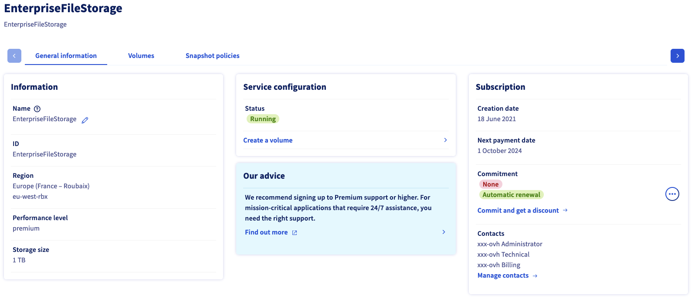{.thumbnail}

La pestaña `Información general`{.action} muestra información técnica sobre su servicio, información general sobre la suscripción y un atajo para [crear un volumen](#create_volume).

> [!primary]
> Para más información sobre las propiedades técnicas de la solución Enterprise File Storage, consulte la página [Concepts](/pages/storage_and_backup/file_storage/enterprise_file_storage/netapp_concepts).
>

### Gestión de volúmenes 

Haga clic en la pestaña `Volúmenes`{.action}. La tabla muestra todos los volúmenes creados para el servicio seleccionado. Puede hacer clic en un ID de volumen para abrir su [página de gestión](#modify_volume). 

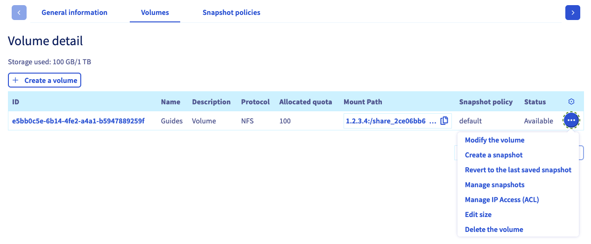{.thumbnail}

Puede realizar varias acciones haciendo clic en el botón `..`{.action} en cada línea de la tabla.

- **Modificar el volumen**: abre el apartado "[Información general](#modify_volume)" del volumen.
- **Crear un snapshot**: abre la sección "[Copias de seguridad](#snapshots)" para realizar un snapshot manual del volumen.
- **Restaurar el último snapshot** : Abre la sección «[Snapshots](#snapshots)» y una ventana para restaurar el volumen.
- **Gestionar los snapshots**: abre la sección "[Copias de seguridad](#snapshots)" del volumen.
- **Gestionar IP Access (ACL)**: abre la sección "[ACL](#access_control)" para gestionar el control de acceso al volumen.
- **Cambiar tamaño**: abre una ventana para cambiar el tamaño del volumen.
- **Eliminar el volumen**: permite eliminar el volumen una vez confirmada la acción en la ventana que aparezca.

#### Creación de un volumen 

Haga clic en el botón `Crear un volumen`{.action}. En la nueva ventana, escriba el nombre y la descripción del volumen. Determine el tamaño en GB y haga clic en `Crear un volumen`{.action} para aceptar la creación.

{.thumbnail}

#### Modificación de un volumen 

Haga clic en un ID de volumen de la tabla para abrir la página de gestión del volumen.

La pestaña `Información general`{.action} muestra los detalles de su volumen, así como instrucciones detalladas sobre la conexión al volumen, incluyendo los parámetros individuales.

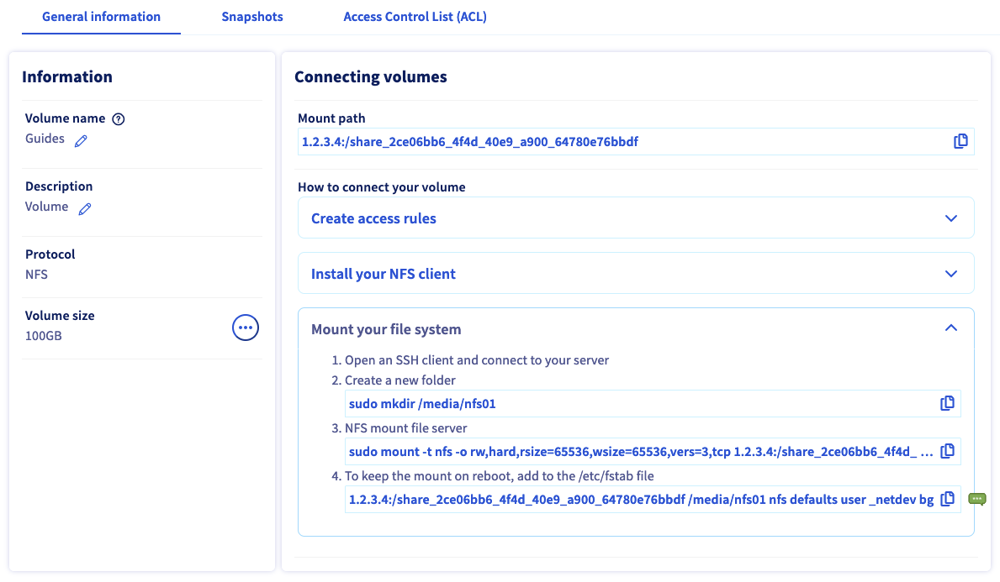{.thumbnail}

En esta pestaña también puede modificar el nombre y la descripción del volumen.

#### Eliminar un volumen 

Para eliminar un volumen, haga clic en el botón `...`{.action} de la tabla en la pestaña `Volúmenes`{.action} y seleccione `Eliminar volumen`{.action}.

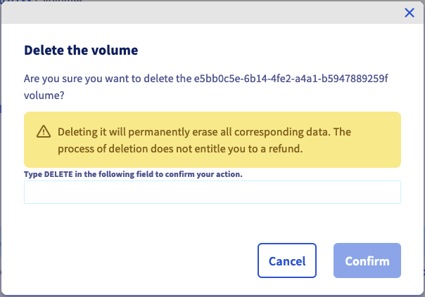{.thumbnail}

Escriba `DELETE` y haga clic en `Confirmar`{.action} para confirmar la eliminación.

#### Creación y gestión de snapshots de un volumen 

> [!primary]
>
> Los snapshots utilizan la capacidad de almacenamiento de su solución Enterprise File Storage. Por defecto, el 5% del tamaño de un volumen está siempre reservado a los snapshots.
>

La pestaña `Snapshots`{.action} muestra todos los snapshots creados para el volumen seleccionado.

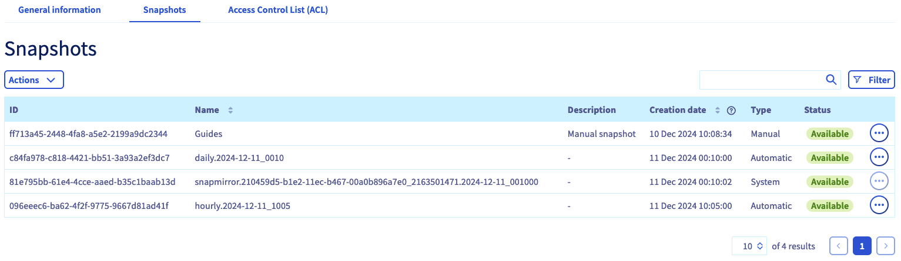{.thumbnail}

En la misma pestaña, también puede ver todas las [políticas de snapshots](#snapshot_policy) creadas para el servicio y aplicarlas a este volumen.

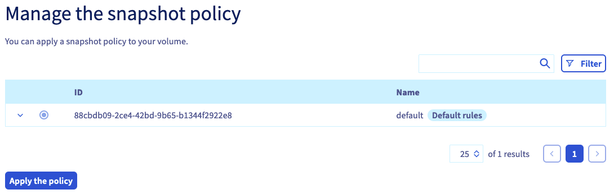{.thumbnail}

Haga clic en la línea de la regla correspondiente para consultar los detalles de la programación de los snapshots. Seleccione una política a través del botón de selección dedicado y haga clic en el botón `Aplicar la política`{.action} situado debajo de la tabla.

Para configurar sus [políticas de snapshots](#snapshot_policy), vuelva a la sección [Gestión de volúmenes](#instructions) de su servicio y abra la pestaña `Snapshot policies`{.action}.

#### Creación de un snapshot 

Para crear un nuevo snapshot de un volumen en su estado actual, haga clic en el botón `Actions`{.action} y luego en `Crear un snapshot`{.action}.

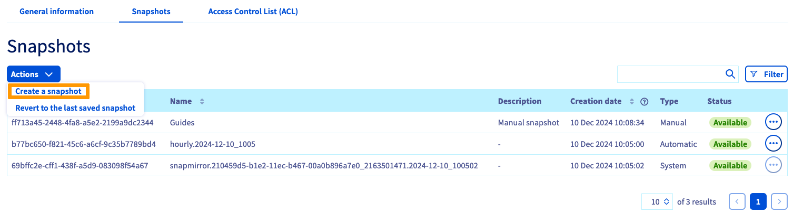{.thumbnail}

Se abrirá una ventana en la que podrá introducir un nombre y una descripción.

Haga clic en el botón `Crear un snapshot`{.action} para comenzar la creación.

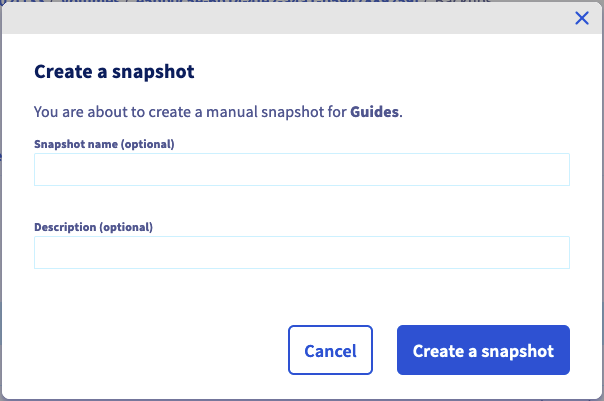{.thumbnail}

#### Modificación de un snapshot 

Puede modificar el nombre o la descripción de un snapshot haciendo clic en el botón `...`{.action} de la tabla y, a continuación, en `Editar`{.action}. Se abrirá una ventana en la que podrá elegir un nuevo nombre y/o descripción.

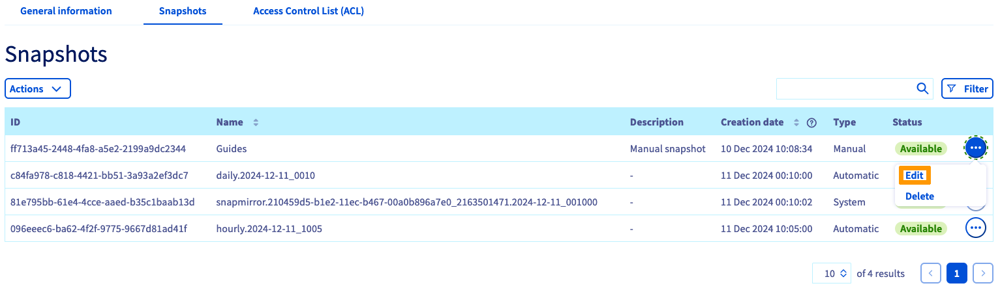{.thumbnail}

Haga clic en `Confirmar`{.action} para confirmar los cambios.

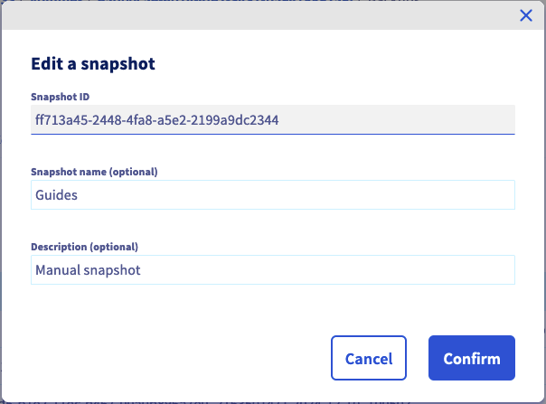{.thumbnail}

#### Eliminación de un snapshot 

> [!warning]
>
> No es posible eliminar un snapshot de tipo `system`.
> Estos son indispensables para el buen funcionamiento de su producto Enterprise File Storage.
>

Para eliminar un snapshot, haga clic en el botón `...`{.action} de la tabla y seleccione `Eliminar`{.action}.

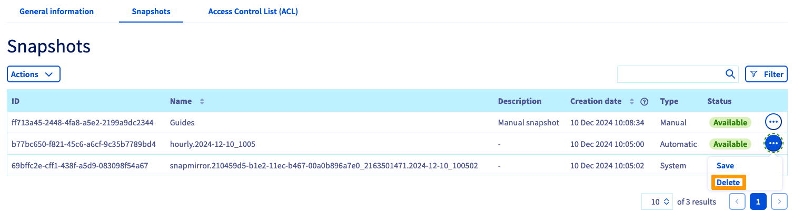{.thumbnail}

Haga clic en `Eliminar un snapshot`{.action} para confirmar la eliminación.

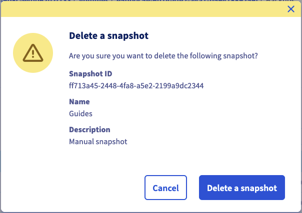{.thumbnail}

#### Restauración del volumen mediante un snapshot 

> [!warning]
>
> Tenga en cuenta que, una vez restaurado un volumen mediante un snapshot, todos los archivos o snapshots creados posteriormente se perderán.
> Cuando se restaura un volumen, todos los datos que contiene se sustituyen por los datos del snapshot. Esta acción es irreversible.
>

Es posible restaurar un volumen utilizando el último snapshot `manuel`. Haga clic en el botón `Actions`{.action} y seleccione `Restaurar el último snapshot`{.action}.

> [!primary]
>
> Para restaurar el volumen utilizando un snapshot anterior al último snapshot, es necesario eliminar los snapshots hasta que el snapshot a utilizar para la restauración sea el más reciente.
>

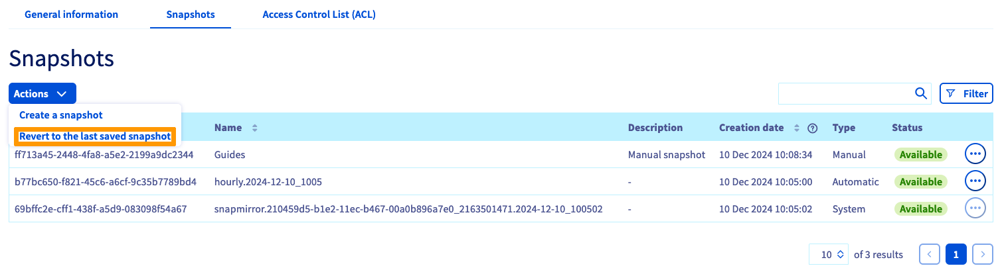{.thumbnail}

#### Backup de un snapshot automático 

Los snapshots `automáticos` creados por las [políticas de snapshot](#snapshot_policy) pueden guardarse haciendo clic en el botón `...`{.action} en la tabla y seleccionando `Guardar`{.action}.

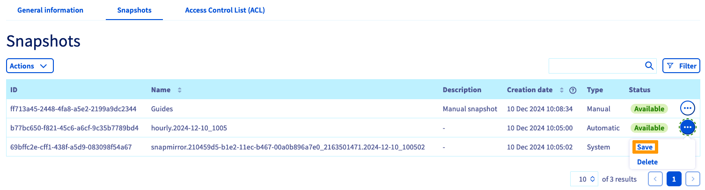{.thumbnail}

Guardando un snapshot `automático`, este se convertirá en `manual`, lo que impedirá su rotación mediante la política de snapshots y, por lo tanto, su eliminación automática.

#### Gestión de volúmenes ACL 

El control de acceso a los volúmenes funciona mediante restricciones de direcciones IP. Como no hay ninguna restricción configurada por defecto, el primer paso al crear los volúmenes es definir las direcciones IP o los rangos desde los que se autorizará el acceso.

En la pestaña `Control de accesos (ACL)`{.action}, haga clic en el botón `+ Añadir un nuevo acceso`{.action}.

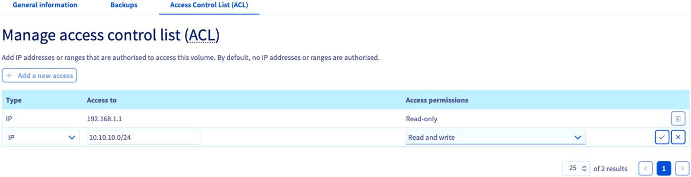{.thumbnail}

Esta acción crea una nueva línea en la tabla, en la que puede introducir una dirección IP o un bloque de dirección (CIDR). Seleccione `Sólo Lectura` o `Lectura y escritura` como tipo de acceso en el menú desplegable y marque esta entrada para añadirla al ACL.

Para eliminar el acceso al volumen, haga clic en el icono de la papelera correspondiente de la tabla.

### Gestión de las políticas de snapshots 

> [!primary]
>
> Por defecto, cada volumen está protegido por una política de snapshots denominada `default` que crea snapshots del volumen a intervalos regulares.
>

La adición de políticas permite planificar la creación de snapshots para todos sus volúmenes.

Haga clic en la pestaña `Snapshot policiales`{.action}. La tabla muestra todas las políticas creadas para el servicio seleccionado.

Ya existe una política por defecto que no se puede modificar. Para añadir la suya, haga clic en el botón `Crear una política de snapshots`{.action}.

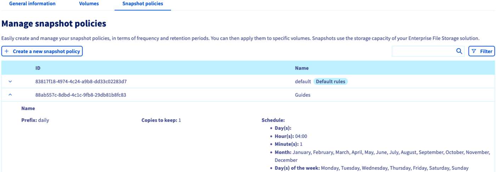{.thumbnail}

En la nueva página, introduzca un nombre y una descripción para la política. A continuación, utilice el botón `+ Añadir una nueva regla`{.action} para añadir una o más reglas a la política.

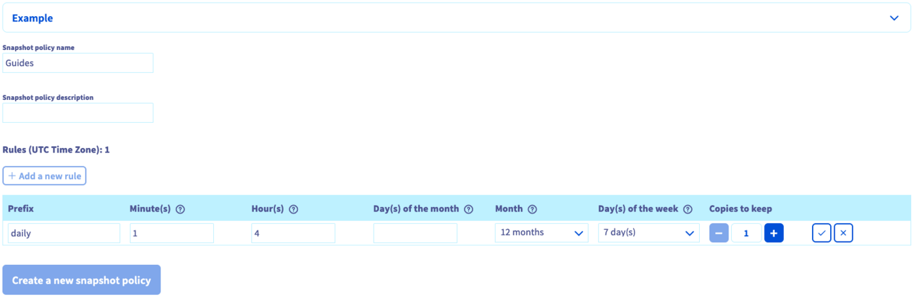{.thumbnail}

Rellene los campos para indicar la frecuencia de creación del snapshot. También debe indicar un prefijo para los snapshots, necesario para su denominación.

Para más información sobre cada valor, haga clic en el icono con signo de interrogación (¿`?`{.action}). Si desarrolla la sección `Ejemplo`{.action}, puede ver dos conjuntos de reglas de política con una explicación de los resultados.

Marque la nueva regla para añadirla. Una vez que haya creado todas las reglas, haga clic en `Crear una nueva Snapshot policy`{.action}.

[Seleccione un volumen](#manage_volume) y abra la pestaña `Snapshots`{.action} para [aplicar las reglas](#snapshots).

Para eliminar una política, haga clic en el icono de la papelera correspondiente de la tabla.

### Primeros pasos 

Si no está familiarizado con la solución Enterprise File Storage, puede seguir los pasos que se indican a continuación:

- [Crear un volumen:](#create_volume)
- [Configurar el control de accesos](#access_control)
- [Configurar las políticas de snapshot](#snapshot_policy) (opcional)
- [Aplicar reglas de snapshot al volumen](#snapshots) (opcional)
- [Listar y recuperar los snapshots](#access_snapshots) (opcional)
- [Conéctese a su volumen siguiendo las instrucciones de la sección "Información general".](#modify_volume)
- [Cómo utilizar Enterprise File Storage a través de la API con nuestras guías](#gofurther) (opcionales)

## Más información 

[Enterprise File Storage - API Quickstart](/pages/storage_and_backup/file_storage/enterprise_file_storage/netapp_quick_start)

[Enterprise File Storage - Gestión de volúmenes](/pages/storage_and_backup/file_storage/enterprise_file_storage/netapp_volumes)

[Enterprise File Storage - Gestión de ACL de volumen](/pages/storage_and_backup/file_storage/enterprise_file_storage/netapp_volume_acl)

[Enterprise File Storage - Gestión de snapshots de volúmenes](/pages/storage_and_backup/file_storage/enterprise_file_storage/netapp_volume_snapshots)

Si necesita formación o asistencia técnica para implantar nuestras soluciones, póngase en contacto con su representante de ventas o haga clic en [este enlace](https://www.ovhcloud.com/es-es/professional-services/) para obtener un presupuesto y solicitar un análisis personalizado de su proyecto a nuestros expertos del equipo de Servicios Profesionales.

Si quiere disfrutar de ayuda para utilizar y configurar sus soluciones de OVHcloud, puede consultar nuestras distintas soluciones [pestañas de soporte](/links/support).

Interactúe con nuestra [comunidad de usuarios](/links/community).