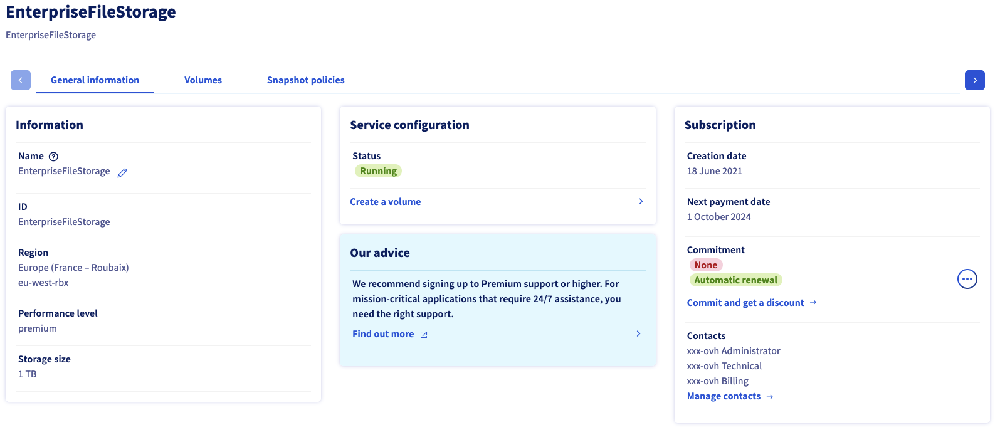
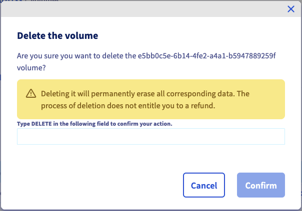
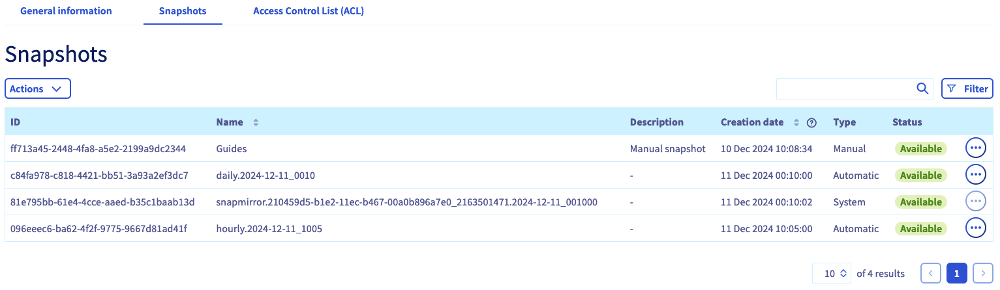

## Obiettivo

I servizi Enterprise File Storage possono essere gestiti [tramite le API OVHcloud](/pages/storage_and_backup/file_storage/enterprise_file_storage/netapp_quick_start) o dallo Spazio Cliente OVHcloud.

**Questa guida ti mostra come gestire i volumi e gli Snapshot di Enterprise File Storage nello Spazio Cliente OVH.**

## Prerequisiti

- Disporre di un servizio Enterprise File Storage sul proprio account OVHcloud. Il servizio può essere ordinato dalla [pagina prodotto](/links/storage/enterprise-file-storage) o dallo [Spazio Cliente OVHcloud](/links/manager).
- Avere accesso allo [Spazio Cliente OVHcloud](/links/manager).

## Procedura 

Accedi allo [Spazio Cliente OVHcloud](/links/manager) e seleziona `Bare Metal Cloud`{.action} nella barra di navigazione superiore. Apri `Storage e Backup`{.action}, poi `Enterprise File Storage`{.action} nel menu a sinistra e seleziona il tuo servizio nella lista.

{.thumbnail}

Nella scheda `Informazioni generali`{.action} vengono mostrate informazioni tecniche sul tuo servizio, informazioni generali sull'abbonamento e una scorciatoia per [creare un volume](#create_volume).

> [!primary]
> Consulta la pagina [Concetti](/pages/storage_and_backup/file_storage/enterprise_file_storage/netapp_concepts) per ottenere informazioni dettagliate sulle proprietà tecniche della soluzione Enterprise File Storage.
>

### Gestione dei volumi 

Clicca sulla scheda `Volumi`{.action}. La tabella elenca tutti i volumi creati per il servizio selezionato. Clicca su un identificativo di volume per aprire la [pagina di gestione](#modify_volume). 

{.thumbnail}

Cliccando sul pulsante `...`{.action} in ogni riga della tabella, puoi effettuare diverse azioni.

- **Modifica il volume**: apri la sezione "[Informazioni generali](#modify_volume)" del volume.
- **Crea uno Snapshot**: apri la sezione "[Backup](#snapshots)" per effettuare uno Snapshot manuale del volume.
- **Ripristina ultimo Snapshot**: apre la sezione "[Snapshots](#snapshots)" e una finestra che permette di ripristinare il volume.
- **Gestisci gli Snapshot**: apri la sezione "[Backup](#snapshots)" del volume
- **Gestisci IP Access (ACL)**: apre la sezione "[ACL](#access_control)" che permette di gestire il controllo di accesso al volume.
- **Modifica dimensione**: apre una finestra che consente di modificare la dimensione del volume.
- **Elimina il volume**: permette di eliminare questo volume una volta confermata l'azione nella finestra che appare.

#### Crea un volume 

Clicca sul pulsante `Crea un volume`{.action}. Nella nuova finestra, inserisci il nome e la descrizione del volume. Determina la dimensione in GB e clicca su `Crea un volume`{.action} per confermare la creazione.

{.thumbnail}

#### Modifica di un volume 

Clicca su un ID di volume nella tabella per aprire la pagina di gestione di questo volume.

Nella scheda `Informazioni generali`{.action} vengono visualizzati i dettagli del volume e le istruzioni dettagliate per la connessione al volume, inclusi i singoli parametri.

{.thumbnail}

Da questa scheda è inoltre possibile modificare il nome e la descrizione del volume.

#### Eliminazione di un volume 

Per eliminare un volume, clicca sul pulsante `...`{.action} nella tabella dalla scheda `Volumes`{.action} e seleziona `Elimina il volume`{.action}.

{.thumbnail}

Digita `DELETE` e clicca su `Conferma`{.action} per confermare l’eliminazione.

### Gestione degli Snapshot di un volume 

> [!primary]
>
> Gli Snapshot utilizzano la capacità di storage della soluzione Enterprise File Storage. Di default, il 5% della dimensione di un volume è sempre riservato agli Snapshot.
>

Nella scheda `Snapshots`{.action} sono elencati tutti gli Snapshot creati per il volume selezionato.

{.thumbnail}

Nella stessa scheda è inoltre possibile visualizzare tutte le [politiche di Snapshot](#snapshot_policy) create per il servizio e applicarle a questo volume.

{.thumbnail}

Clicca sulla riga della regola corrispondente per visualizzare i dettagli della pianificazione degli Snapshot. Seleziona una politica cliccando sul pulsante di selezione dedicato e poi sul pulsante `Applica la politica`{.action} sotto la tabella.

Per configurare le [politiche di Snapshot](#snapshot_policy), torna alla sezione [Gestione dei volumi](#instructions) del tuo servizio e apri la scheda `Snapshot policies`{.action}.

#### Creazione di uno Snapshot 

Per creare un nuovo Snapshot di un volume nello stato attuale, clicca sul pulsante `Actions`{.action} e poi su `Crea uno Snapshot`{.action}.

{.thumbnail}

Nella nuova finestra, inserisci un nome e una descrizione.

Clicca sul pulsante `Crea uno Snapshot`{.action} per avviare la creazione.

{.thumbnail}

#### Modifica uno Snapshot 

Per modificare il nome o la descrizione di uno Snapshot, clicca sul pulsante `...`{.action} nella tabella e seleziona `Modifica`{.action}. Si aprirà una finestra che ti permetterà di scegliere un nuovo nome e/o una nuova descrizione.

{.thumbnail}

Clicca su `Conferma`{.action} per applicare le modifiche.

{.thumbnail}

#### Elimina uno Snapshot 

> [!warning]
>
> Non è possibile eliminare uno Snapshot di tipo `system`.
> sono indispensabili per il corretto funzionamento della soluzione Enterprise File Storage.
>

Per eliminare uno Snapshot, clicca sul pulsante `...`{.action} nella tabella e seleziona `Elimina`{.action}.

{.thumbnail}

Clicca su `Elimina uno Snapshot`{.action} per confermare l’eliminazione.

{.thumbnail}

#### Ripristino del volume utilizzando uno snapshot 

> [!warning]
>
> Ti ricordiamo che, una volta ripristinato un volume con uno Snapshot, tutti i file e gli Snapshot creati in seguito andranno persi.
> Quando un volume viene ripristinato, tutti i dati in esso contenuti vengono sovrascritti con i dati dello Snapshot. Questa azione è irreversibile.
>

È possibile ripristinare un volume utilizzando l’ultimo Snapshot `manuale`. Clicca sul pulsante `Actions`{.action} e poi su `Ripristina l’ultimo Snapshot`{.action}.

> [!primary]
>
> Per ripristinare il volume utilizzando uno Snapshot precedente all'ultimo Snapshot, è necessario eliminare gli Snapshot fino a quando quello da utilizzare per il ripristino non sarà il più recente.
>

{.thumbnail}

#### Backup di uno Snapshot automatico 

Gli Snapshot `automatici` creati dalle [politiche di Snapshot](#snapshot_policy) possono essere salvati cliccando sul pulsante `...`{.action} nella tabella e poi su `Salva`{.action}.

{.thumbnail}

Salvando uno Snapshot `automatico`, quest’ultimo diventerà `manuel`, cosa che impedirà la sua rotazione da parte della politica di Snapshot e quindi la sua eliminazione automatica.

### Gestione delle ACL dei volumi 

Il controllo degli accessi ai volumi funziona tramite le restrizioni degli indirizzi IP. Dal momento che per impostazione predefinita non vengono configurate restrizioni, il primo passo per la creazione di volumi consiste nell'impostare indirizzi IP o intervalli da cui sarà consentito l'accesso.

Nella scheda `Controllo di accesso (ACL)`{.action}, clicca sul pulsante `+ Aggiungi un nuovo accesso`{.action}.

{.thumbnail}

Questa azione crea una nuova riga nella tabella in cui è possibile immettere un indirizzo IP o un blocco di indirizzi (CIDR). Selezionare `Sola lettura` o `Lettura e scrittura` come tipo di accesso dal menu a comparsa, quindi selezionare questa voce per aggiungerla all'ACL.

Per rimuovere l'accesso al volume, fare clic sull'icona del cestino corrispondente nella tabella.

### Gestione delle politiche di snapshot 

> [!primary]
>
> Per impostazione predefinita, ogni volume è protetto da una politica di Snapshot chiamata `default`, che crea snapshot del volume a intervalli regolari.
>

Aggiungere delle politiche ti permette di pianificare la creazione di Snapshot per tutti i tuoi volumi.

Clicca sulla scheda `Snapshot poliziesche`{.action}. La tabella elenca tutte le politiche create per il servizio selezionato.

Esiste già una politica predefinita che non può essere modificata. Per aggiungere la tua, clicca sul pulsante `Crea una politica di Snapshot`{.action}.

{.thumbnail}

Nella nuova pagina, inserisci un nome e una descrizione per la politica. Poi clicca su `+ Aggiungi una nuova regola`{.action} per aggiungere una o più regole alla politica.

{.thumbnail}

Compila i campi per indicare i criteri per la periodicità di creazione dello Snapshot. È inoltre necessario indicare un prefisso per gli Snapshot, necessario alla loro denominazione.

Per maggiori informazioni su ciascun valore, clicca sull'icona con il punto di domanda (`?`{.action}). Sviluppando la sezione `Esempio`{.action}, potete visualizzare due serie di regole di politica con una spiegazione del loro risultato.

Seleziona la nuova regola per aggiungerla. Una volta inserite tutte le regole, clicca su `Crea uno Snapshot policy`{.action}.

[Seleziona un volume](#manage_volume) e clicca sulla scheda `Snapshot`{.action} per [applicare le tue regole](#snapshots).

Per eliminare una politica, clicca sull'icona del cestino corrispondente nella tabella.

### Iniziare a 

Se non conosci la soluzione Enterprise File Storage, segui questi passaggi:

- [Creare un volume](#create_volume)
- [Configura il controllo degli accessi](#access_control)
- [Configura le politiche di Snapshot](#snapshot_policy) (facoltativo)
- [Applicare regole di snapshot al volume](#snapshots) (facoltativo)
- [Elencare e recuperare gli snapshot](#access_snapshots) (facoltativo)
- [Accedi al tuo volume seguendo le indicazioni della sezione "Informazioni generali"](#modify_volume)
- [Scopri come utilizzare Enterprise File Storage via API consultando le nostre guide](#gofurther) (in opzione)

## Per saperne di più 

[Enterprise File Storage - API Quickstart](/pages/storage_and_backup/file_storage/enterprise_file_storage/netapp_quick_start)

[Enterprise File Storage - Gestione dei volumi](/pages/storage_and_backup/file_storage/enterprise_file_storage/netapp_volumes)

[Enterprise File Storage - Gestione delle ACL di volume](/pages/storage_and_backup/file_storage/enterprise_file_storage/netapp_volume_acl)

[Enterprise File Storage - Gestione degli Snapshot dei volumi](/pages/storage_and_backup/file_storage/enterprise_file_storage/netapp_volume_snapshots)

Se avete bisogno di formazione o di assistenza tecnica per implementare le nostre soluzioni, contattate il vostro rappresentante o cliccate su [questo link](https://www.ovhcloud.com/it/professional-services/) per ottenere un preventivo e richiedere un'analisi personalizzata del vostro progetto da parte dei nostri esperti del team Professional Services.

Per usufruire di un supporto per l'utilizzo e la configurazione delle soluzioni OVHcloud, è possibile consultare le nostre soluzioni [offerte di supporto](/links/support).

Contatta la nostra [Community di utenti](/links/community).