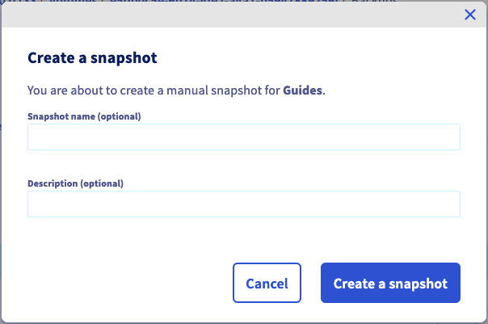
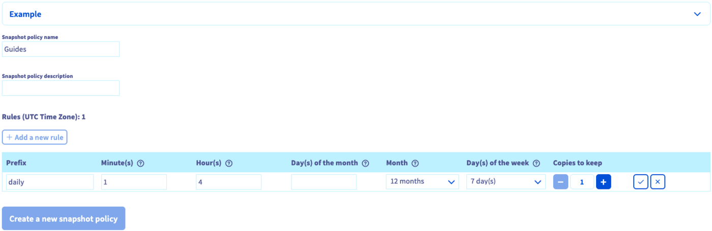

## Wprowadzenie

Usługi Enterprise File Storage mogą być zarządzane [za pośrednictwem API OVHcloud](/pages/storage_and_backup/file_storage/enterprise_file_storage/netapp_quick_start) lub w Panelu klienta OVHcloud.

**Dowiedz się, jak zarządzać wolumenami oraz migawkami do przechowywania plików firmowych w Panelu klienta.**

## Wymagania początkowe

- Posiadanie usługi Enterprise File Storage na Twoim koncie OVHcloud. Usługę można zamówić z poziomu [strony produktu](/links/storage/enterprise-file-storage) lub z poziomu [panelu klienta OVHcloud](/links/manager).
- Dostęp do [Panelu client OVHcloud](/links/manager).

## W praktyce 

Zaloguj się do [Panelu client OVHcloud](https://www.ovh.com/auth/?action=gotomanager&from=https://www.ovh.pl/&ovhSubsidiary=pl) i wybierz `Bare Metal Cloud`{.action} na górnym pasku nawigacji. Otwórz `Storage i Backup`{.action}, a następnie `Enterprise File Storage`{.action} w menu po lewej stronie i wybierz Twoją usługę z listy.

{.thumbnail}

W zakładce `Informacje ogólne`{.action} znajdują się informacje techniczne dotyczące Twojej usługi, ogólne informacje o abonamencie oraz skrót, w celu [utworzenia wolumenu](#create_volume).

> [!primary]
> Zapoznaj się ze stroną [Concepts](/pages/storage_and_backup/file_storage/enterprise_file_storage/netapp_concepts), aby uzyskać szczegółowe informacje na temat właściwości technicznych rozwiązania Enterprise File Storage.
>

### Zarządzanie wolumenami 

Kliknij zakładkę `Wolumeny`{.action}. Tabela zawiera listę wszystkich wolumenów utworzonych dla wybranej usługi. Aby otworzyć [stronę zarządzania](#modify_volume), kliknij identyfikator wolumenu. 

{.thumbnail}

Możesz wykonać kilka operacji klikając przycisk...` `{.action} w każdym wierszu tabeli.

- **Zmień wolumen**: otwiera sekcję "[Informacje ogólne](#modify_volume)" wolumenu.
- **Utwórz snapshot**: otwiera sekcję "[Kopie](#snapshots) zapasowe", aby wykonać ręczny snapshot wolumenu.
- **Przywróć ostatni snapshot**: Otwiera sekcję "[Snapshots](#snapshots)" oraz okno umożliwiające przywrócenie woluminu.
- **Zarządzanie snapshotami**: otwiera sekcję "[Kopie zapasowe](#snapshots)" wolumenu.
- **Zarządzanie IP Access (ACL)**: otwiera sekcję "[ACL](#access_control)", która umożliwia zarządzanie kontrolą dostępu do wolumenu.
- **Zmień rozmiar**: Otwiera okno umożliwiające zmianę rozmiaru woluminu.d
- **Usuń wolumen**: pozwala usunąć ten wolumen po potwierdzeniu działania w oknie, które się wyświetli.

#### Tworzenie wolumenu 

Kliknij przycisk `Utwórz wolumen`{.action}. W nowym oknie, które się pojawi, wprowadź nazwę i opis wolumenu. Wybierz rozmiar w GB i kliknij na `Utwórz wolumen`{.action}, aby zatwierdzić utworzenie.

{.thumbnail}

#### Zmiana wolumenu 

Kliknij ID wolumenu w tabeli, aby otworzyć stronę zarządzania tym wolumenem.

W zakładce `Informacje ogólne`{.action} wyświetlane są informacje o wolumenie oraz szczegółowe instrukcje dotyczące połączenia z wolumenem, w tym poszczególne parametry.

{.thumbnail}

W tej zakładce możesz również zmienić nazwę i opis wolumenu.

### Usuwanie woluminu 

Możesz usunąć wolumen, klikając przycisk`...`{.action} w tabeli w zakładce `Volumes`{.action}, a następnie `Usuń wolumen`{.action}.

{.thumbnail}

Wpisz `DELETE` i kliknij na `Potwierdź`{.action}, aby zatwierdzić usunięcie.

#### Tworzenie i zarządzanie snapshotami wolumenu 

> [!primary]
>
> Snapshoty wykorzystują przestrzeń dyskową rozwiązania Enterprise File Storage. Domyślnie, 5% rozmiaru wolumenu jest zawsze zarezerwowane na snapshoty.
>

W zakładce `Snapshoty`{.action} wyszczególnione są wszystkie snapshoty utworzone dla wybranego wolumenu.

{.thumbnail}

W tej samej karcie można również wyświetlić wszystkie [reguły snapshotów] (#snapshot_policy) utworzone dla usługi i zastosować je do tego wolumenu.

{.thumbnail}

Kliknij linię odpowiedniej reguły, aby wyświetlić szczegóły harmonogramu snapshotów. Wybierz politykę, klikając dedykowany przycisk wyboru, następnie kliknij przycisk `Zastosuj politykę`{.action} znajdujący się pod tabelą.

Aby skonfigurować [zasady wykonywania snapshotów] (#snapshot_policy), wróć do sekcji [Zarządzanie wolumenami] (#instrukcje) i otwórz zakładkę `Snapshot policies`{.action}.

### Tworzenie snapshota 

Aby utworzyć nowy snapshot wolumenu w jego aktualnym stanie, kliknij przycisk `Actions`{.action}, a następnie `Utwórz snapshot`{.action}.

{.thumbnail}

Pojawi się nowe okno, w którym możesz wpisać nazwę i opis.

Kliknij przycisk `Utwórz snapshot`{.action}, aby rozpocząć tworzenie.

{.thumbnail}

### Zmiana snapshota 

Możesz zmienić nazwę lub opis snapshota klikając na przycisk ``...`{.action} w tabeli, następnie kliknij na `Edytuj`{.action}. Otworzy się wówczas okno, w którym możesz wybrać nową nazwę i/lub opis.

{.thumbnail}

Kliknij na `Potwierdź`{.action}, aby zatwierdzić zmiany.

{.thumbnail}

### Usuwanie snapshota 

> [!warning]
>
> Nie można usunąć snapshota typu `system`.
> Są one niezbędne do prawidłowego funkcjonowania oferty Enterprise File Storage.
>

Możesz usunąć snapshot, klikając przycisk `...`{.action} w tabeli, a następnie `Usuń`{.action}.

{.thumbnail}

Kliknij przycisk `Usuń snapshot`{.action}, aby potwierdzić usunięcie.

{.thumbnail}

### Przywracanie woluminu przy użyciu snapshota 

> [!warning]
>
> Pamiętaj, że po przywróceniu wolumenu za pomocą snapshota wszystkie pliki lub snapshoty utworzone później zostaną utracone.
> Po przywróceniu wolumenu wszystkie zawarte w nim dane zostaną zastąpione danymi z kopii zapasowej snapshot. Operacja ta jest nieodwracalna.
>

Wolumen można przywrócić przy użyciu ostatniego snapshota `manual`. Kliknij przycisk `Actions`{.action}, a następnie `Przywróć ostatni snapshot`{.action}.

> [!primary]
>
> Aby przywrócić wolumen za pomocą snapshota sprzed ostatniego snapshota, należy usunąć snapshoty, aż do momentu, gdy snapshot używany do przywrócenia będzie najnowszy.
>

{.thumbnail}

### Automatyczna kopia zapasowa snapshotu 

Kopie zapasowe `automatycznych` migawek utworzonych przez [Zasady migawek](#snapshot_policy) można wykonać, klikając przycisk `...`{.action} w tabeli, a następnie klikając `Zapisz`{.action}.

{.thumbnail}

Po wykonaniu kopii zapasowej snapshot `automatically`, stanie się on `manual`, co uniemożliwi jego obracanie za pomocą polityki snapshotów, a tym samym automatyczne usuwanie.

#### Zarządzanie ACL wolumenów 

Kontrola dostępu do wolumenów działa poprzez ograniczenia adresów IP. Ponieważ żadne ograniczenie nie jest domyślnie skonfigurowane, pierwszym krokiem podczas tworzenia wolumenów jest zdefiniowanie adresów IP lub zakresów, z których dostęp będzie dozwolony.

W zakładce `Kontrola dostępu (ACL)`{.action} kliknij przycisk `+ Dodaj nowy dostęp`{.action}.

{.thumbnail}

Operacja ta tworzy nowy wiersz w tabeli, w której możesz wprowadzić adres IP lub blok adresu (CIDR). Wybierz `Odczyt` lub `Odczyt i zapis` jako typ dostępu w rozwijanym menu, następnie zaznacz ten wpis, aby dodać go do ACL.

Aby usunąć dostęp do wolumenu, kliknij ikonę kosza w tabeli.

### Zarządzanie polityką wykonywania snapshotów 

> [!primary]
>
> Domyślnie każdy wolumin jest chroniony przez politykę wykonywania snapshotów o nazwie `default`, która tworzy snapshoty woluminu w regularnych odstępach czasu.
>

Dodanie reguł pozwala na zaplanowanie tworzenia snapshotów dla wszystkich Twoich wolumenów.

Kliknij zakładkę `Snapshot policies`{.action}. Tabela zawiera listę wszystkich polityk utworzonych dla wybranej usługi.

Polityka domyślna już istnieje i nie można jej zmienić. Aby dodać własną, kliknij przycisk `Utwórz politykę wykonywania snapshotów`{.action}.

{.thumbnail}

Na stronie, która się wtedy wyświetli, wprowadź nazwę i opis polityki. Następnie użyj przycisku '+ Dodaj nową regułę`{.action} aby dodać jedną lub więcej reguł do polityki.

{.thumbnail}

Wypełnij pola, aby określić kryteria okresowości tworzenia snapshota. Musisz również podać prefiks dla snapshotów niezbędny do nadania im nazwy.

Szczegółowe informacje na temat każdej wartości można znaleźć, klikając ikonę znaku zapytania (`?`{.action}). Rozwijając sekcję `Przykład`{.action}, możesz wyświetlić dwa zestawy reguł wraz z wyjaśnieniem ich wyniku.

Zaznacz nową regułę, aby ją dodać. Po dodaniu wszystkich reguł kliknij przycisk `Utwórz nową politykę wykonywania snapshotów`{.action}.

[Wybierz wolumen] (#manage_volume) i przejdź do zakładki `Snapshots`{.action}, aby [zastosować reguły] (#snapshots).

Aby usunąć politykę, kliknij odpowiednią ikonę kosza w tabeli.

### Pierwsze kroki 

Jeśli nie jesteś zaznajomiony z korzystaniem z rozwiązania Enterprise File Storage, możesz postępować zgodnie z poniższymi instrukcjami:

- [Utwórz wolumen](#create_volume)
- [Konfiguracja kontroli dostępu](#access_control)
- [Konfiguracja polityki snapshota](#snapshot_policy) (opcjonalnie)
- [Zastosowanie reguł snapshota dla wolumenu](#snapshots) (opcjonalnie)
- [Wyświetlanie i pobieranie snafonów](#access_snapshots) (opcjonalnie)
- [Zaloguj się do wolumenu zgodnie z instrukcjami w sekcji "Informacje ogólne"](#modify_volume)
- [Dowiedz się, jak korzystać z Enterprise File Storage poprzez API, sprawdź nasze przewodniki](#gofurther) (opcjonalnie)

## Sprawdź również 

[Enterprise File Storage - API Quickstart](/pages/storage_and_backup/file_storage/enterprise_file_storage/netapp_quick_start)

[Enterprise File Storage - Zarządzanie wolumenami](/pages/storage_and_backup/file_storage/enterprise_file_storage/netapp_volumes)

[Enterprise File Storage - Zarządzanie ACL wolumenu](/pages/storage_and_backup/file_storage/enterprise_file_storage/netapp_volume_acl)

[Enterprise File Storage - Zarządzanie snapshotami wolumenów](/pages/storage_and_backup/file_storage/enterprise_file_storage/netapp_volume_snapshots)

Jeśli potrzebujesz szkolenia lub pomocy technicznej w celu wdrożenia naszych rozwiązań, skontaktuj się z przedstawicielem handlowym lub kliknij [ten link](https://www.ovhcloud.com/pl/professional-services/), aby uzyskać wycenę i poprosić o spersonalizowaną analizę projektu od naszych ekspertów z zespołu Professional Services.

Jeśli chcesz otrzymywać wsparcie w zakresie konfiguracji i użytkowania Twoich rozwiązań OVHcloud, zapoznaj się z naszymi [ofertami pomocy](/links/support).
 
Dołącz do [grona naszych użytkowników](/links/community).