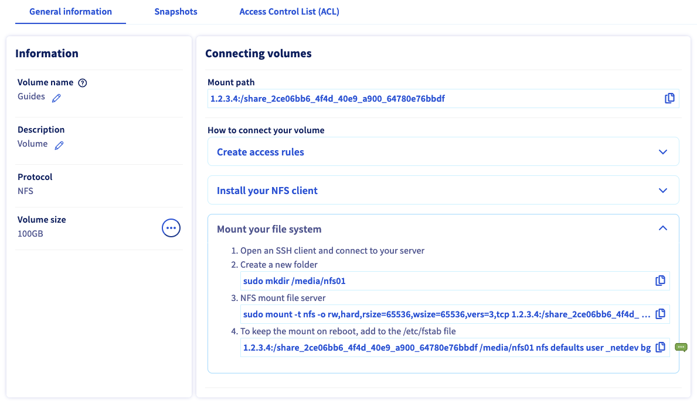
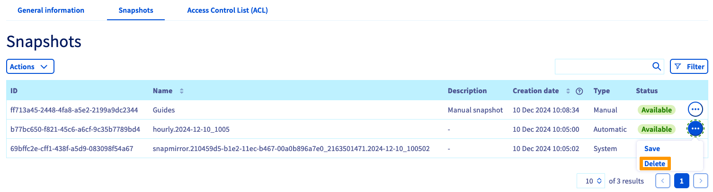

## Objetivo

Os serviços Enterprise File Storage podem ser geridos [através das API OVHcloud](/pages/storage_and_backup/file_storage/enterprise_file_storage/netapp_quick_start) ou a partir da Área de Cliente OVHcloud.

**Saiba como gerir os volumes e as snapshots de Enterprise File Storage na sua Área de Cliente.**

## Requisitos

- Ter um serviço Enterprise File Storage na sua conta OVHcloud. O serviço pode ser encomendado a partir da [página produto](/links/storage/enterprise-file-storage) ou a partir da [Área de Cliente OVHcloud](/links/manager).
- Ter acesso à [Área de Cliente OVHcloud](/links/manager).

## Instruções 

Ligue-se à sua [Área de Cliente OVHcloud](/links/manager) e selecione `Bare Metal Cloud`{.action} na barra de navegação superior. Abra o `Storage e o Backup`{.action}, depois o `Enterprise File Storage`{.action} no menu à esquerda e selecione o seu serviço na lista.

{.thumbnail}

O separador `Informações gerais`{.action} apresenta informações técnicas sobre o seu serviço, informações gerais sobre a subscrição e um atalho para [criar um volume](#create_volume).

> [!primary]
> Consulte a página [Conceitos](/pages/storage_and_backup/file_storage/enterprise_file_storage/netapp_concepts) para obter informações detalhadas sobre as propriedades técnicas da solução Enterprise File Storage.
>

### Gestão dos volumes 

Clique no separador `Volumes`{.action}. O quadro apresenta todos os volumes criados para o serviço selecionado. Pode clicar num identificador de volume para abrir a sua [página de gestão](#modify_volume). 

{.thumbnail}

Pode efetuar várias ações clicando no botão `...`{.action} em cada linha da tabela.

- **Modificar o volume**: Abre a secção "[Informações gerais](#modify_volume)" do volume.
- **Criar uma snapshot**: abra a secção "[Backups](#snapshots)" para efetuar uma snapshot manual do volume.
- **Restaurar a última snapshot** : abre a secção " [Snapshots](#snapshots) " bem como uma janela que permite restaurar o volume.
- **Gerir as snapshots**: abre a secção "[Backups](#snapshots)" do volume.
- **Gerir IP Access (ACL)**: Abre a secção "[ACL](#access_control)" que permite gerir o controlo de acesso ao volume.
- **Alterar tamanho** : abre uma janela que permite alterar o tamanho do volume.
- **Eliminar o volume**: permite eliminar este volume quando a ação for confirmada na janela que aparecer.

#### Criação de um volume 

Clique no botão `Criar um volume`{.action}. Na nova janela, insira o nome e a descrição do volume. Determine o tamanho em GB e clique em `Criar um volume`{.action} para validar a criação.

{.thumbnail}

#### Modificação de um volume 

Clique num ID de volume no quadro para abrir a página de gestão deste volume.

O separador `Informações gerais`{.action} apresenta os detalhes do volume, bem como instruções pormenorizadas sobre a ligação ao volume, incluindo os parâmetros individuais.

{.thumbnail}

A partir deste separador, também pode alterar o nome e a descrição do volume.

#### Eliminação de um volume 

Pode eliminar um volume clicando no botão `...`{.action} na tabela no separador `Volumes`{.action}, e depois em `Eliminar o volume`{.action}.

{.thumbnail}

Digite `DELETE` e clique em `Confirmar`{.action} para validar a eliminação.

#### Criação e gestão das snapshots de um volume 

> [!primary]
>
> Snapshots nutzen die Speicherkapazität Ihrer Enterprise File Storage-Lösung. Standardmäßig sind 5 % der Größe eines Volumes immer für Snapshots reserviert.
>

O separador `Snapshots`{.action} regista todas as snapshots criadas para o volume selecionado.

{.thumbnail}

No mesmo separador, pode também visualizar todas as [políticas de snapshots](#snapshot_policy) criadas para o serviço e aplicá-las a esse volume.

{.thumbnail}

Clique na linha de regra para consultar os detalhes da programação das snapshots. Selecione uma política através do botão de seleção dedicado e, em seguida, clique no botão `Aplicar a política`{.action} na parte inferior da tabela.

Para configurar as suas [políticas de snapshot](#snapshot_policy), volte à secção [Gestão de volumes](#instructions) do seu serviço e abra o separador `Políticas de snapshot`{.action}.

#### Criação de uma snapshot 

Para criar uma nova snapshot de um volume no seu estado atual, clique no botão `Ações`{.action} e, a seguir, em Criar uma snapshot {.action}.

{.thumbnail}

Na nova janela que se abrir, pode introduzir um nome e uma descrição.

Clique no botão `Criar uma snapshot`{.action} para iniciar a criação.

{.thumbnail}

#### Modificação de uma snapshot 

Pode alterar o nome ou a descrição de uma snapshot clicando no botão `..`{.action} na tabela e, a seguir, clique em `Editar`{.action}. Aparecerá uma janela que lhe permitirá escolher um novo nome e/ou descrição.

{.thumbnail}

Clique em `Confirmar`{.action} para validar as suas alterações.

{.thumbnail}

#### Eliminação de uma snapshot 

> [!warning]
>
> Não é possível eliminar uma snapshot de tipo `sistema`.
> Estes são indispensáveis ao bom funcionamento da sua oferta Enterprise File Storage.
>

Pode eliminar uma snapshot clicando no botão `...`{.action} na tabela e, a seguir, em `Eliminar`{.action}.

{.thumbnail}

Clique em Eliminar uma snapshot {.action} para validar a eliminação.

{.thumbnail}

#### Restauro do volume através de uma snapshot 

> [!warning]
>
> Tenha em conta que, após o restauro de um volume com a utilização de uma snapshot, todos os ficheiros ou snapshots criados posteriormente serão perdidos.
> Quando um volume é restaurado, todos os dados nele contidos são substituídos pelos dados da snapshot. Esta operação é irreversível.
>

É possível restaurar um volume utilizando a última snapshot `manual`. Clique no botão `Ações`{.action} e, a seguir, em `Restaurar a última snapshot`{.action}.

> [!primary]
>
> Para restaurar o volume utilizando uma snapshot anterior à última snapshot, é necessário eliminar as snapshots até que a snapshot a utilizar para o restauro seja a mais recente.
>

{.thumbnail}

#### Backup de uma snapshot automática 

As snapshots `automáticas`, criadas pelas [políticas de snapshot](#snapshot_policy) podem ser guardadas clicando no botão `...`{.action} no quadro e, a seguir, em `Guardar`{.action}.

{.thumbnail}

Ao guardar uma snapshot `automática`, esta tornar-se-á `manual`, o que impedirá a sua rotação pela política de snapshots e a sua eliminação automática.

### Gestão das ACL de volumes 

O controlo de acesso aos volumes funciona através de restrições de endereços IP. Uma vez que não existem restrições configuradas por predefinição, a primeira etapa aquando da criação de volumes consiste em definir endereços IP ou intervalos a partir dos quais o acesso será autorizado.

No separador `Controlo de acesso (ACL)`{.action}, clique no botão `+ Adicionar um novo acesso`{.action}.

{.thumbnail}

Esta ação cria uma nova linha na tabela na qual pode introduzir um endereço IP ou um bloco de endereço (CIDR). Selecione `Leitura isolada` ou `Leitura e escrita` como tipo de acesso no menu pendente e selecione esta entrada para a adicionar ao ACL.

Para remover o acesso ao volume, clique no ícone da lixeira correspondente na tabela.

### Gestão das políticas de snapshots 

> [!primary]
>
> Por predefinição, cada volume está protegido por uma política de snapshots chamada `default` que cria snapshots de volume a intervalos regulares.
>

A adição de políticas permite-lhe planificar a criação de snapshots para todos os seus volumes.

Clique no separador `Snapshot policies`{.action}. O quadro apresenta todas as políticas criadas para o serviço selecionado.

Uma política predefinida já está em vigor e não pode ser alterada. Para adicionar a sua, clique no botão `Criar uma política de snapshots`{.action}.

{.thumbnail}

Na página que aparecer, introduza um nome e uma descrição para a política. De seguida, utilize o botão `+ Adicionar uma nova regra`{.action} para adicionar uma ou mais regras à política.

{.thumbnail}

Preencha os campos para indicar os critérios de periodicidade de criação da snapshot. Deve igualmente indicar um prefixo para as snapshots, necessário à sua denominação.

Encontrará mais informações sobre cada valor ao clicar no ícone que representa um ponto de interrogação (`?`{.action}). Ao desenvolver a secção `Exemplo`{.action}, pode visualizar dois conjuntos de regras de política com uma explicação do seu resultado.

Selecione a nova regra para a adicionar. Depois de adicionar todas as regras, clique em `Criar uma nova Snapshot policy`{.action}.

[Selecione um volume](#manage_volume) e aceda ao separador `Snapshots`{.action} para [aplicar as suas regras](#snapshots).

Para eliminar uma política, clique no ícone de lixo correspondente na tabela.

### Primeiros passos 

Se não está familiarizado com a utilização da solução Enterprise File Storage, pode seguir os passos abaixo:

- [Criar um volume](#create_volume)
- [Configurar o controlo de acesso](#access_control)
- [(Opcional) Configurar as políticas de snapshot](#snapshot_policy)
- [Aplicar regras de snapshot ao volume](#snapshots) (facultativo)
- [Listar e recuperar as snaphots](#access_snapshots) (facultativo)
- [Aceda ao volume seguindo as instruções da secção "Informações gerais"](#modify_volume)
- [Saiba como utilizar o Enterprise File Storage através da API ao consultar os nossos guias](#gofurther) (como opção)

## Quer saber mais? 

[Enterprise File Storage - API Quickstart](/pages/storage_and_backup/file_storage/enterprise_file_storage/netapp_quick_start)

[Enterprise File Storage - Gestão de volumes](/pages/storage_and_backup/file_storage/enterprise_file_storage/netapp_volumes)

[Enterprise File Storage - Gestão dos ACL de volume](/pages/storage_and_backup/file_storage/enterprise_file_storage/netapp_volume_acl)

[Enterprise File Storage - Gestão das snapshots de volumes](/pages/storage_and_backup/file_storage/enterprise_file_storage/netapp_volume_snapshots)

Se precisar de formação ou de assistência técnica para implementar as nossas soluções, contacte o seu representante comercial ou clique em [esta ligação](https://www.ovhcloud.com/pt/professional-services/) para obter um orçamento e solicitar uma análise personalizada do seu projecto aos nossos especialistas da equipa de Serviços Profissionais.

Se pretender usufruir de uma assistência na utilização e na configuração das suas soluções OVHcloud, consulte as nossas diferentes [ofertas de suporte](/links/support).

Fale com nossa [comunidade de utilizadores](/links/community).
