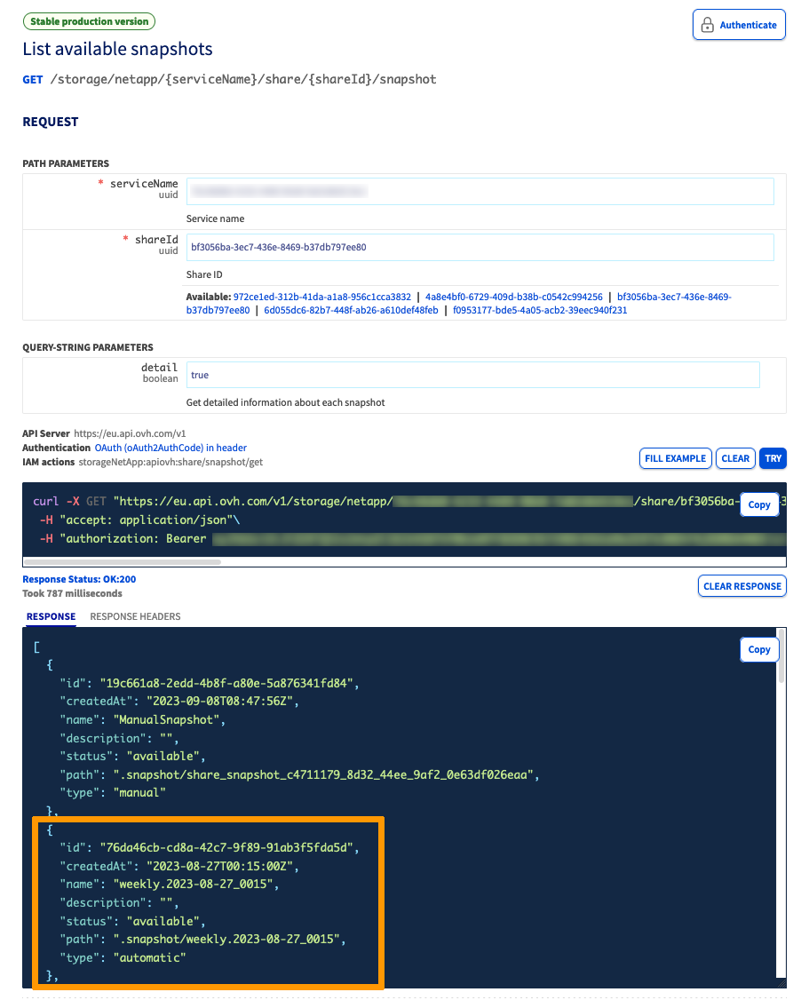

## Objective 

Les snapshots **automatiques** sont crées par une [Politique de Snapshots](/pages/storage_and_backup/file_storage/enterprise_file_storage/netapp_snapshot_policy) en suivant les règles associées à celle-ci.

Conserver un snapshot automatique empêche sa rotation par la politique de snapshots et donc sa suppression. Le snapshot devient de type `manual`.

**Apprenez à conserver un snapshot automatique de votre solution Enterprise File Storage à l'aide de l'API OVHcloud.**

## Prérequis

- Disposer d'une offre OVHcloud [Enterprise File Storage](/links/storage/enterprise-file-storage)
- Être connecté à l’[API OVHcloud](/links/api)
- Disposer d'un volume Enterprise File Storage avec un snapshot `automatique`

> [!success]
> Si vous n'êtes pas familier avec l'utilisation de l'API OVHcloud, consultez notre guide « [Premiers pas avec les API OVHcloud](/pages/manage_and_operate/api/first-steps) ».

## En pratique

1\. Identifiez l'`id` du snapshot à l'aide de l'appel API suivant :

> [!api]
>
> @api {v1} /storage GET /storage/netapp/{serviceName}/share/{shareId}/snapshot
>

- `{serviceName}` est l'identifiant unique du service
- `{shareId}` est l'identifiant du volume auquel appartient le snapshot

{.thumbnail}

2\. Conservez le snapshot en utilisant l'appel API suivant :

> [!api]
>
> @api {v1} /storage POST /storage/netapp/{serviceName}/share/{shareId}/snapshot/{snapshotId}/hold
>

- `{serviceName}` est l'identifiant unique du service
- `{shareId}` est l'identifiant du volume auquel appartient le snapshot
- `{snapshotID}` est l'identifiant du snapshot récupéré à l'étape précédente

> [!warning]
>
> Une fois l'opération de conservation (`hold`) effectuée, l'`id` et le `type` du snapshot seront modifiés. Toutefois, ses propriétés `name`, `createdAt` et `path` seront conservées.
> Prenez note du nouvel `id` si vous souhaitez continuer à effectuer des opérations sur le snapshot.

{.thumbnail}

**Le snapshot *automatique* est maintenant conservé et devient un snapshot *manuel*.**

## Aller plus loin

Si vous avez besoin d'une formation ou d'une assistance technique pour la mise en oeuvre de nos solutions, contactez votre commercial ou cliquez sur [ce lien](/links/professional-services) pour obtenir un devis et demander une analyse personnalisée de votre projet à nos experts de l’équipe Professional Services.

Échangez avec notre [communauté d'utilisateurs](/links/community).
