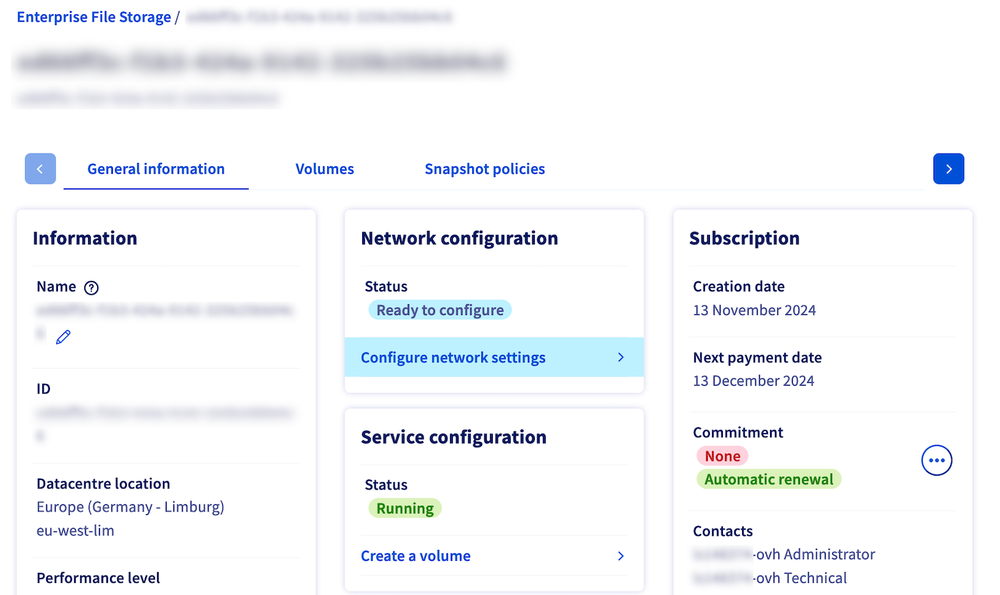
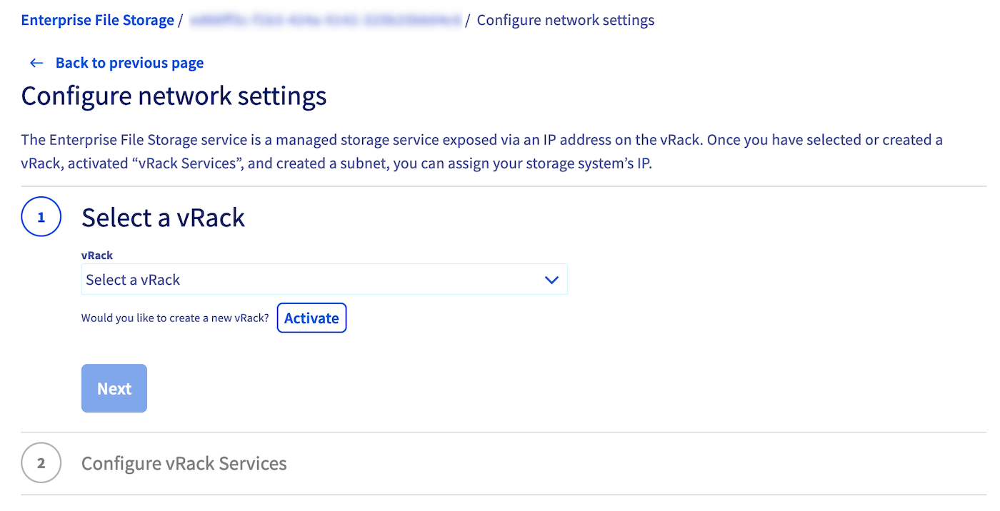

## Objective

Enterprise File Storage services can be managed via [OVHcloud API](/pages/storage_and_backup/file_storage/enterprise_file_storage/netapp_quick_start) or from your OVHcloud Control Panel.

This guide explains how to connect your Enterprise File Storage service to a [vRack private network](/links/network/vrack) using vRack Services and Service Endpoint technology.

> [!primary]
>
> For more information on vRack Services, please refer to [this page](/pages/network/vrack_services/global).
>

## Requirements

- An [Enterprise File Storage](/links/storage/enterprise-file-storage) service in your OVHcloud account
- Access to the [OVHcloud Control Panel](/links/manager)

## Overview

{.thumbnail}

Enterprise File Storage is a service that is exposed to the vRack via an IP address. There are three steps to assigning an IP address to your service:

1. Selecting or creating a vRack
2. Selecting or activating a vRack Services
3. Selecting or creating of a subnet

## Instructions 

Log in to your [OVHcloud Control Panel](/links/manager) and select `Bare Metal Cloud`{.action} from the top navigation bar. Go to `Storage and Backup`{.action} then `Enterprise File Storage`{.action} and select your service from the list.

{.thumbnail}

By default, the service is not connected to a private network, it is in `Ready to configure`{.action} state. This step is required before you can create your volumes and/or set your ACLs. 

Click the `Configure Network Parameters`{.action} link to configure your Service Endpoint to enable your volumes to be consumed from your private network.

### Step 1 - Selecting or creating a vRack

You must have a vRack to activate your vRack services. OVHcloud vRack is a free service. If you don't have one at this stage, you can order one using the `Order`{.action} button in the Control Panel. Otherwise, select your vRack from the drop down menu.

{.thumbnail}

### Step 2 - Selecting or activating a vRack Services

In this second step you will create a vRack Service. If you don't already have a vRack Services activated, you can do it at this step. Click on "Activate", and you will be redirected to the vRack Services configuration page. For more information on vRack Services configuration, please refer to [this page](/pages/network/vrack_services/global). Once your new vRack Services is activated, you will need to go back to the `Configure Network Parameters`{.action} page to perform the rest of the configuration (i.e. Step 1 above).

{.thumbnail}

### Step 3 - Selecting or creating a subnet

Select the subnet on which you want to expose your Enterprise File Storage service. If your subnet does not yet exist, it is necessary to create it. To do this, go to the vRack Services configuration page, “Subnet” tab.  For more information on creating a subnet, you can consult [this page](/pages/network/vrack_services/global).

{.thumbnail}

Once you've completed these 3 steps, click the `Configure`{.action} button. You will be redirected to your Enterprise File Storage information page and will be able to follow the deployment of your Service Endpoint.

After a few moments, your new Service Endpoint will be configured and available.

{.thumbnail}

You can now follow the guides below to create and manage your volumes, snapshots and ACLs.

## Go further 

[Managing Enterprise File Storage from the OVHcloud Control Panel](/pages/storage_and_backup/file_storage/enterprise_file_storage/netapp_control_panel)

[Enterprise File Storage - API Quickstart](/pages/storage_and_backup/file_storage/enterprise_file_storage/netapp_quick_start)

[Enterprise File Storage - Managing volumes](/pages/storage_and_backup/file_storage/enterprise_file_storage/netapp_volumes)

[Enterprise File Storage - Managing volume ACLs](/pages/storage_and_backup/file_storage/enterprise_file_storage/netapp_volume_acl)

[Enterprise File Storage - Managing volume snapshots](/pages/storage_and_backup/file_storage/enterprise_file_storage/netapp_volume_snapshots)

If you need training or technical assistance to implement our solutions, contact your sales representative or click on [this link](/links/professional-services) to get a quote and ask our Professional Services experts for assisting you on your specific use case of your project.

Join our [community of users](/links/community).
