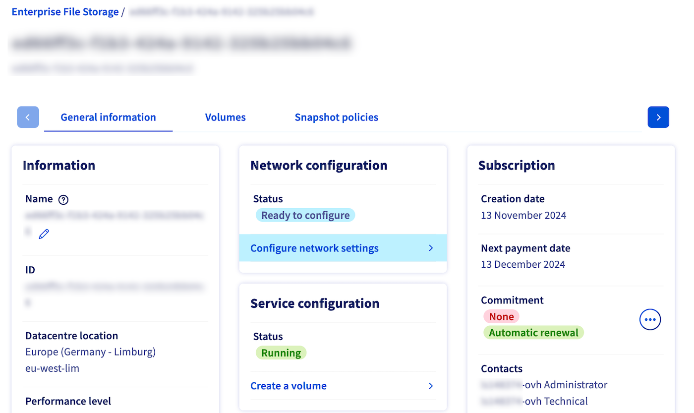
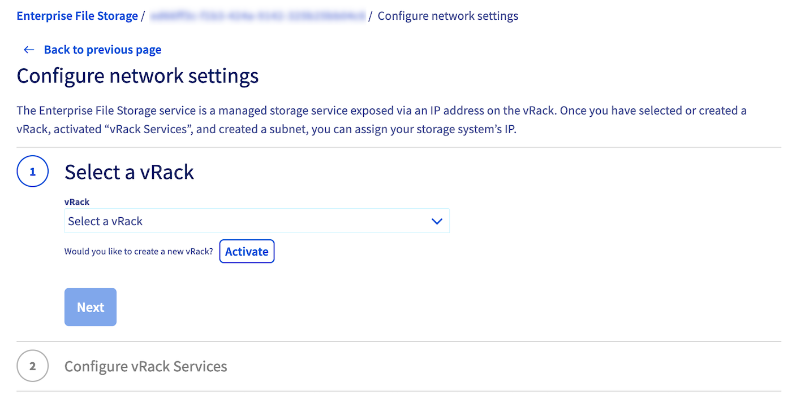
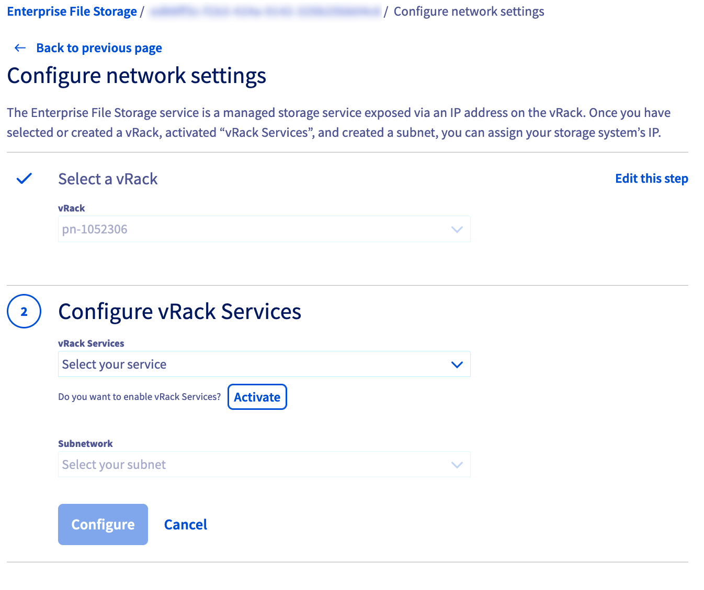
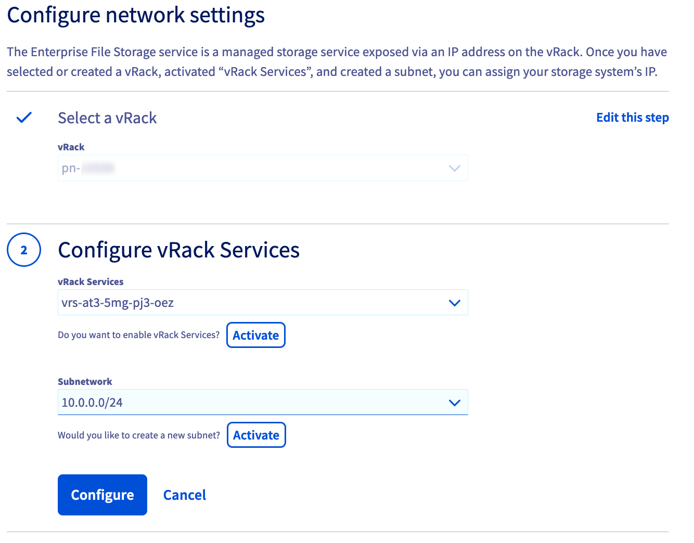
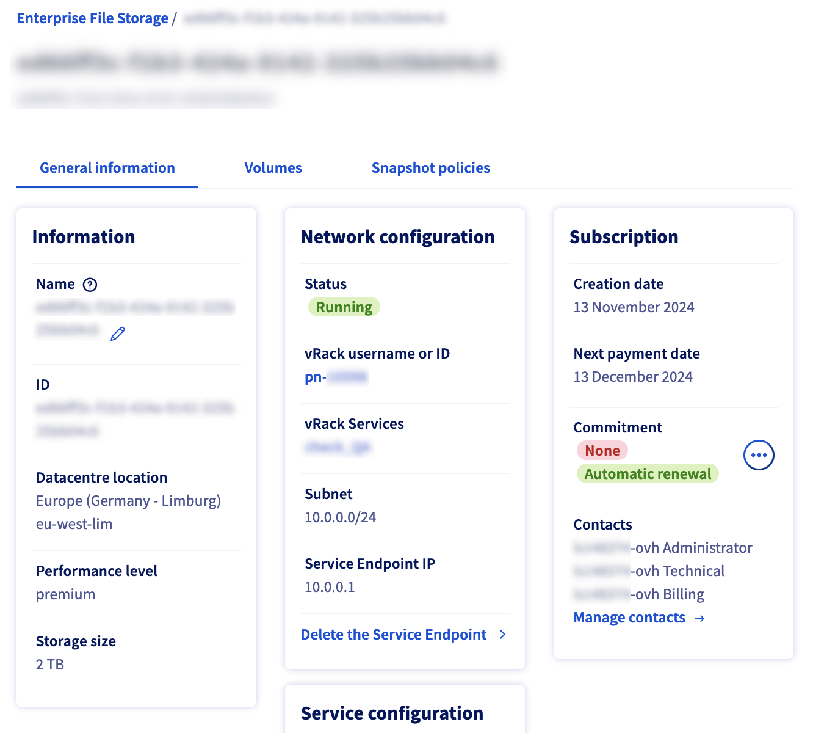

## Objectif

Les services Enterprise File Storage peuvent être gérés via [les API OVHcloud](/pages/storage_and_backup/file_storage/enterprise_file_storage/netapp_quick_start) ou depuis votre espace client OVHcloud.

Découvrez dans ce guide comment rattacher votre service Enterprise File Storage à un [réseau privé vRack](/links/network/vrack), via la technologie vRack Services et la fonctionnalité Service Endpoint.

> [!primary]
>
> Pour plus d’informations concernant vRack Services, consultez [cette page](/pages/network/vrack_services/global).
>

## Prérequis

- Avoir un service [Enterprise File Storage](/links/storage/enterprise-file-storage) dans votre compte OVHcloud.
- Être connecté à votre [espace client OVHcloud](/links/manager).

## Overview

{.thumbnail}

Enterprise File Storage est un service exposé via une adresse IP sur le vRack. L’attribution de l’IP de votre service se fait en trois étapes :

1. Sélection ou création d’un vRack
2. Sélection ou création d'un vRack Services
3. Sélection ou création d’un sous-réseau

## En pratique 

Connectez-vous à votre [espace client OVHcloud](/links/manager) et sélectionez `Bare Metal Cloud`{.action} dans la barre de navigation supérieure. Ouvrez `Storage et Backup`{.action} puis `Enterprise File Storage`{.action} et sélectionnez votre service dans la liste.

{.thumbnail}

Par défaut, le service n’est pas rattaché à un réseau privé, il est dans un statut `Prêt à configurer`{.action}. 

Cette étape est nécessaire avant même de pouvoir créer vos volumes et/ou de paramétrer vos ACLs.

Cliquez sur le lien `Configurer les paramètres réseaux`{.action} pour configurer votre Service Endpoint et ainsi permettre à vos volumes d’être consommés depuis votre réseau privé.

### Etape 1 - Sélection ou création d’un vRack

Pour activer votre vRack Services, vous devez avoir un vRack. Si vous n'en avez pas à cette étape, il est possible d'en commander un via le bouton `Commander`{.action} de votre espace client. Le vRack est un service gratuit. Sinon, sélectionnez votre vRack dans la liste déroulante.

{.thumbnail}

### Etape 2 - Sélection ou création d'un vRack Services

Dans cette deuxième étape, vous devez sélectionner un vRack Services. Si vous n'avez pas de vRack Services, il est possible à cette étape d'activer un nouveau vRack Services. Cliquez sur "Activer", vous serez alors redirigé vers la page de configuration de vRack Services. Pour plus d'information sur la création d'un vRack Services, vous pouvez consulter [cette page](/pages/network/vrack_services/global). Une fois votre vRack Services activé, il vous faudra revenir à l'étape configuration de paramètre réseaux pour la suite de la configuration de votre Enterprise File Storage (étape 1, ci-dessus).

{.thumbnail}

### Etape 3 - Sélection ou création d’un sous-réseau

Sélectionnez le sous-réseau sur lequel vous voulez exposer votre service Enterprise File Storage. Si votre sous-réseau n’existe pas encore, il est nécessaire de le créer. Pour ce faire, rendez-vous sur la page configuration de vRack Services, onglet "Sous-réseau".  Pour plus d'information sur la création d'un sous-réseau, vous pouvez consulter [cette page](/pages/network/vrack_services/global).

{.thumbnail}

Une fois ces trois étapes terminées, cliquez sur le bouton `Configurer`{.action}. Vous allez être redirigé vers la page d'information de votre Enterprise File Storage et pourrez suivre le déploiement de votre Service Endpoint.

Après quelques instants, votre nouveau Service Endpoint est configuré et disponible.

{.thumbnail}

Vous pouvez à présent suivre les guides ci-dessous pour créer et gérer vos volumes, créer et gérer vos snapshots ainsi que vos ACLs.

## Aller plus loin 

[Enterprise File Storage - Gestion depuis l'espace client OVHcloud](/pages/storage_and_backup/file_storage/enterprise_file_storage/netapp_control_panel)

[Enterprise File Storage - API Quickstart](/pages/storage_and_backup/file_storage/enterprise_file_storage/netapp_quick_start)

[Enterprise File Storage - Gestion des volumes](/pages/storage_and_backup/file_storage/enterprise_file_storage/netapp_volumes)

[Enterprise File Storage - Gestion des ACL de volume](/pages/storage_and_backup/file_storage/enterprise_file_storage/netapp_volume_acl)

[Enterprise File Storage - Gestion des snapshots de volumes](/pages/storage_and_backup/file_storage/enterprise_file_storage/netapp_volume_snapshots)

Si vous avez besoin d'une formation ou d'une assistance technique pour la mise en oeuvre de nos solutions, contactez votre commercial ou cliquez sur [ce lien](/links/professional-services) pour obtenir un devis et demander une analyse personnalisée de votre projet à nos experts de l’équipe Professional Services.

Échangez avec notre [communauté d'utilisateurs](/links/community).
