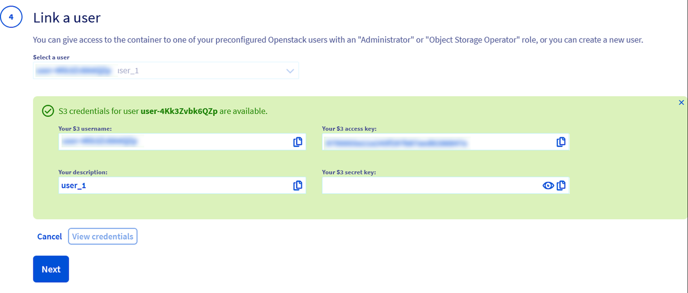
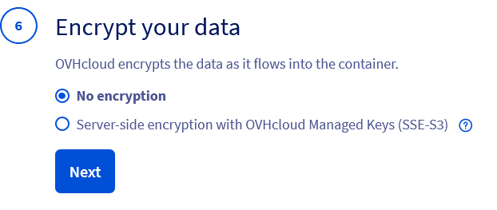

## Objective

**Learn how to create an Object Storage bucket from the OVHcloud Control Panel.**

> [!primary]
>
> - If you are interested in the **Standard object storage - SWIFT API** storage class, follow this [guide](/pages/storage_and_backup/object_storage/pcs_create_container)
> - If you are interested in the **Cloud Archive - SWIFT API** storage class, follow this [guide](/pages/storage_and_backup/object_storage/pca_create_container).
>

## Requirements

- A [Public Cloud project](/pages/public_cloud/compute/create_a_public_cloud_project) in your OVHcloud account
- Access to your [OVHcloud Control Panel](/links/manager)

## Instructions

### Using the Control Panel

To create an Object Storage bucket, first log in to your [OVHcloud Control Panel](/links/manager) and open your `Public Cloud`{.action} project. Click on `Object Storage`{.action} in the navigation bar on the left and then on the `My containers`{.action} tab.

Click `Create Object Container`{.action} and select your storage class:

Select a deployment mode:

> [!primary]
>
> OVHcloud provides multiple deployment modes to meet different needs in terms of resilience, availability, and performance. Each mode is optimized for specific use cases and offers varying levels of redundancy and fault tolerance.
>

Select a region:

> [!primary]
>
> Regions can vary depending on the chosen deployment mode.
>

You must link a user to the bucket:

To do this, you can either link an existing Object Storage user:

You can view the user credentials by clicking on `View credentials`{.action}:

Or you can create a new Object Storage user:

At this stage, you can decide whether or not to enable **versioning**.

Versioning allows you to keep multiple variants of an object in the same bucket. This feature helps **preserve, retrieve, and restore every version of every object stored in your buckets**, making it easier to recover from unintended user actions or application failures. By default, versioning is disabled on buckets, and you must explicitly enable it. Find more information about versioning on our [dedicated guide](/pages/storage_and_backup/object_storage/s3_versioning).

You can now decide whether or not you wish to **encrypt your data** using [SSE-OMK (server-side encryption with OVHcloud Managed Keys)](/pages/storage_and_backup/object_storage/s3_encrypt_your_objects_with_sse_c).

Finally, name your bucket:

Congratulations, your bucket is created:

### Where to find the Endpoint URL of a bucket

Click on the name of your bucket to view its details and content:

## Go further

If you need training or technical assistance to implement our solutions, contact your sales representative or click on [this link](/links/professional-services) to get a quote and ask our Professional Services experts for assisting you on your specific use case of your project.

Join our [community of users](/links/community).
