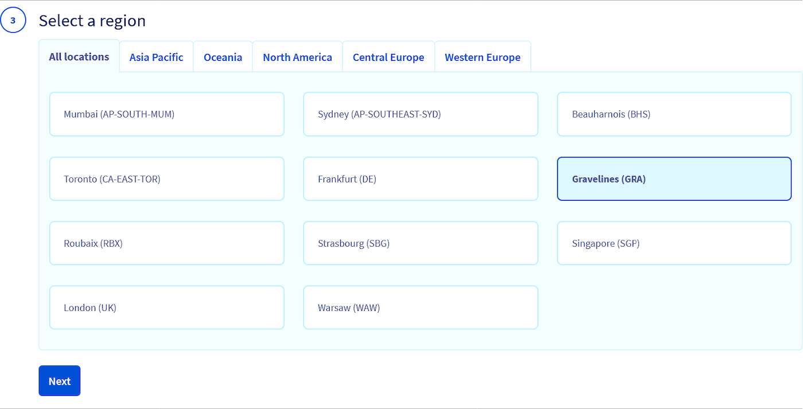

## Objectif

**Découvrez comment créer un bucket Object Storage depuis votre espace client OVHcloud.**

> [!primary]
>
> - Si vous êtes intéressé par la classe de stockage **Standard object storage - SWIFT API**, veuillez suivre ce [guide](/pages/storage_and_backup/object_storage/pcs_create_container).
> - Si vous êtes intéressé par la classe de stockage **Cloud Archive - SWIFT API**, veuillez suivre ce [guide](/pages/storage_and_backup/object_storage/pca_create_container).
>

## Prérequis

- Un [projet Public Cloud](/pages/public_cloud/compute/create_a_public_cloud_project) dans votre compte OVHcloud
- Être connecté à votre [espace client OVHcloud](/links/manager)

## En pratique

### Via l'espace client OVHcloud

Pour créer un bucket Object Storage, vous devez d'abord vous connecter à votre [espace client OVHcloud](/links/manager) et ouvrir votre projet `Public Cloud`{.action}. Cliquez sur `Object Storage`{.action} dans la barre de navigation à gauche puis sur l'onglet `Mes conteneurs`{.action}.

Cliquez sur `Créer un conteneur d'objet`{.action} et sélectionnez votre classe de stockage:

Sélectionnez un mode de déploiement :

> [!primary]
>
> OVHcloud propose plusieurs modes de déploiement pour répondre à différents besoins en termes de résilience, de disponibilité et de performance. Chaque mode est optimisé pour des cas d’usage spécifiques et offre différents niveaux de redondance et de tolérance aux pannes.
>

Sélectionnez une région :

> [!primary]
>
> Les régions peuvent varier suivant la classe de stockage sélectionnée.
>

Vous devez lier un utilisateur au bucket :

Pour cela, vous pouvez lier un utilisateur Object Storage existant :

Vous pouvez voir les informations d'identification de l'utilisateur, en cliquant sur `View credentials`{.action} :

Si vous n'en avez pas déjà un, vous pouvez créer un nouvel utilisateur Object Storage :

À ce stade, vous pouvez décider d'activer ou non le **versioning**.

Le contrôle de version (*versioning*) vous permet de conserver plusieurs variantes d'un objet dans le même compartiment. Cette fonctionnalité aide **à préserver, récupérer et restaurer chaque version de chaque objet stocké dans vos buckets**, facilitant ainsi la récupération en cas d'actions utilisateur non intentionnelles ou de défaillances d'application. Par défaut, le versioning est désactivé sur les buckets et vous devez explicitement l'activer. Retrouvez plus d'informations sur le versioning dans notre [guide dédié](/pages/storage_and_backup/object_storage/s3_versioning).

Vous pouvez ensuite décider si vous souhaitez ou non **chiffrer vos données** à l'aide de [SSE-S3 (chiffrement côté serveur avec les clés managées OVHcloud)](/pages/storage_and_backup/object_storage/s3_encrypt_your_objects_with_sse_c).

Enfin, nommez votre bucket :

Félicitations, votre bucket est créé :

### Où trouver l'URL Endpoint d'un bucket

Cliquez sur le nom de votre bucket pour en afficher les détails et le contenu :

## Aller plus loin

Si vous avez besoin d'une formation ou d'une assistance technique pour la mise en oeuvre de nos solutions, contactez votre commercial ou cliquez sur [ce lien](/links/professional-services) pour obtenir un devis et demander une analyse personnalisée de votre projet à nos experts de l’équipe Professional Services.

Échangez avec notre [communauté d'utilisateurs](/links/community).
