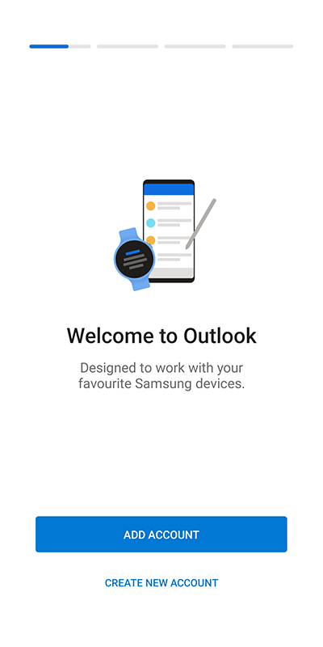
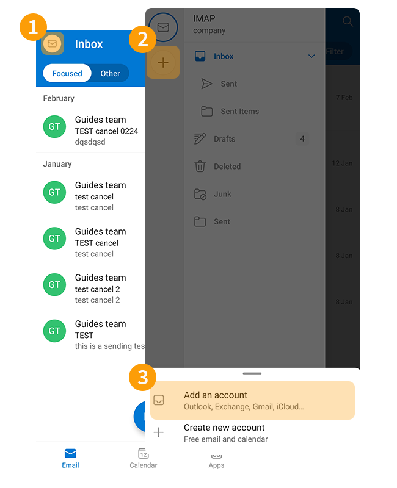
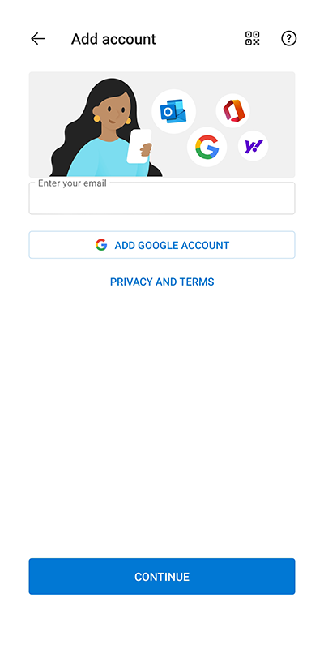
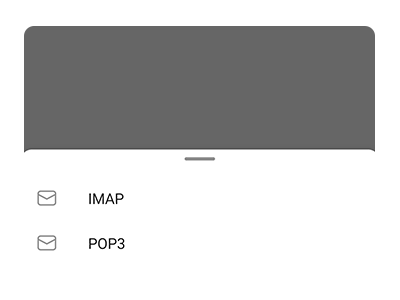
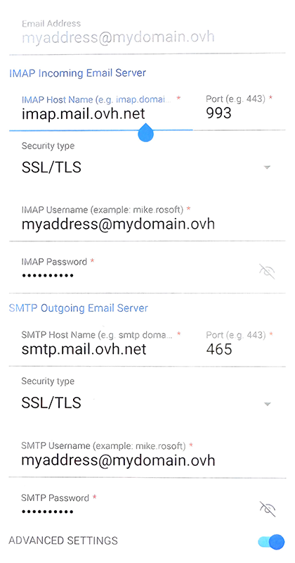
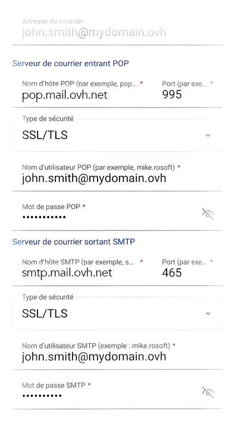
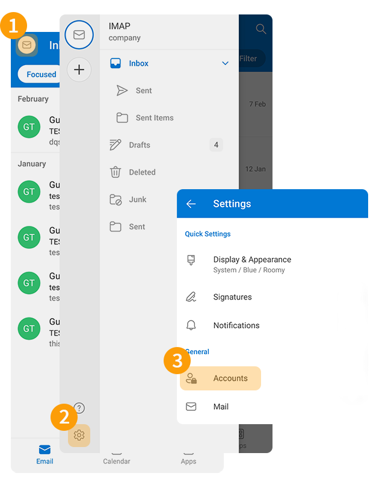
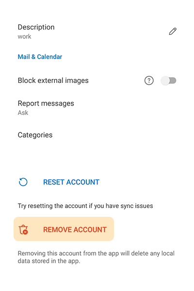

## Objectif

Les comptes E-mail Pro peuvent être configurés sur différents logiciels de messagerie compatibles. Cela vous permet d’utiliser votre adresse e-mail depuis l’appareil de votre choix. L'application Outlook de Microsoft sur Android est disponible gratuitement depuis le Google Play Store.

**Découvrez comment configurer votre adresse E-mail Pro sur l'application mobile Outlook pour Android**

> [!warning]
>
> OVHcloud met à votre disposition des services dont la configuration, la gestion et la responsabilité vous incombent. Il vous revient de ce fait d'en assurer le bon fonctionnement.
>
> Nous mettons à votre disposition ce guide afin de vous accompagner au mieux sur des tâches courantes. Néanmoins, nous vous recommandons de faire appel à un [partenaire spécialisé](https://marketplace.ovhcloud.com/c/support-collaboration) et/ou de contacter l'éditeur du service si vous éprouvez des difficultés. En effet, nous ne serons pas en mesure de vous fournir une assistance. Plus d'informations dans la section « Aller plus loin » de ce guide.

## Prérequis

- Disposer d’une adresse [E-mail Pro](/links/web/email-pro).
- Disposer de l'application Outlook sur votre appareil mobile [Android](https://play.google.com/store/apps/details?id=com.microsoft.office.outlook&hl=fr).
- Posséder les identifiants relatifs à l'adresse e-mail que vous souhaitez paramétrer.

## En pratique

### Ajouter le compte 

> [!warning]
>
> Dans nos exemples, nous utilisons la mention serveur : pro**?**.mail.ovh.net. Vous devrez remplacer le « ? » par le chiffre désignant le serveur de votre service E-mail Pro.
>
> Retrouvez ce chiffre dans votre [espace client OVHcloud](/links/manager), dans la rubrique `Web Cloud`{.action} puis `E-mail Pro`{.action}. Le nom du serveur est visible dans le cadre **Connexion** de l'onglet `Informations Générales`{.action}.
>

- **Lors du premier démarrage de l'application** : un assistant de configuration s'affiche, appuyez sur `Ajouter un compte`{.action}.

{.thumbnail .w-400 .h-600}

- **Si un compte a déjà été paramétré** :
    - Appuyez sur l'enveloppe « &#9993; » dans la partie supérieure gauche de votre écran.
    - Appuyez ensuite sur le bouton `+`{.action} dans la barre verticale de gauche.
    - Appuyez sur `Ajouter un compte`{.action}.

{.thumbnail .w-400 .h-600}

Suivez les étapes d'installation en cliquant sur les onglets ci-dessous :

> [!tabs]
> **Etape 1**
>>
>> Saisissez votre adresse e-mail et appuyez sur `Continuer`{.action}.
>>
>> {.thumbnail .w-400 .h-600}
>>
> **Etape 2**
>>
>> Sélectionnez le protocole de réception, **IMAP**(recommandé) ou **POP3**.
>>
>> {.thumbnail .w-400 .h-600}
>>
>> > [!warning]
>> >
>> > Si la fenêtre de choix du protocole n'apparait pas, appuyez sur le bouton `?` dans le coin supérieur droit de l'écran, puis choisissez `Changer de fournisseur de compte`{.action}. Sélectionnez alors `IMAP`(recommandé) ou `POP3`. 
>> > {.thumbnail .w-400 .h-600}
>>
> **Etape 3 - IMAP**
>>
>> Dans la fenêtre suivante, cochez `Paramètres avancés`{.action} et complétez les informations suivantes :
>>
>> - **Adresse e-mail**
>> - **Nom complet** : saisissez votre adresse e-mail complète
>> - **Description**
>> - **Serveur de courrier entrant IMAP** : - **Nom d'hôte IMAP** : saisissez `pro**?**.mail.ovh.net` (remplacez bien «**?**» par le numéro de votre serveur). - **Port** : 993 - **Type de sécurité** : SSL/TLS - **Nom d'utilisateur IMAP** : votre adresse e-mail complète - **Mot de passe IMAP** : celui de votre adresse e-mail
>> - **Serveur de courrier entrant SMTP** : - **Nom d'hôte SMTP** : saisissez `pro**?**.mail.ovh.net` (remplacez bien «**?**» par le numéro de votre serveur). - **Port** : 587 - **Type de sécurité** : SSL/TLS - **Nom d'utilisateur SMTP** : votre adresse e-mail complète - **Mot de passe SMTP** : celui de votre adresse e-mail
>>
>> Pour finaliser la configuration, cliquez sur le bouton « &#10003; »
>>
>> {.thumbnail .w-400 .h-600}
>>
> **Etape 3 - POP3**
>>
>> Dans la fenêtre suivante, cochez `Paramètres avancés`{.action} et complétez les informations suivantes :
>>
>> - **Adresse e-mail**
>> - **Nom complet** : Saisissez votre adresse e-mail complète
>> - **Description**
>> - **Serveur de courrier entrant POP3** : - **Nom d'hôte POP3** : saisissez `pro**?**.mail.ovh.net` (remplacez bien «**?**» par le numéro de votre serveur). - **Port** : 995 - **Type de sécurité** : SSL/TLS - **Nom d'utilisateur POP3** : votre adresse e-mail complète - **Mot de passe POP3** : celui de votre adresse e-mail
>> - **Serveur de courrier entrant SMTP** : - **Nom d'hôte SMTP** : saisissez `pro**?**.mail.ovh.net` (remplacez bien «**?**» par le numéro de votre serveur). - **Port** : 587 - **Type de sécurité** : SSL/TLS - **Nom d'utilisateur SMTP** : votre adresse e-mail complète - **Mot de passe SMTP** : celui de votre adresse e-mail
>>
>> Pour finaliser la configuration, cliquez sur le bouton « &#10003; »
>>
>> {.thumbnail .w-400 .h-600}
>>

> [!warning]
>
> Si, après avoir suivi les étapes de configuration ci-dessus, vous rencontrez un défaut d'envoi ou de réception, consultez la rubrique « [Modifier les paramètres existants](#modify-settings) ».

### Utiliser l'adresse e-mail

Une fois l'adresse e-mail configurée, il ne reste plus qu’à l'utiliser ! Vous pouvez dès à présent envoyer et recevoir des messages.

OVHcloud propose aussi une application web permettant d'accéder à votre adresse e-mail depuis un navigateur internet. Celle-ci est accessible via ce lien : [Webmail](/links/web/email). Vous pouvez vous y connecter grâce aux identifiants de votre adresse e-mail. Pour toute question relative à son utilisation, aidez-vous de notre guide [Consulter son compte depuis l’interface OWA](/pages/web_cloud/email_and_collaborative_solutions/using_the_outlook_web_app_webmail/email_owa).

### Modifier les paramètres existants 

L'application Outlook ne permet pas de modifier les paramètres serveur de votre compte e-mail.

Si votre compte e-mail est déjà paramétré et que vous souhaitez le paramétrer à nouveau, vous devez alors le supprimer et le recréer :

1. Appuyez sur l'enveloppe « &#9993; » dans la partie supérieure gauche de votre écran.
2. Appuyez sur l'icône de réglage « &#9965; » dans le bas de la colonne de gauche.
3. Dans la section « Général », appuyez sur `Comptes` pour visualiser l'ensemble des adresses e-mail configurées sur l'application.

{.thumbnail .w-400 .h-600}

- Sélectionnez le compte e-mail concerné.
- Appuyez sur `Supprimer le compte`{.action}.
- Appuyez sur `Supprimer`{.action} à la question  « Voulez-vous supprimer le compte ? ».

{.thumbnail .w-400 .h-600}

> [!success]
>
> Une fois votre compte e-mail supprimé, suivez les instructions de la partie « [Ajouter le compte](#add-account) » de cette documentation.

### Rappel des paramètres POP, IMAP et SMTP 

#### Paramètres de réception IMAP et POP

Pour la réception des e-mails, lors du choix du type de compte, nous vous conseillons une utilisation en **IMAP**. Vous pouvez cependant sélectionner **POP**.

Cliquez sur l'onglet correspondant à votre protocole de réception :

> [!tabs]
> **Configuration IMAP**
>>
>> - **Nom d'utilisateur** : Renseignez l'adresse e-mail **complète**
>> - **Mot de passe** : Renseignez le mot de passe de l'adresse e-mail
>> - **Serveur (entrant)** : pro**?**.mail.ovh.net
>> - **Port** : 993
>> - **Type de sécurité** : SSL/TLS
>>
> **Configuration POP**
>>
>> - **Nom d'utilisateur** : Renseignez l'adresse e-mail **complète**
>> - **Mot de passe** : Renseignez le mot de passe de l'adresse e-mail
>> - **Serveur (entrant)** : pro**?**.mail.ovh.net
>> - **Port** : 995
>> - **Type de sécurité** : SSL/TLS

#### Paramètres d'envoi SMTP

Pour l'envoi des e-mails, si vous devez renseigner manuellement les paramètres **SMTP** dans les préférences du compte, retrouvez ci-dessous les paramètres à utiliser :

**Configuration SMTP**

- **Nom d'utilisateur** : Renseignez l'adresse e-mail **complète**
- **Mot de passe** : Renseignez le mot de passe de l'adresse e-mail
- **Serveur (entrant)** : pro**?**.mail.ovh.net
- **Port** : 587
- **Type de sécurité** : SSL/TLS

> [!primary]
>
> **Changer sa configuration**
>
> Si votre adresse e-mail est configurée en **IMAP** et que vous souhaitez changer cette configuration en **POP**, vous devez supprimer le compte  puis le recréer en **POP**. Consultez le chapitre « [Modifier les paramètres existants](#modify-settings) » de ce guide.

## Aller plus loin

> [!primary]
>
> Pour plus d'informations sur la configuration d'une adresse e-mail depuis l'application Outlook sur Android, consultez [le centre d'aide Microsoft](https://support.microsoft.com/fr-fr/office/configurer-le-courrier-%C3%A9lectronique-%C3%A0-l-aide-de-l-application-outlook-pour-android-886db551-8dfa-4fd5-b835-f8e532091872).

Pour des prestations spécialisées (référencement, développement, etc), contactez les [partenaires OVHcloud](/links/partner).

Si vous souhaitez bénéficier d'une assistance à l'usage et à la configuration de vos solutions OVHcloud, nous vous proposons de consulter nos différentes [offres de support](/links/support).

Échangez avec notre [communauté d'utilisateurs](/links/community).