

## Objective

Want to back up your email accounts hosted on an OVHcloud Private Exchange platform? Use the Veeam Backup for Microsoft 365 software. This guide details all the elements you need to install, configure and use Veeam Backup for your email accounts.

**Find out how to back up the email accounts on your Private Exchange platform with Veeam Backup for Microsoft 365.**

## Requirements

- You must have signed up to an [OVHcloud Private Exchange solution](/links/web/emails-private-exchange) and created email accounts on it.
- You must be logged in to the [OVHcloud Control Panel](/links/manager).
- [Download Veeam Backup for Microsoft 365](https://www.veeam.com/products/free/backup-microsoft-office-365.html) on a computer running Microsoft Windows 10 or higher.

## Instructions

### Install Veeam Backup 

Download the latest version of [Veeam Backup for Microsoft 365](https://www.veeam.com/products/free/backup-microsoft-office-365.html) from the Veeam website.

Follow the installation steps by clicking on the 8 tabs below:

> [!tabs]
> **Step 1**
>>
>> - Launch the downloaded file in `.iso` format to mount the virtual DVD.
>> - Open the virtual DVD `Veeam Backup for Microsoft 365` mounted on your computer and run the `Veem.Setup.exe` installation file.
>>
>> 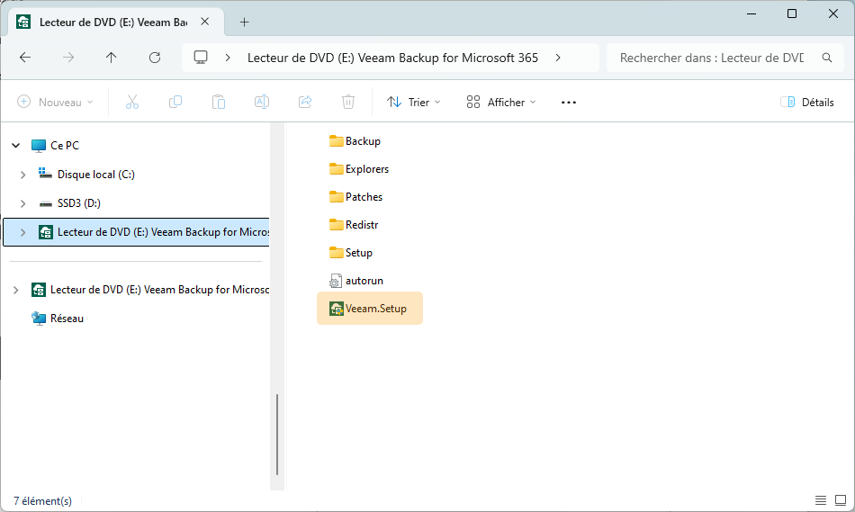{.thumbnail .h-600}
>>
> **Step 2**
>>
>> Click `Install`{.action}, then select the first item in the `Veeam Backup for Microsoft 365` list to install all components.
>>
>> 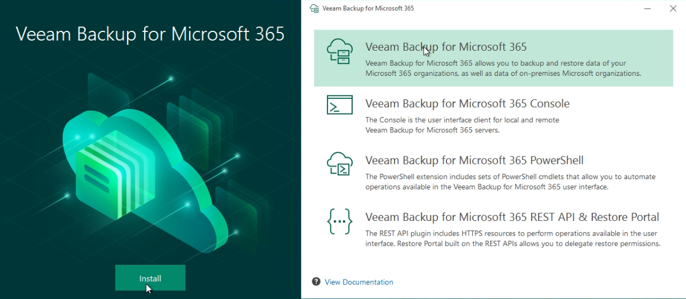{.thumbnail .h-600}
>>
> **Step 3**
>>
>> Read and confirm the Veeam Backup Terms of Use by clicking `I Accept`{.action}.
>>
>> {.thumbnail .h-600}
>>
> **Step 4**
>>
>> - If you have a Veeam Backup license, you can load it from your computer by clicking the `Browse...`{.action} button.
>> - Leave the `Update license automatically` box ticked.
>> - Click `Next`{.action} to proceed to the next step.
>>
>> > [!primary]
>> >
>> > Unlicensed, use of Veeam Backup is **limited to 10 email accounts**.
>>
>> 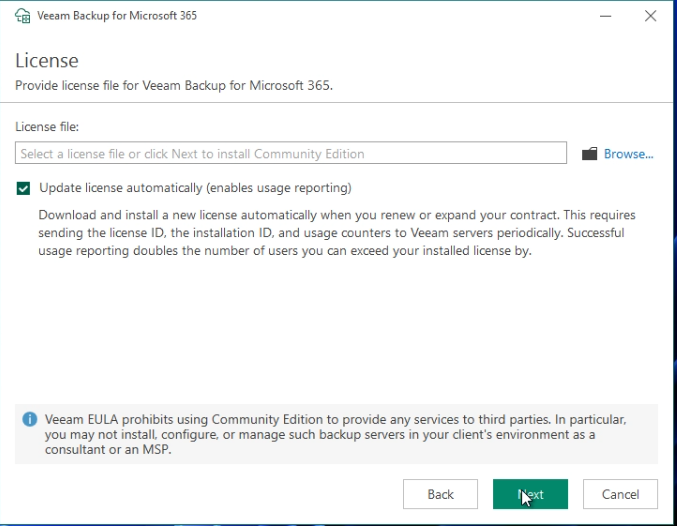{.thumbnail .h-600}
>>
> **Step 5**
>>
>> - The installation tunnel automatically sets the database instance and NATS server credentials. Retrieve the elements indicated in the window below or click `Customize Settings`{.action} to define the settings yourself.
>> - Launch the installation by clicking `Install`{.action}.
>> - After this installation, you can go to the [Configure Veeam Backup](#configure-veeam) chapter.
>>
>> > [!warning]
>> >
>> > If Veeam Backup has already been installed on your computer and/or you do not get the same window as below, **proceed to step 6**.
>>
>> 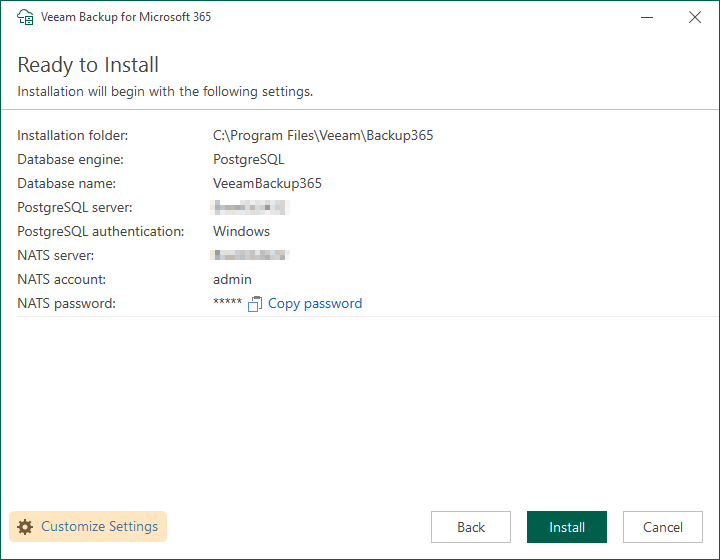{.thumbnail .h-600}
>>
> **Step 6**
>>
>> - If you do not have a Veeam Backup database instance, you can create one by clicking directly on `Next`{.action}.
>> - **OR** you can connect to an existing instance by selecting `Use existing instance` and `Native authentication with the following credentials`, then filling in the connection information.
>>
>> {.thumbnail .h-600}
>>
> **Step 7**
>>
>> - For a new instance, enter a strong username (`Username`) and password (`Password`). If you already have an existing instance, select `Use existing instance` and enter the corresponding information.
>> - Click `Next`{.action} to proceed to the next step.
>>
>> {.thumbnail .h-600}
>>
> **Step 8**
>>
>> Launch the installation by clicking `Install`{.action}.
>>
>> {.thumbnail .h-600}

### Configure Veeam Backup 

#### Connect Veeam Backup to your Exchange platform

Find out how to add your Exchange platform to Veeam Backup before you can create backup operations on your email accounts.

Follow the configuration steps by clicking on the 10 tabs below:

> [!tabs]
> **Step 1**
>>
>> Launch the `Veeam Backup for Microsoft 365` application from the Windows menu or on your desktop.
>>
>> {.thumbnail .h-600}
>>
> **Step 2**
>>
>> By default, Veeam Backup allows you to log in locally to your computer. Click `Connect`{.action}.
>>
>> {.thumbnail .h-600}
>>
> **Step 3**
>>
>> If you have not entered a license, a message will appear reminding you that you are limited to 10 users (10 email accounts). Click `No`{.action} to continue or `Yes`{.action} if you wish to associate a license with your installation.
>>
>> 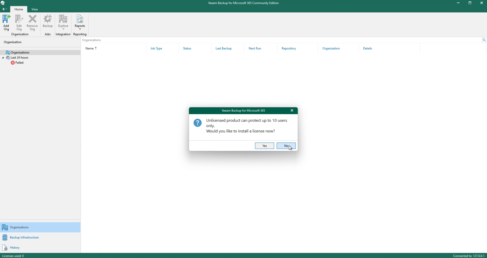{.thumbnail .h-600}
>>
> **Step 4**
>>
>> Click `Add Org`{.action} in the top left of your window.
>>
>> 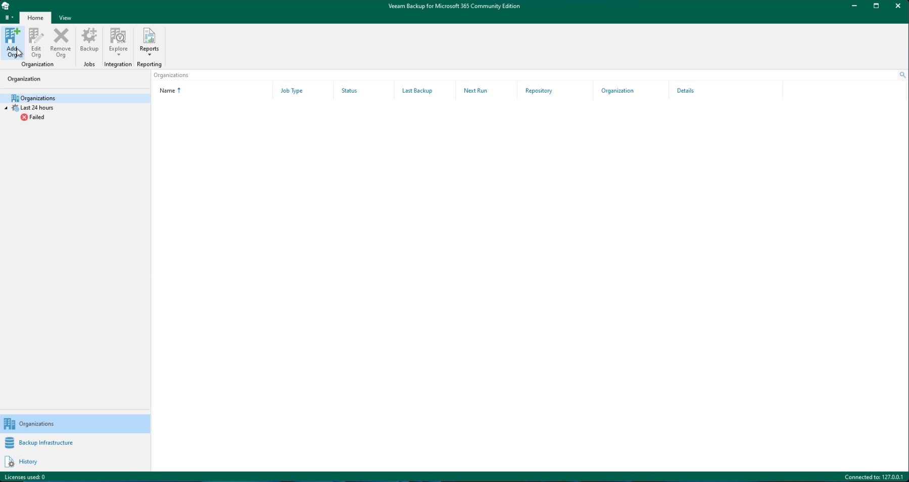{.thumbnail .h-600}
>>
> **Step 5**
>>
>> In the `Select organization deployment type` dropdown menu, select `On-premise`{.action}, then deselect `SharePoint Server`.
>>
>> {.thumbnail .h-600}
>>
> **Step 6**
>>
>> Before you proceed, you must create a user named "Impersonate User" on your Exchange platform. To create this type of user, log in to the [OVHcloud APIs](/links/api) and use the following API call:
>>
>> > [!api]
>> >
>> > @api {v1} /email/exchange POST /email/exchange/{organizationName}/service/{exchangeService}/impersonatedUser
>>
>> - In the `exchangeService` and `organizationName` boxes, enter the reference for your Exchange platform, visible from your [OVHcloud Control Panel](/links/manager) in the `Web Cloud`{.action} > `Microsoft`{.action} > `Exchange`{.action} section, by selecting the platform concerned.
>>
>> - Enter a password of at least 15 characters between the quotation marks, next to `"password": `.
>>
>> - Click `Execute`{.action} below to start creating your “Impersonate User”.
>>
>> 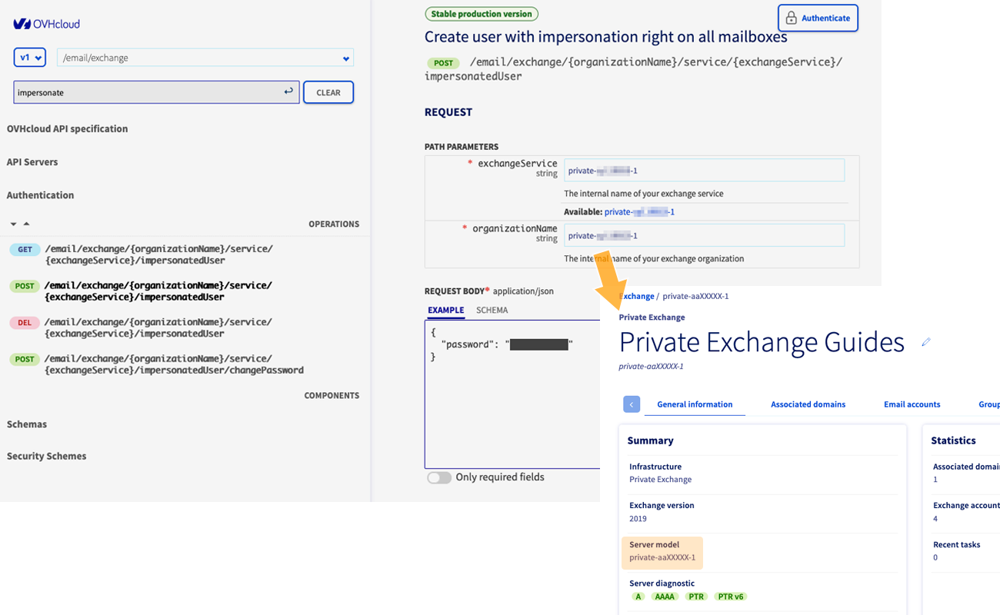{.thumbnail .h-600}
>>
> **Step 7**
>>
>> Retrieve the name of your "Impersonate User" with the following API call:
>>
>> > [!api]
>> >
>> > @api {v1} /email/exchange GET /email/exchange/{organizationName}/service/{exchangeService}/impersonatedUser
>>
>> - In the `exchangeService` and `organizationName` boxes, enter the reference for your Exchange platform that you retrieved in the previous step.
>>
>> - Click `Execute`{.action} below.
>>
>> - The name of the "Impersonate User" corresponds to the value `"upn": ` visible in the `RESPONSE` of the API call.
>>
>> {.thumbnail .h-600}
>>
> **Step 8**
>>
>> - Enter the host name of your Exchange platform. You can view it from your [OVHcloud Control Panel](/links/manager) in the `Web Cloud`{.action} > `Microsoft`{.action} > `Exchange`{.action} section, by selecting the platform concerned.
>>
>> - The host name corresponds to the value mentioned to access the webmail.
>>
>> {.thumbnail .h-600}
>>
> **Step 9**
>>
>> From the Veeam Backup interface, enter the following information:
>>
>> - `Server name` : Host name of the Exchange platform listed in step 8, enter it without the `https://`.
>> - `Username`: Username recorded in step 7 corresponding to the Impersonate User.
>> - `Password`: The password for the Impersonate User defined in step 6.
>>
>> {.thumbnail .h-600}
>>
> **Step 10**
>>
>> - You should get the same results as on the screenshot below (ignore the warning `Check ApplicationImpersanation role`).
>> - Click `Finish`{.action} to finish connecting to the Exchange platform.
>>
>> {.thumbnail .h-600}

#### Create email account backup operations

Once your Exchange platform has been added to Veeam backup, find out how to create a backup operation for your email accounts.

Follow the creation steps by clicking on the 9 tabs below:

> [!tabs]
> **Step 1**
>>
>> Your Exchange server is visible in the `Organization` column on the left. Select it.
>>
>> {.thumbnail .h-600}
>>
> **Step 2**
>>
>> Right-click in the window in the center and click `Add to backup job...`{.action}.
>>
>> 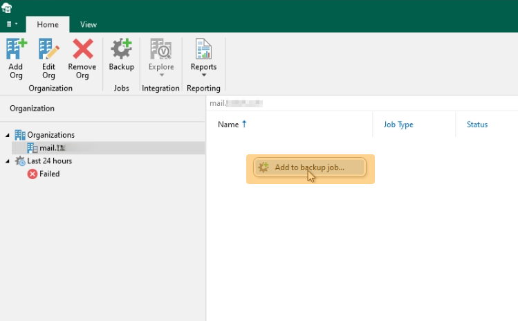{.thumbnail .h-600}
>>
> **Step 3**
>> Enter a name and description for your backup operation, then click `Next`{.action}.
>>
>> {.thumbnail .h-600}
>>
> **Step 4**
>>
>> - Select `Back up the following object`{.action}.
>> - Click `Add`{.action}, then `Users`{.action}.
>>
>> 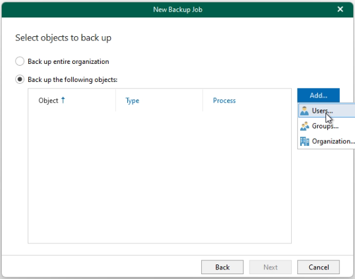{.thumbnail .h-600}
>>
> **Step 5**
>>
>> From this window, determine whether your backup operation affects one or more accounts at once.
>>
>> - Select the email account(s) you would like to assign to your backup operation.
>> - Click `Add`{.action} when you have finished your selection.
>>
>> {.thumbnail .h-600}
>>
> **Step 6**
>>
>> - The selected items appear in the window.
>> - Click `Next`{.action} to proceed to the next step.
>>
>> {.thumbnail .h-600}
>>
> **Step 7**
>> From this window, you can add exclusion rules using the `Add`{.action} button. These settings will be applied to the email accounts you have selected. For example, you can exclude a specific calendar or folder.
>>
>> > [!warning]
>> >
>> > If you want specific exclusion rules for each email account, you will need to create several backup operations for each email account.
>>
>> - Click `Next`{.action} to proceed to the next step.
>>
>> 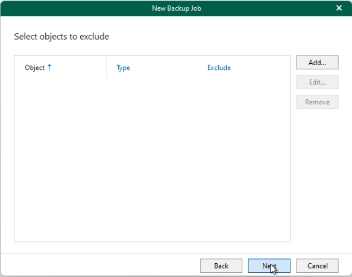{.thumbnail .h-600}
>>
> **Step 8**
>> Select the backup repository that is located, by default, on your computer.
>>
>> 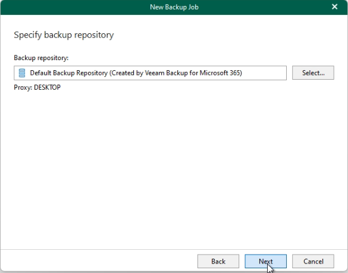{.thumbnail .h-600}
>>
> **Step 9**
>>
>> - From this window, set backup scheduling options if desired.
>> - Tick `Start the job` if you want to start the backup operation immediately.
>> - Click `Create`{.action} to finish creating the backup operation.
>>
>> 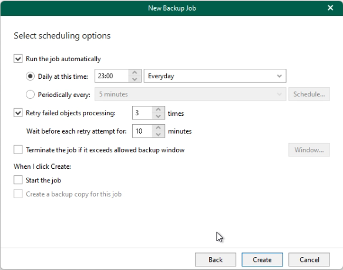{.thumbnail .h-600}

#### Launch an email account backup operation

When a backup operation is created, find out how to start it and retrieve the backup.

Follow the launch steps by clicking on the 4 tabs below:

> [!tabs]
> **Step 1**
>>
>> From the list of backup operations, select the one you want to launch, right-click on it, then click `Start`{.action}.
>>
>> 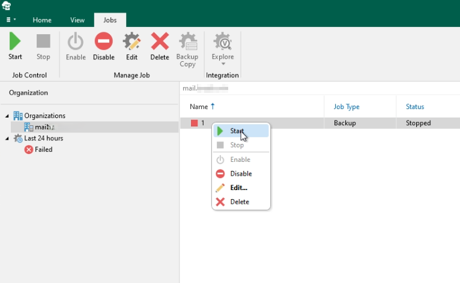{.thumbnail .h-600}
>>
> **Step 2**
>>
>> Once the operation is complete, in the lower part of your Veeam Backup interface, you will find the backup report.
>>
>> 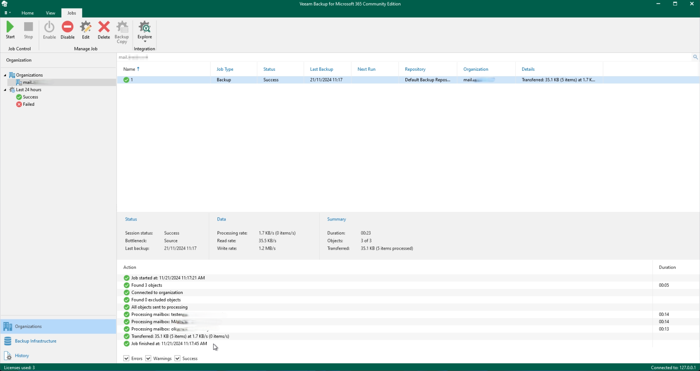{.thumbnail .h-600}
>>
> **Step 3**
>>
>> - Click `Explore`{.action} in the top horizontal menu bar.
>> - Choose the last backup with the `Explore the Exchange state of...`{.action} **or** choose other backups via `Explore Exchange point-in-time state...`{.action}.
>>
>> {.thumbnail .h-600}
>>
> **Step 4**
>>
>> In the left-hand column, you will see a list of your saved email accounts. Right-click on the email account of your choice. There are two choices:
>>
>> - Export a backup to a file `.pst` using the `Export to...`{.action} buttons
>> - Restore a backup directly to an email account using the `Restore to...`{.action} buttons
>>
>> 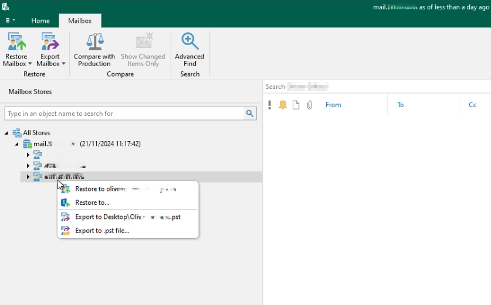{.thumbnail .h-600}

## Go further 

[Getting started with the Private Exchange service](/pages/web_cloud/email_and_collaborative_solutions/microsoft_exchange/exchange_veeam_backup)

For specialised services (SEO, development, etc.), contact [OVHcloud partners](/links/partner).

If you would like assistance using and configuring your OVHcloud solutions, please refer to our [support offers](/links/support).

Join our [community of users](/links/community).