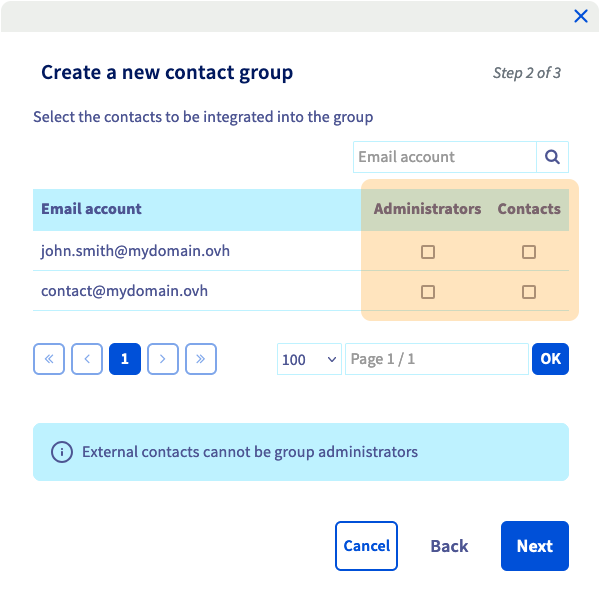

## Objetivo

Los grupos de Exchange permiten que varios participantes puedan comunicarse a través del envío de emails a una única dirección del grupo. Con esta función colaborativa puede crear y gestionar listas de correo que incluyan tanto a usuarios Exchange como a contactos externos.

**Esta guía explica cómo usar los grupos de Exchange a través del área de cliente de OVHcloud y Outlook Web App (OWA).**

## Requisitos

- Tener acceso al [panel de control de OVHcloud](/links/manager)
- Tener una [solución Exchange de OVHcloud](/links/web/emails-hosted-exchange) activa.

## Procedimiento

### Crear un grupo nuevo

Primero acceda a su [área de cliente de OVHcloud](/links/manager), diríjase a la sección `Webcloud`{.action}, y seleccione su servicio Exchange de la columna que está debajo de `Microsoft`{.action} `Exchange`{.action}. Haga clic en la pestaña `Grupos`{.action} del menú horizontal.

{.thumbnail .w-600 .h-600}

Al hacer clic en `Crear un grupo de contactos`{.action} se abrirá una nueva ventana donde podrá configurar las opciones del grupo:

{.thumbnail .w-600 .h-600}

- **Dirección de correo electrónico**: configure una nueva dirección para enviar mensajes a la lista de correo. Tenga cuidado de no utilizar una dirección que ya esté operativa.
- **Nombre del grupo**: Utilice el nombre que aparece en su [área de cliente de OVHcloud](/links/manager) y en su [correo web de OVHcloud](/links/web/email) (OWA).
- **Tamaño máximo de entrada o salida**: Puede especificar el tamaño máximo de los mensajes de correo electrónico entrantes y salientes.
- **Ocultar en Outlook**: si está marcado, la dirección del grupo no aparecerá en la lista de direcciones del servicio Exchange.
- **Requiere autenticación**: Si se marca esta casilla, solo los usuarios de la misma plataforma podrán enviar mensajes con la dirección del grupo.

Haga clic en `Siguiente`{.action} para continuar.

En la segunda página, seleccione los **Contactos** del grupo y designe los **Administradores**. Estas opciones solo se tomarán de las direcciones de correo electrónico y los contactos externos que ya figuren en el servicio.

- **Administradores**: Cuentas de correo electrónico autorizadas a enviar correo electrónico a todos los contactos del grupo.
- **Contactos**: Cuentas de correo electrónico que recibirán los mensajes de correo electrónico enviados al grupo por los administradores.

> [!primary]
>
> Tenga en cuenta que los administradores deben configurarse como **Contactos** para recibir los mensajes de correo electrónico del grupo.

{.thumbnail .w-600 .h-600}

Haga clic en `Siguiente`{.action} para continuar y haga clic en `Confirmar`{.action} para finalizar las opciones.

### Administrar grupos

Después de crear el grupo, puede cambiar la configuración que haya establecido. Para ello, haga clic en `...`{.action} a la derecha del grupo en la tabla.

{.thumbnail .w-600 .h-600}

#### Administrar los usuarios de un grupo

Para añadir `Contacts` a su grupo o definir los `Administradores`, haga clic en el botón `...`{.action} y luego en `Configurar los usuarios`{.action}. Marque los atributos que quiera asociar a las direcciones de correo electrónico en la columna `Cuenta de correo`.

> [!primary]
>
> Un grupo puede contener un máximo de 10.000 contactos.

{.thumbnail .w-600 .h-600}

#### Administrar las delegaciones de un grupo

Aparecerá la opción `Configurar delegaciones`{.action} del menú. Esta opción le permite delegar el acceso del mismo modo que se hace para una cuenta Exchange. Encontrar todos los detalles en [esta guía](/pages/web_cloud/email_and_collaborative_solutions/microsoft_exchange/feature_delegation).

{.thumbnail .w-600 .h-600}

> [!primary]
>
> Tenga en cuenta que cada cambio en este servicio puede tardar unos minutos en aplicarse. Puede comprobar el estado de la mayoría de las operaciones seleccionando las opciones `Plus`{.action} y `Tareas recientes`{.action} en el menú horizontal.

### Enviar mensajes a un grupo en OWA

Ahora puede probar su lista de correo a través del [webmail de OVHcloud](/links/web/email) (OWA) simplemente mandando un correo a la dirección del grupo.

## Más información

[Delegar permisos en una cuenta Exchange](/pages/web_cloud/email_and_collaborative_solutions/microsoft_exchange/feature_delegation)

[Usar Outlook Web App con una cuenta Exchange](/pages/web_cloud/email_and_collaborative_solutions/using_the_outlook_web_app_webmail/email_owa)

[Compartir calendarios en OWA](/pages/web_cloud/email_and_collaborative_solutions/using_the_outlook_web_app_webmail/owa_calendar_sharing)

Para servicios especializados (posicionamiento, desarrollo, etc.), contacte con [partners de OVHcloud](/links/partner).

Si quiere disfrutar de ayuda para utilizar y configurar sus soluciones de OVHcloud, puede consultar nuestras distintas soluciones [pestañas de soporte](/links/support).

Interactúe con nuestra [comunidad de usuarios](/links/community).