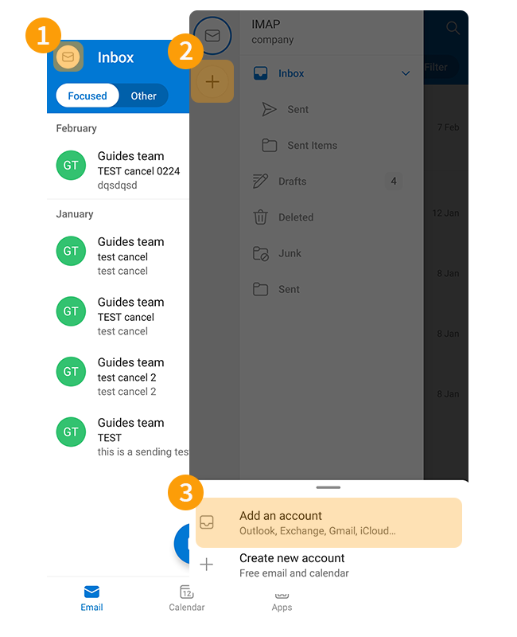
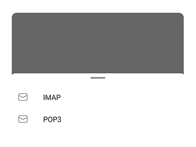

## Objective

MX Plan accounts can be configured on various compatible email clients. This allows you to use your email address from the device of your choice. The Outlook app from Microsoft on Android is available for free from the Google Play Store.

**Find out how to configure your MX Plan email address on the Outlook mobile app for Android**

> [!warning]
>
> OVHcloud provides services that you are responsible for configuring, managing and managing. It is therefore up to you to ensure that it works properly.
>
> We have provided you with this guide in order to help you with common tasks. Nevertheless, we recommend contacting a [specialized partner](https://marketplace.ovhcloud.com/c/support-collaboration) and/or the service publisher if you experience any difficulties. We will not be able to assist you. You can find more information in the “Go further” section of this guide.

## Requirements

- an MX Plan email address (included in the MX Plan solution, or in an [OVHcloud Web Hosting solution](/links/web/hosting)).
- You need to have the Outlook app on your mobile device [Android](https://play.google.com/store/apps/details?id=com.microsoft.office.outlook&hl=en).
- You must have the login details for the email address you would like to configure.

## Instructions

### Add an account 

- **When you start the application for the first time**: A configuration wizard will appear. Tap `Add account`{.action}.

{.thumbnail .w-400 .h-600}

- **If an account has already been set up**:
    - Press the envelope " &#9993; " at the top left of your screen.
    - Then press the `+`{.action} button in the left-hand vertical bar.
    - Press `Add Account`{.action}.

{.thumbnail .w-400 .h-600}

Follow the installation steps by clicking on the tabs below:

> [!tabs]
> **Step 1**
>>
>> Enter your email address and press `Continue`{.action}.
>>
>> {.thumbnail .w-400 .h-600}
>>
> **Step 2**
>>
>> Select the receive protocol, **IMAP**(recommended) or **POP3**.
>>
>> {.thumbnail .w-400 .h-600}
>>
>> > [!warning]
>> >
>> > If the protocol selection window does not appear, press the `?` button in the top right-hand corner of the screen, then choose `Change account provider`{.action}. Then select `IMAP`(recommended) or `POP3`. 
>> > {.thumbnail .w-400 .h-600}
>>
> **Step 3 - IMAP**
>>
>> In the next window, tick `Advanced settings`{.action} and enter the following information:
>>
>> - **Email address**
>> - **Full name** : enter your full email address
>> - **Description**
>> - **IMAP Incoming Mail Server**: - **IMAP Hostname**: For the **EUROPE**, type `imap.mail.ovh.net` or `ssl0.ovh.net`. For **AMERICA/ASIA**, type `imap.mail.ovh.ca` - **Port**: 993 - **Security Type**: SSL/TLS - **IMAP Username**: Your full email address - **IMAP password**: Your email address password
>> - **SMTP Incoming Mail Server**: - **SMTP Hostname**: For the **EUROPE**, type `smtp.mail.ovh.net` or `ssl0.ovh.net` . For **AMERICA/ASIA**, type `smtp.mail.ovh.ca` - **Port**: 465 - **Security Type**: SSL/TLS - **SMTP Username**: Your full email address - **SMTP password**: Your email address password
>>
>> To finalize the configuration, click the “ &#10003; ” button
>>
>> {.thumbnail .w-400 .h-600}
>>
> **Step 3 - POP3**
>>
>> In the next window, tick `Advanced settings`{.action} and enter the following information:
>>
>> - **Email address**
>> - **Full name** : Enter your full email address
>> - **Description**
>> - **POP3 Incoming Mail Server**: - **POP3 Hostname**: For the **EUROPE**, type `pop.mail.ovh.net` or `ssl0.ovh.net` . For **AMERICA/ASIA**, type `pop.mail.ovh.ca` - **Port**: 995 - **Security Type**: SSL/TLS - **POP3 User Name**: Your full email address - **POP3 Password**: Your email address password
>> - **SMTP Incoming Mail Server**: - **SMTP Hostname**: For the **EUROPE**, type `smtp.mail.ovh.net` or `ssl0.ovh.net`. For **AMERICA/ASIA**, type `smtp.mail.ovh.ca` - **Port**: 465 - **Security Type**: SSL/TLS - **SMTP Username**: Your full email address - **SMTP password**: Your email address password
>>
>> To finalize the configuration, click the “ &#10003; ” button
>>
>> {.thumbnail .w-400 .h-600}
>>

> [!warning]
>
> If, after following the configuration steps above, you encounter a sending or receiving error, please refer to the topic “[Modify existing settings](#modify-settings)”.

### Use the email address

Once you have configured your email address, you can start using it! You can now send and receive messages.

OVHcloud also offers a web application that can be used to access your email address from a web browser. You can access it here: [Webmail](/links/web/email). You can log in using your email credentials. If you have any questions on how to use it, please use our guides [View your account via the OWA interface](/pages/web_cloud/email_and_collaborative_solutions/using_the_outlook_web_app_webmail/email_owa) or [Use your email address via the Roundcube webmail](/pages/web_cloud/email_and_collaborative_solutions/mx_plan/email_roundcube#or-and-how-to-log-in-via-webmail-roundcube).

### Modify existing settings 

The Outlook application does not allow you to modify the server settings of your email account.

If your email account is already set up and you want to set it up again, you will need to delete and recreate it:

1. Press the envelope " &#9993; " at the top left of your screen.
2. Press the " &#9965; " adjustment icon at the bottom of the left column.
3. In the "General" section, press `Accounts` to view all of the email addresses configured on the application.

{.thumbnail .w-400 .h-600}

- Select the email account concerned.
- Press `Delete account`{.action}.
- Tap `Delete`{.action} at the question “Do you want to delete the account?”.

{.thumbnail .w-400 .h-600}

> [!success]
>
> Once you have deleted your email account, follow the instructions in the “[Add account](#add-account)” section of this guide.

### Reminder of POP, IMAP and SMTP settings 

### IMAP and POP Receive Settings

When you choose your account type, we recommend using **IMAP** to receive emails. However, you can select **POP**.

> [!warning]
>
> Please note down the value that corresponds to your location (**EUROPE** or **AMERICA/ASIA-PACIFIC**)

Follow the installation steps by clicking on the tabs below:

> [!tabs]
> **IMAP configuration**
>>
>> - **Username**: Enter the **full** email address
>> - **Password**: Enter the password for the email address
>> - **EUROPE Server (incoming)**: imap.mail.ovh.net **ou** ssl0.ovh.net
>> - **AMERICA/ASIA-PACIFIC server (incoming)**: imap.mail.ovh.ca
>> - **Port**: 993
>> - **Security type**: SSL/TLS
>>
> **POP configuration**
>>
>> - **Username**: Enter the **full** email address
>> - **Password**: Enter the password for the email address
>> - **EUROPE server (incoming)**: pop.mail.ovh.net **or** ssl0.ovh.net
>> - **AMERICA/ASIA-PACIFIC server (incoming)**: pop.mail.ovh.ca
>> - **Port**: 995
>> - **Security type**: SSL/TLS

#### SMTP Send Settings

For sending emails, if you have to enter the **SMTP** settings manually in your account preferences, you will find the settings below:

**SMTP configuration**

- **Username**: Enter the **full** email address
- **Password**: Enter the password for the email address
- **EUROPE server (incoming)**: pop.mail.ovh.net **ou** ssl0.ovh.net
- **AMERICA/ASIA-PACIFIC server (incoming)**: pop.mail.ovh.ca
- **Port**: 995
- **Security type**: SSL/TLS

> [!primary]
>
> **Change your configuration**
>
> If your email address is configured in **IMAP** and you want to change this configuration to **POP**, you will need to delete the account, then recreate it in **POP**. Refer to the “[Modify existing settings](#modify-settings)” chapter of this guide.

## Go further 

> [!primary]
>
> For more information about configuring an email address from the Outlook application on Android, see [the Microsoft Help Center](https://support.microsoft.com/en-gb/office/configure-email-%C3%A9email-%C3%A0-l-help-for-Outlook-application-for-android-886db551-8dfa-4fd5-b835-f8e532091872).

For specialised services (SEO, development, etc.), contact [OVHcloud partners](/links/partner).

If you would like assistance using and configuring your OVHcloud solutions, please refer to our [support offers](/links/support).

Join our [community of users](/links/community).