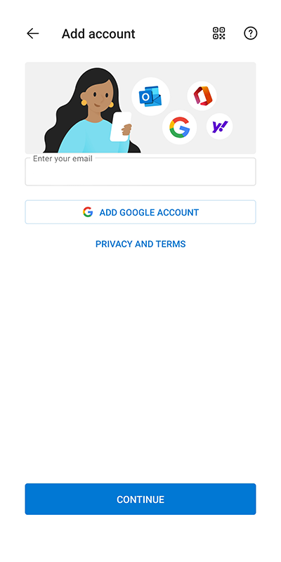
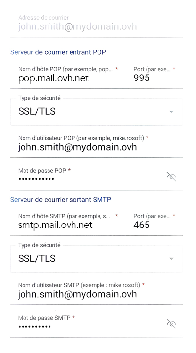

## Obiettivo

Gli account MX Plan possono essere configurati su client di posta compatibili. per permetterti di utilizzare il tuo indirizzo email dal dispositivo che preferisci. L'applicazione Microsoft Outlook su Android è disponibile gratuitamente dal Google Play Store.

**Questa guida ti mostra come configurare il tuo indirizzo email MX Plan sull’applicazione mobile Outlook per Android**

> [!warning]
>
> OVHcloud mette a disposizione i servizi ma non si occupa della loro configurazione e gestione. garantirne il corretto funzionamento è quindi responsabilità dell’utente.
>
> Questa guida ti aiuta a eseguire le operazioni necessarie alla configurazione del tuo account. Tuttavia, in caso di difficoltà o dubbi, ti consigliamo di contattare un [partner specializzato](https://marketplace.ovhcloud.com/c/support-collaboration) o il fornitore del servizio. OVH non sarà infatti in grado di fornirti assistenza. Per maggiori informazioni consulta la sezione "Per saperne di più".

## Prerequisiti

- Disporre di un indirizzo email MX Plan (compreso in una soluzione MX Plan o in una soluzione di [hosting Web OVHcloud](/links/web/hosting)).
- Avere l’applicazione Outlook sul proprio dispositivo mobile [Android](https://play.google.com/store/apps/details?id=com.microsoft.office.outlook&hl=it).
- Disporre delle credenziali associate all’indirizzo email da configurare.

## Procedura

### Aggiungi l'account 

- **Al primo avvio dell’applicazione** : compare l’assistente di configurazione, clicca su `Aggiungi account`{.action}.

{.thumbnail .w-400 .h-600}

- **Se è già stato impostato un account**:
    - Premere lo skin " &#9993;" in alto a sinistra.
    - Clicca sul pulsante `+`{.action} nella barra verticale sinistra.
    - Clicca su `Aggiungi account`{.action}.

{.thumbnail .w-400 .h-600}

Segui i passaggi di installazione cliccando sulle schede qui sotto:

> [!tabs]
> **Step 1**
>>
>> Inserisci il tuo indirizzo email e clicca su `Continua`{.action}.
>>
>> {.thumbnail .w-400 .h-600}
>>
> **Step 2**
>>
>> Selezionare il protocollo di ricezione, **IMAP**(consigliato) o **POP3**.
>>
>> {.thumbnail .w-400 .h-600}
>>
>> > [!warning]
>> >
>> > Se la finestra di scelta del protocollo non appare, clicca sul pulsante `?` nell’angolo superiore destro dello schermo e seleziona `Cambia provider account`{.action}. Seleziona `IMAP`(consigliato) o `POP3`. 
>> > {.thumbnail .w-400 .h-600}
>>
> **Step 3 - IMAP**
>>
>> Nella finestra successiva, spunta `Impostazioni avanzate`{.action} e inserisci le informazioni seguenti:
>>
>> - **Indirizzo email**
>> - **Nome visualizzato**: inserisci l’indirizzo email completo
>> - **Descrizione**
>> - **Server di posta in entrata IMAP**: - **Hostname IMAP**: per l'**EUROPA**, digitare `imap.mail.ovh.net` o `ssl0.ovh.net`. Per l'**AMERICA/ASIA**, inserisci `imap.mail.ovh.ca` - **Porta**: 993 - **Tipo di sicurezza**: SSL/TLS - **Nome utente IMAP***: il tuo indirizzo email completo - **Password IMAP**: quello del tuo indirizzo email
>> - **Server di posta in entrata SMTP**: - **Host Name SMTP**: per l'**EUROPA**, digitare `smtp.mail.ovh.net` o `ssl0.ovh.net` . Per l'**AMERICA/ASIA**, inserisci `smtp.mail.ovh.ca` - **Porta**: 465 - **Tipo di sicurezza**: SSL/TLS - **Nome utente SMTP**: il tuo indirizzo email completo - **Password SMTP**: quello del tuo indirizzo email
>>
>> Per completare la configurazione, clicca sul pulsante " &#10003;"
>>
>> {.thumbnail .w-400 .h-600}
>>
> **Step 3 - POP3**
>>
>> Nella finestra successiva, spunta `Impostazioni avanzate`{.action} e inserisci le informazioni seguenti:
>>
>> - **Indirizzo email**
>> - **Nome visualizzato**: Inserisci l’indirizzo email completo
>> - **Descrizione**
>> - **Server di posta in entrata POP3**: - **Hostname POP3**: per l'**EUROPA**, digitare `pop.mail.ovh.net` o `ssl0.ovh.net` . Per l'**AMERICA/ASIA**inserisci `pop.mail.ovh.ca` - **Porta**: 995 - **Tipo di sicurezza**: SSL/TLS - **Nome utente POP3**: il tuo indirizzo email completo - **Password POP3**: quello del tuo indirizzo email
>> - **Server di posta in entrata SMTP**: - **Host Name SMTP**: per l'**EUROPA**, digitare `smtp.mail.ovh.net` o `ssl0.ovh.net`. Per l'**AMERICA/ASIA**, inserisci `smtp.mail.ovh.ca` - **Porta**: 465 - **Tipo di sicurezza**: SSL/TLS - **Nome utente SMTP**: il tuo indirizzo email completo - **Password SMTP**: quello del tuo indirizzo email
>>
>> Per completare la configurazione, clicca sul pulsante " &#10003; "
>>
>> {.thumbnail .w-400 .h-600}
>>

> [!warning]
>
> Se, dopo aver seguito i passaggi di configurazione di cui sopra, si verifica un errore di invio o di ricezione, vedere "[Modifica le impostazioni esistenti](#modify-settings)".

### Utilizza l'indirizzo email

Una volta configurato l’indirizzo email, non ti resta che utilizzarlo! Da questo momento è possibile inviare e ricevere messaggi.

OVHcloud propone anche un’applicazione Web che permette di accedere al tuo indirizzo email da un browser Internet. Per consultare la guida, clicca su questo link: [Webmail](/links/web/email). e accessibile con le credenziali del tuo account. Per qualsiasi domanda relativa al suo utilizzo, consulta le nostre guide [Consulta il tuo account dall'interfaccia OWA](/pages/web_cloud/email_and_collaborative_solutions/using_the_outlook_web_app_webmail/email_owa) o [Utilizza il tuo indirizzo email dalla webmail RoundCube](/pages/web_cloud/email_and_collaborative_solutions/mx_plan/email_roundcube#o-e-come-connettersi-alla-webmail-roundcube).

### Modifica le impostazioni esistenti 

L’applicazione Outlook non permette di modificare le impostazioni server dell’account email.

Se il tuo account email è già stato configurato e vuoi configurarlo di nuovo, è necessario eliminarlo e ricrearlo:

1. Premere lo skin " &#9993; " nell'angolo superiore sinistro dello schermo.
2. Premere l'icona di regolazione " &#9965; " nella parte inferiore della colonna sinistra.
3. Nella sezione "Generale", clicca su `Account` per visualizzare tutti gli indirizzi email configurati sull’applicazione.

{.thumbnail .w-400 .h-600}

- Seleziona l’account email associato.
- Clicca su `Elimina l’account`{.action}.
- Clicca su `Elimina`{.action} alla domanda "Vuoi eliminare l'account?".

{.thumbnail .w-400 .h-600}

> [!success]
>
> Una volta eliminato il tuo account email, segui le istruzioni riportate nella sezione "[Aggiungi account](#add-account)" di questa guida.

### Richiamo dei parametri POP, IMAP e SMTP 

#### Parametri di ricezione IMAP e POP

Per la ricezione delle email, durante la scelta del tipo di account, ti consigliamo di utilizzare il **IMAP**. Tuttavia, è possibile selezionare **POP**.

> [!warning]
>
> È necessario rilevare il valore corrispondente alla tua localizzazione (**EUROPA** o **AMERICA/ASIA PACIFICA**)

Segui i passaggi di installazione cliccando sulle schede qui sotto:

> [!tabs]
> **Configurazione IMAP**
>>
>> - **Nome utente**: Inserisci l'indirizzo email **completo**
>> - **Password**: Inserisci la password dell’indirizzo email
>> - **Server EUROPA (in entrata)**: imap.mail.ovh.net **o** ssl0.ovh.net
>> - **Server AMERICA/ASIA PACIFICA (in entrata)**: imap.mail.ovh.ca
>> - **Porta**: 993
>> - **Tipo di sicurezza**: SSL/TLS
>>
> **Configurazione POP**
>>
>> - **Nome utente**: Inserisci l'indirizzo email **completo**
>> - **Password**: Inserisci la password dell’indirizzo email
>> - **Server EUROPA (in entrata)**: pop.mail.ovh.net **o** ssl0.ovh.net
>> - **Server AMERICA/ASIA PACIFICA (in entrata)**: pop.mail.ovh.ca
>> - **Porta**: 995
>> - **Tipo di sicurezza**: SSL/TLS

#### Parametri di invio SMTP

Per l’invio delle email, se hai necessità di inserire manualmente le impostazioni **SMTP** nelle preferenze dell’account, trovi qui sotto le impostazioni da utilizzare:

**Configurazione SMTP**

- **Nome utente**: Inserisci l'indirizzo email **completo**
- **Password**: Inserisci la password dell’indirizzo email
- **Server EUROPA (in entrata)**: pop.mail.ovh.net **o** ssl0.ovh.net
- **Server AMERICA/ASIA PACIFICA (in entrata)**: pop.mail.ovh.ca
- **Porta**: 995
- **Tipo di sicurezza**: SSL/TLS

> [!primary]
>
> **Modifica la configurazione**
>
> Se il tuo indirizzo email è configurato in **IMAP** e vuoi modificare questa configurazione in **POP**, elimina l’account e poi ricrealo in **POP**. Consulta il capitolo "[Modifica le impostazioni esistenti](#modify-settings)" di questa guida.

## Per saperne di più 

> [!primary]
>
> Per ulteriori informazioni sulla configurazione di un indirizzo e-mail dall'applicazione Outlook su Android, vedere [Microsoft Help Center](https://support.microsoft.com/it-it/office/configurazione-posta-%C3%A9elettronica-%C3%A0-l-aiuto-dell-applicazione-outlook-per-android-886db551-8dfa-4fd5-b835-f8e532091872).

Per prestazioni specializzate (referenziamento, sviluppo, ecc...), contatta i [partner OVHcloud](/links/partner).

Per usufruire di un supporto per l'utilizzo e la configurazione delle soluzioni OVHcloud, è possibile consultare le nostre soluzioni [offerte di supporto](/links/support).

Contatta la nostra [Community di utenti](/links/community).