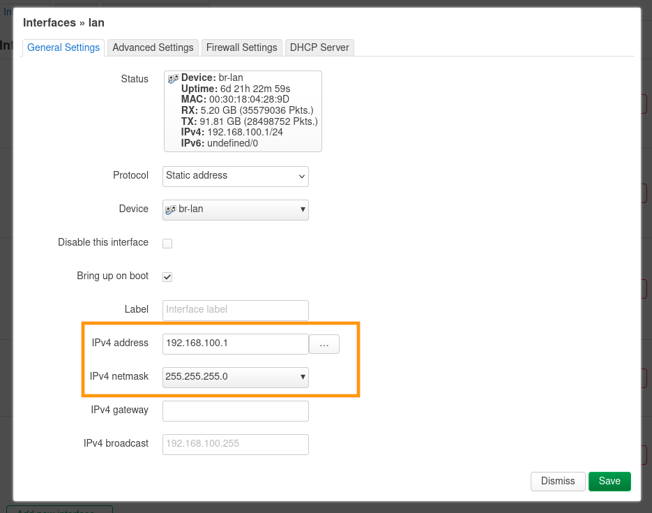
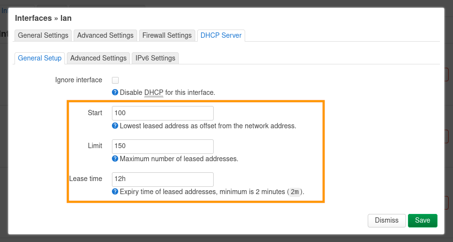
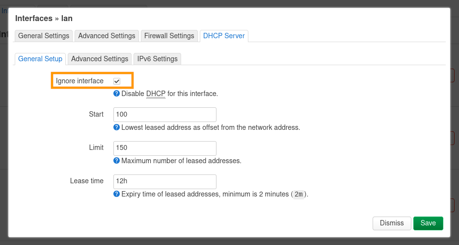
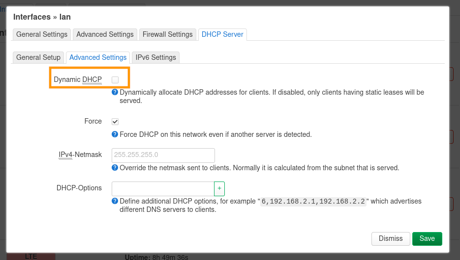
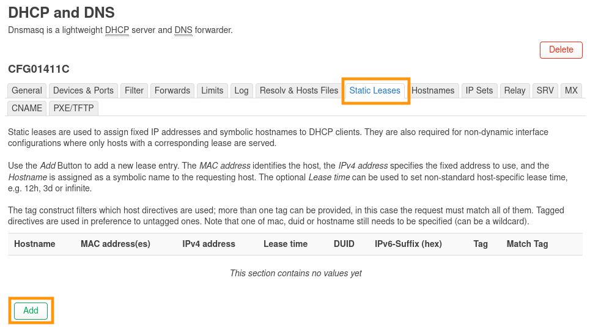
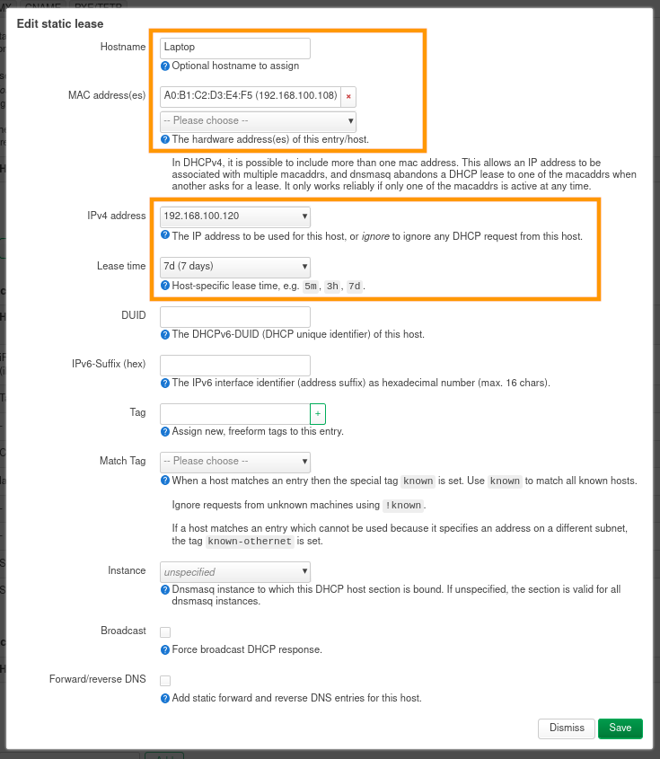
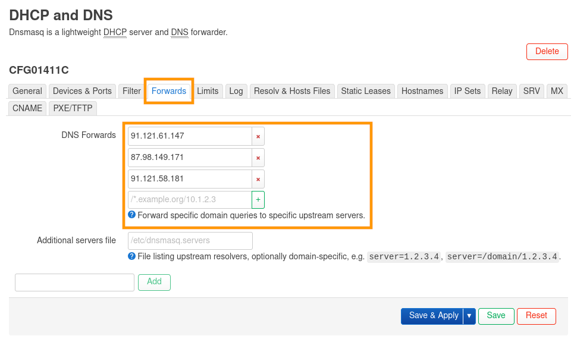
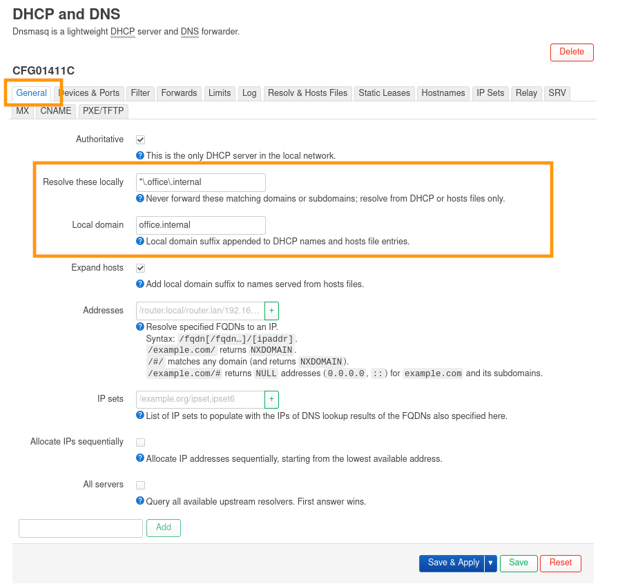
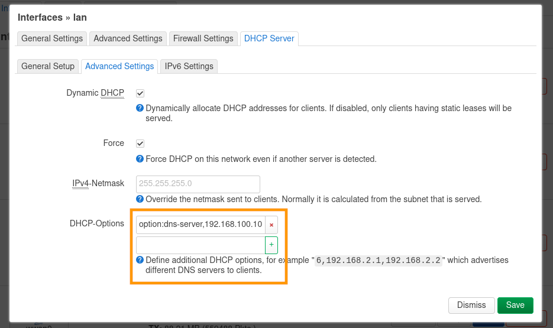

## Objectif

Découvrez comment configurer votre réseau local depuis l'interface de votre **OverTheBox**. Ce guide vous permet de :

- Modifier l'adressage du réseau local de l'OverTheBox.
- Modifier la configuration DHCP de l'OverTheBox.
- Modifier la configuration DNS de l'OverTheBox.

## Prérequis

- Une **OverTheBox** fournie par OVHcloud ou une installation depuis [le projet Open Source](/pages/web_cloud/internet/overthebox/advanced_installer_limage_overthebox_sur_votre_materiel).
- Être connecté à l'interface web de l'**OverTheBox** depuis [overthebox.ovh](http://overthebox.ovh) ou [192.168.100.1](https://192.168.100.1).

## En pratique

### Modifier l'adressage local

- Rendez-vous dans l'onglet `Network > Interfaces`{.action}.
- Cliquez sur le bouton `Edit`{.action} de l'interface `LAN`.

{.thumbnail}

> [!primary]
>
> Les plages d'adresses IPv4 privées sont standardisées, votre réseau doit être contenu dans l'une de ces plages :
>
> - 10.0.0.0/8
> - 192.168.0.0/16
> - 172.16.0.0/12
>

- Modifiez le paramètre `IPv4 address`{.action} pour modifier l'IP locale de l'**OverTheBox**.
- Modifiez le paramètre `IPv4 netmask`{.action} si vous souhaitez que votre réseau local soit différent d'un sous-réseau `/24`. Un réseau `/24` permet de distribuer 254 IP, il n'est en général pas nécessaire de le modifier.
- Cliquez sur `Save`{.action} pour sauvegarder vos modifications.
- Cliquez sur `Save & Apply`{.action} pour appliquer vos modifications.

{.thumbnail}

> [!success]
>
> La plage d'IP hôte du serveur DHCP sera automatiquement mise à jour pour fonctionner avec cette nouvelle IP LAN.
>

### Modifier la plage du DHCP

- Rendez-vous dans l'onglet `Network > Interfaces`{.action}.
- Cliquez sur le bouton `Edit`{.action} de l'interface `LAN`.

{.thumbnail}

> [!primary]
>
> La plage du DHCP doit être incluse dans votre sous-réseau, soit maximum 253 IP pour un réseau `/24`.
>

- Rendez-vous dans l'onglet `DHCP Server`{.action}.
- Modifiez le paramètre `Start`{.action} pour modifier le début de la plage utilisée par le serveur DHCP.
- Modifiez le paramètre `Limit`{.action} pour modifier le nombre d'IP que le DHCP peut allouer.
- Modifiez le paramètre `Lease Time`{.action} pour modifier la durée de validité d'une allocation DHCP.
- Par défaut, comme dans notre exemple, le serveur DHCP alloue des IP de `192.168.100.100` à `192.168.100.250` pour une durée de `12 heures`.
- Cliquez sur `Save`{.action} pour sauvegarder vos modifications.
- Cliquez sur `Save & Apply`{.action} pour appliquer vos modifications.

{.thumbnail}

### Désactiver le serveur DHCP

- Rendez-vous dans l'onglet `Network > Interfaces`{.action}.
- Cliquez sur le bouton `Edit`{.action} de l'interface `LAN`.

{.thumbnail}

> [!warning]
>
> Désactiver le DHCP signifie que l'**OverTheBox** n'attribuera plus automatiquement d'IP locale, cette action doit être accompagnée d'une configuration manuelle de vos équipements ou de la présence d'un autre serveur DHCP sur votre réseau local.
>

- Rendez-vous dans l'onglet `DHCP Server`{.action}.
- Cochez le paramètre `Ignore interface`{.action} pour désactiver le serveur DHCP complètement.
- Cliquez sur `Save`{.action} pour sauvegarder vos modifications.
- Cliquez sur `Save & Apply`{.action} pour appliquer vos modifications.

{.thumbnail}

### Désactiver l'allocation dynamique du DHCP

- Rendez-vous dans l'onglet `Network > Interfaces`{.action}.
- Cliquez sur le bouton `Edit`{.action} de l'interface `LAN`.

{.thumbnail}

> [!warning]
>
> Désactiver l'allocation dynamique du DHCP signifie que l'**OverTheBox** attribuera automatiquement une IP locale uniquement aux équipements configurés pour recevoir un bail statique.
>

- Rendez-vous dans l'onglet `DHCP Server > Advanced Settings`{.action}.
- Décochez le paramètre `Dynamic DHCP`{.action} pour désactiver les allocations dynamiques du serveur DHCP.
- Cliquez sur `Save`{.action} pour sauvegarder vos modifications.
- Cliquez sur `Save & Apply`{.action} pour appliquer vos modifications.

{.thumbnail}

### Configurer un bail DHCP statique

> [!primary]
>
> Un bail DHCP statique permet d'attribuer toujours la même IP à un appareil du réseau. Cela permet de donner une adresse IP statique à un équipement sans modifier la configuration réseau de l'équipement.
>

- Rendez-vous dans l'onglet `Network > DHCP and DNS`{.action}.
- Rendez-vous dans la section `Static Leases`{.action}.
- Cliquez sur le bouton `Add`{.action} pour ajouter un nouveau bail statique.

{.thumbnail}

> [!warning]
>
> L'adresse IP utilisée ne doit être unique pour chaque bail statique. Si deux équipements ont la même adresse, cela créera des conflits réseaux.
>

- Modifiez le paramètre `Hostname`{.action} pour modifier le nom d'hôte, dans notre exemple l'équipement sera `Laptop`.
- Modifiez le paramètre `MAC address`{.action} pour sélectionner l'adresse MAC sur laquelle s'applique la règle. Vous pouvez la sélectionner dans le menu déroulant si l'appareil est déjà connecté au DHCP de l'**OverTheBox**, ou l'entrer manuellement en remplissant le champ `custom`.
- Modifiez le paramètre `IPv4 address`{.action} pour configurer l'adresse IP que le DHCP allouera à l'équipement. Le serveur DHCP allouera toujours cette adresse IP à l'équipement.
- Si vous le souhaitez, modifiez le paramètre `Lease time`{.action} pour allonger le temps d'allocation du bail DHCP pour cet équipement.
- Cliquez sur `Save`{.action} pour sauvegarder vos modifications.
- Cliquez sur `Save & Apply`{.action} pour appliquer vos modifications.

{.thumbnail}

### Configurer les DNS

Par défaut, l'**OverTheBox** utilise les serveurs DNS d'OVHcloud mais vous pouvez les modifier.

- Rendez-vous dans l'onglet `Network > DHCP and DNS`{.action}.
- Rendez-vous dans la section `Forwards`{.action}.
- Modifiez le paramètre `DNS Forwards`{.action} pour configurer les serveurs DNS utilisés par le serveur DHCP.
- Cliquez sur `Save`{.action} pour sauvegarder vos modifications.
- Cliquez sur `Save & Apply`{.action} pour appliquer vos modifications.

{.thumbnail}

### Configurer un nom de domaine local

> [!warning]
>
> Il est possible d'utiliser un nom de domaine avec un TLD officiel, mais vous devez en être le propriétaire pour éviter les conflits réseaux.
> Si vous souhaitez obtenir un nom de domaine, consultez [nos offres sur ovhcloud.com](/links/web/domains).
>

> [!primary]
>
> Depuis août 2024, l'ICANN autorise formellement le TLD `.internal` pour une utilisation au sein d'un réseau privé.
>

Il est possible de configurer un nom de domaine local qui vous permettra d'accéder directement à vos équipements par un nom de domaine.

- Rendez-vous dans l'onglet `Network > DHCP and DNS`{.action}.
- Rendez-vous dans la section `General`{.action}.
- Modifiez le paramètre `Resolve this locally`{.action} pour indiquer au serveur DHCP qu'il ne doit pas chercher l'équipement sur un DNS externe. Dans notre cas, le nom de domaine utilisé étant `office.internal`, nous indiquons donc `*\.office.internal\`.
- Modifiez le paramètre `Local domain`{.action} pour indiquer au serveur DHCP quel nom de domaine local utiliser. Dans notre cas, le nom de domaine utilisé étant `office.internal`, un serveur **NAS** avec le nom d'hôte `nas` sera accessible via le nom de domaine `nas.office.internal` par les autres équipements présents dans le réseau local de l'**OverTheBox**.
- Cliquez sur `Save & Apply`{.action} pour appliquer vos modifications.

{.thumbnail}

### Configurer une option DHCP

- Rendez-vous dans l'onglet `Network > Interfaces`{.action}.
- Cliquez sur le bouton `Edit`{.action} de l'interface `LAN`.

{.thumbnail}

- Rendez-vous dans l'onglet `DHCP Server > Advanced Settings`{.action}.
- Modifiez le paramètre `DHCP-options`{.action} avec les paramètres souhaités. Par exemple, pour un serveur **Active Directory** avec l'IP `191.168.100.10`, ajoutez l'option `option:dns-server,192.168.100.10`.
- Cliquez sur `+` pour confirmer vos modifications.
- Cliquez sur `Save`{.action} pour sauvegarder vos modifications.
- Cliquez sur `Save & Apply`{.action} pour appliquer vos modifications.

{.thumbnail}

## Aller plus loin

### Configurer les interfaces

Si vous souhaitez modifier la configuration des interfaces ou le schéma réseau de l'**OverTheBox**, consultez le guide « [Comment configurer une interface réseau ?](/pages/web_cloud/internet/overthebox/advanced_creer_une_interface_modem_manuellement) ».

**OverTheBox** étant basé sur **OpenWRT**, vous pouvez également consulter la [documentation OpenWRT](https://openwrt.org/docs/start).

Échangez avec notre [communauté d'utilisateurs](/links/community).
