## Objectif

Grâce à un lien 4G, votre **OverTheBox** est capable de tirer parti des réseaux mobiles afin d'améliorer les performances ou la résilience de votre accès internet.
Un lien 4G permet une continuité de service en cas de défaillance sur votre réseau fixe (cuivre ou fibre), en utilisant un autre support technologique pour accéder à Internet.
 De plus, les débits offerts par les connexions 4G sont souvent supérieurs aux connexions cuivre. Cela permet d'améliorer significativement votre débit, en particulier le débit montant, grâce à l'agrégation permise par votre service OverTheBox.

## Prérequis

- Une **OverTheBox V3 LTE** fournie par OVHcloud, ainsi qu'une carte SIM au format micro (3FF).
- Ou un autre modèle **OverTheBox** fourni par OVHcloud ou une [installation depuis le projet Open Source](/pages/web_cloud/internet/overthebox/advanced_installer_limage_overthebox_sur_votre_materiel), ainsi qu'une clé LTE Huawei E3372 ou un téléphone.

## En pratique

### Configurer une OverTheBox V3 LTE

Les matériels **OverTheBox V3 LTE** fournis par OVHcloud sont équipés d'un module 4G Cat12 (SIMCOM 7912E) permettant des débits théoriques descendant de 600Mbps et montant de 150Mbps.

Le port de la carte SIM se trouve sous le module à l’intérieur du boîtier.

#### Étape 1 : Insérer la carte SIM

> [!warning]
>
> Avant de réaliser ces manipulations, vous devez :
>
> - Vous décharger en touchant un objet métallique relié à la terre afin de limiter les risques de décharge électrostatique ([plus d'informations](https://fr.wikihow.com/%C3%A9viter-d%27endommager-un-ordinateur-par-une-d%C3%A9charge-%C3%A9lectrostatique)).
> - Vérifier que le boitier est éteint et que son alimentation est **débranchée**.
> - Vous munir d'un tournevis cruciforme.
>

<iframe class="video" width="560" height="315" src="https://www.youtube-nocookie.com/embed/eSX1XWrMHPY?si=_6zsyN5hkkbnC9fN" title="YouTube video player" frameborder="0" allow="accelerometer; autoplay; clipboard-write; encrypted-media; gyroscope; picture-in-picture; web-share" referrerpolicy="strict-origin-when-cross-origin" allowfullscreen></iframe>

> [!tabs]
> Étape 1
>>
>> Ouvrez le boitier en retirant les 6 vis au dos.
>>
>> 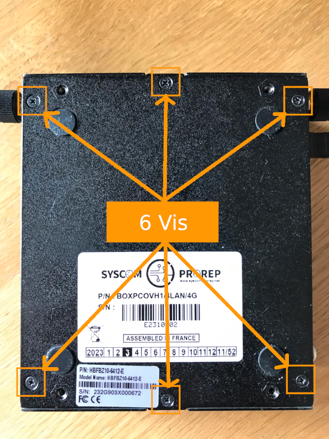{.thumbnail}
>>
> Étape 2
>>
>> Retirez la vis du module 4G.
>>
>> 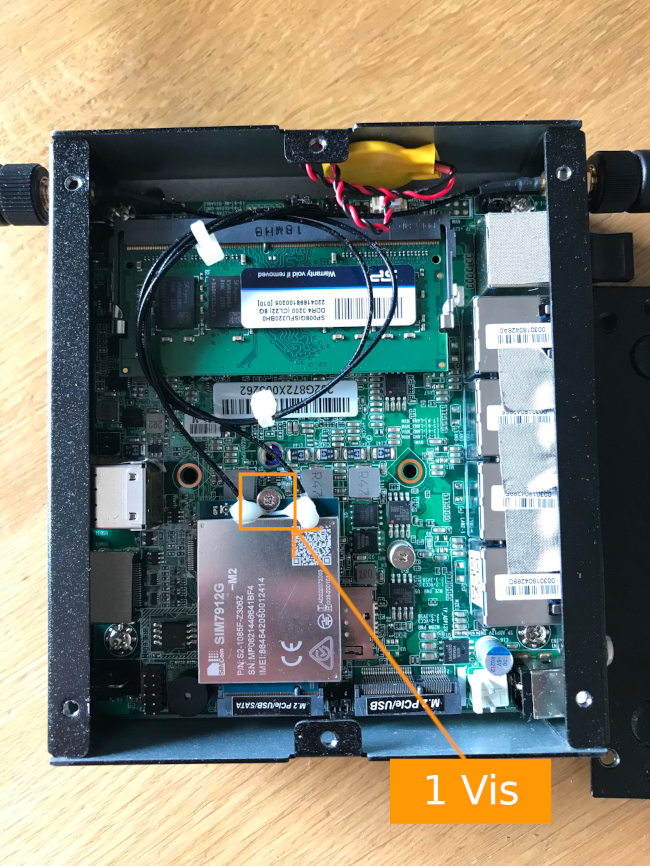{.thumbnail}
>>
> Étape 3
>>
>> Soulevez délicatement le module 4G et insérez la carte SIM.
>>
>> 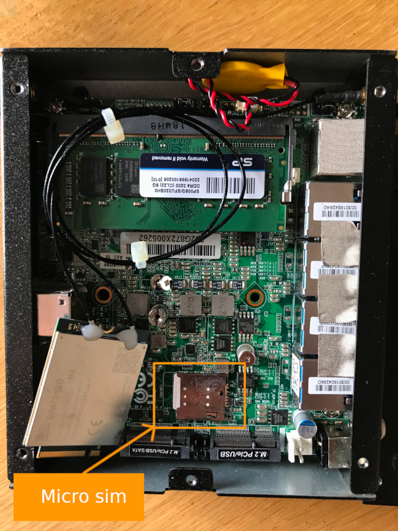{.thumbnail}
>>

Une fois la carte SIM insérée, vous devez refermer le boitier en répétant les mêmes étapes dans l'ordre inverse et veiller à ce que toutes les vis soit utilisées, sans trop les serrer.

- Rebranchez la carte 4G en alignant ses encoches avec les crans du connecteur PCIe, puis insérez-la dans le connecteur en observant un angle de 30 degrés. Ne forcez pas pour reinsérer le carte 4G.  Insérez la vis dans le support prévu dans la carte mère pour sécuriser la carte 4G. Ne serrez pas trop la vis.
- Remettez en place la façade extérieure et sécurisez-la avec les **6 vis** précédemment retirées.

#### Étape 2 : Installer les antennes

Installez les deux antennes 4G présentes dans la boite du boîtier en les vissant sur les pas de vis du boîtier.

{.thumbnail}

Une fois les antennes installées, branchez l'alimentation du boitier et allumez le. Attendez environ une minute après le bip sonore.

#### Étape 3 : Configurer l'interface réseau 4G

Connectez un ordinateur sur le port LAN et rendez-vous sur l'interface web accessible depuis [https://overthebox.ovh](https://overthebox.ovh) ou [https://192.168.100.1](https://192.168.100.1)

L'interface 4G est configurée automatiquement, cependant certains opérateurs requièrent une configuration spécifique de l'APN ou l'utilisation d'un code PIN particulier pour utiliser la carte SIM.

Depuis le menu déroulant, sélectionnez `Network`{.action} > `Interfaces`{.action}.

{.thumbnail}

Puis sélectionnez le bouton `Edit`{.action} pour l'interface **LTE**.

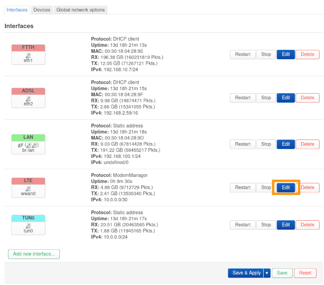{.thumbnail}

Configurez les paramètres en fonction des informations fournies par votre opérateur :

> [!tabs]
> Orange
>>
>> - APN: orange
>> - Code PIN par défaut : 0000
>>
>> {.thumbnail}
>>
> Free
>>
>> - APN: free
>> - Code PIN par défaut : 1234
>>
>> 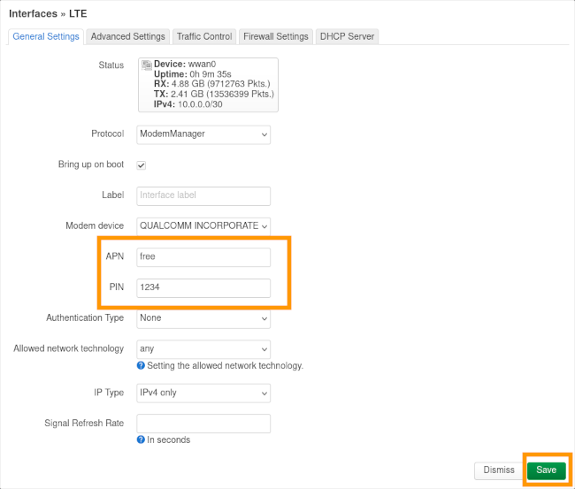{.thumbnail}
>>
> Bouygues
>>
>> - APN: mmsbouygtel.com
>> - Code PIN par défaut : 0000
>>
>> {.thumbnail}
>>
> SFR
>>
>> - APN: wapsfr
>> - Code PIN par défaut : voir au dos du support de la carte SIM
>>
>> 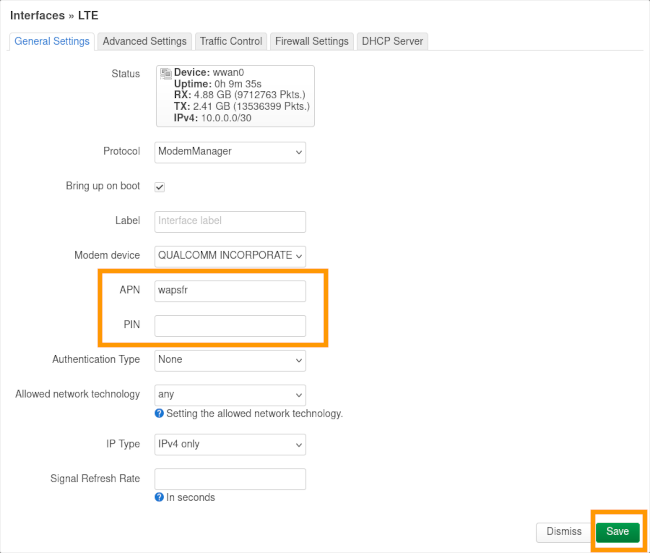{.thumbnail}
>>
> Airmob
>>
>> - APN: fnetnrj
>> - Code PIN par défaut : 0000
>>
>> {.thumbnail}
>>

Validez les modifications en cliquant sur le bouton `Save & Apply`{.action}.

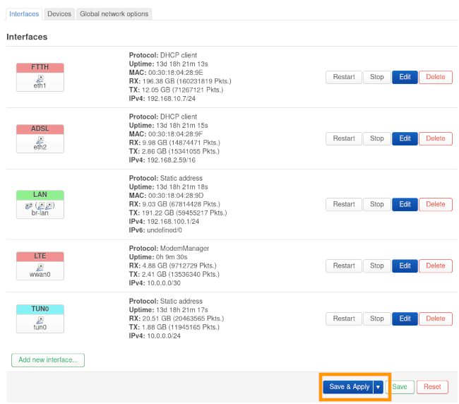{.thumbnail}

> [!success]
>
> La configuration est terminée, vérifiez le bon fonctionnement de votre lien en suivant la section « [Vérifier le fonctionnement du lien 4G](#aller-plus-loin) » de ce guide.
>

### Configurer un autre modèle de boitier OverTheBox

Si votre boîtier ne possède pas de module 4G intégré, il est tout de même possible d'ajouter un lien LTE à l'aide de l'interface USB du boîtier.

> [!alert]
>
> Attention, les clés Brovî E3372-**325** sont nativement incompatibles avec OverTheBox.
>

> [!tabs]
> Huawei E3372
>>
>> Insérez la carte SIM dans votre clé Huawei E3372, puis branchez la clé sur votre ordinateur. Accédez à la clé via votre navigateur à l'adresse `192.168.8.1`.
>>
>> Une fois connecté, accédez au menu `Paramètres`{.action} puis, dans le menu `Gestion Du Code PIN`{.action}, entrez le code PIN de votre carte SIM.
>>
>> 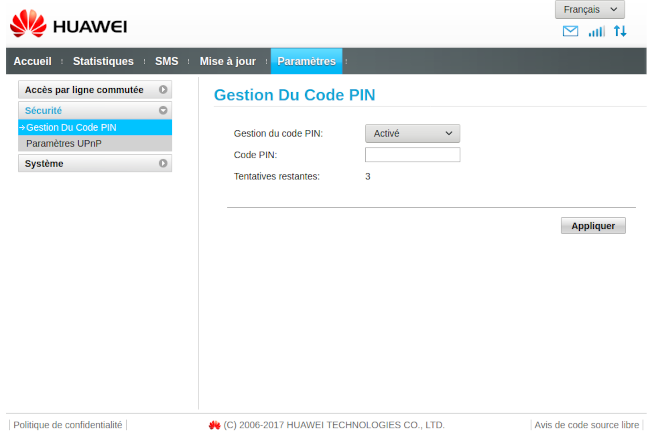{.thumbnail}
>>
>> Retournez sur l'onglet `Accueil`{.action} pour vérifier que vous êtes bien connecté. Si la clé est correctement connectée, la LED sur celle-ci doit également être de couleur fixe, de couleur cyan pour un réseau 4G ou verte pour un réseau 3G.
>>
>> 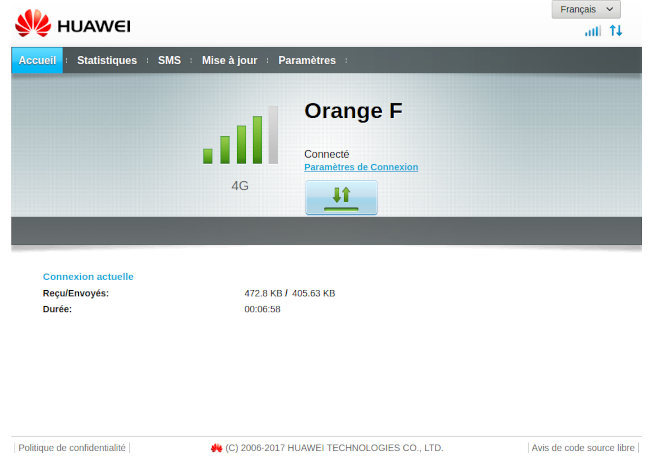{.thumbnail}
>>
>>  Votre clé est prête, il ne reste plus qu'à la brancher sur un des ports USB de votre **OverTheBox**
>>
> Android
>>
>> L'interface Android dépend du modèle de votre téléphone, il est possible que les noms des menus ne soient pas exactement identiques à ceux présentés dans ce guide.
>>
>> - Branchez votre téléphone à l'aide d'un câble USB sur l'un des ports USB de votre **OverTheBox**.
>> - Ouvrez les paramètres de votre téléphone.
>> - Cliquez sur `Réseau et Internet`{.action}.
>> - Cliquez sur `Point d'accès et partage de connexion`{.action}.
>> - Activez le paramètre « Partage de connexion **Via USB** ».
>>
>> {.thumbnail}
>>
>> Votre téléphone partage sa connexion LTE avec votre **OverTheBox**.
>>
> iOS
>>
>> - Branchez votre téléphone à l'aide d'un câble USB sur l'un des ports USB de votre **OverTheBox**.
>> - Ouvrez les paramètres de votre téléphone.
>> - Cliquez sur `Partage de connexion`{.action}.
>> - Activez le paramètre « Partage de connexion ».
>>
>> Votre téléphone partage sa connexion LTE avec votre **OverTheBox**.
>>

## Aller plus loin

### Vérifier le fonctionnement du lien 4G

> [!warning]
>
> Si l'interface n'est pas entourée d'un halo vert, cela signifie que le lien n'est pas fonctionnel.
>
> - Dans le cas de l'**OTB V3 LTE**, vérifiez la configuration des APN ainsi que le PIN de la carte SIM.
> - Pour les autres modèles, vérifiez le statut de la clé USB.
>

Que vous utilisiez une **OverTheBox V3 LTE** ou une autre méthode, l'équipement fournissant la connexion 4G attribue automatiquement une IP à l'**OverTheBox**. L'interface est donc automatiquement détectée par l'**OverTheBox** sans besoin d'intervention de votre part.

Pour vérifier que l'interface est correctement détectée, vérifiez qu'elle est bien présente dans le cadre **Network** de la page principale.

> [!tabs]
> OTB V3 LTE
>>
>> 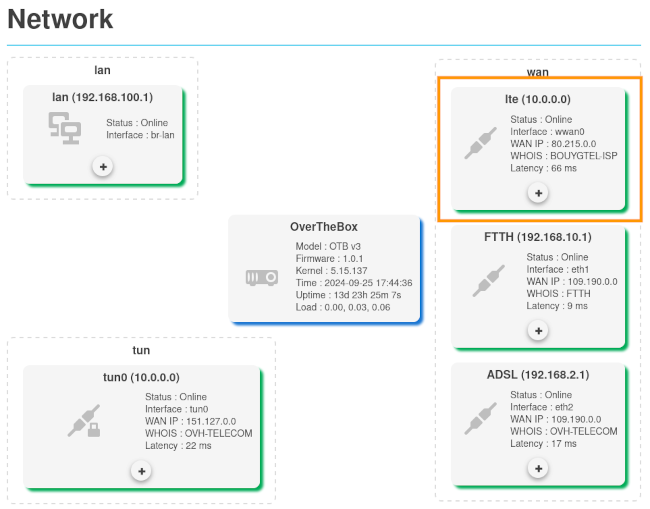{.thumbnail}
>>
> Autres modèles
>>
>> 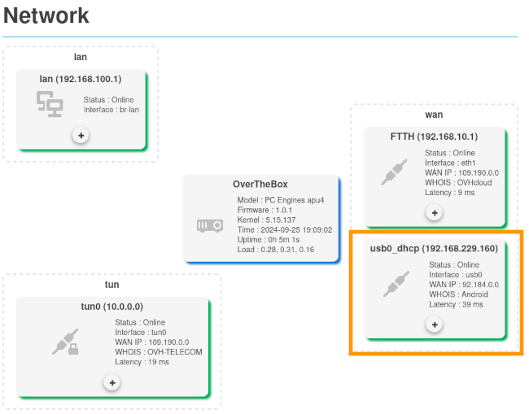{.thumbnail}
>>

### Modifier le comportement de l’agrégation

Les liens mobiles sont souvent associés à des quotas de données. Si vous souhaitez limiter l'utilisation du lien pour que l’agrégation se fasse seulement en cas de souci sur le lien principal, il est possible de modifier le comportement de l’agrégation. Changer le comportement est également recommandé en cas de différence importante entre le débit de l'interface 4G et celui du lien principal (par exemple dans une configuration avec un lien fibre à 1Gbps et un lien 4G à 15Mbps).

Pour limiter l'utilisation du lien, vous devez activer l'option **Backup** dans le paramètre `Multipath TCP`{.action} de l'interface.

Depuis le menu déroulant sélectionnez `Network`{.action} > `Interfaces`{.action}. 
Puis sélectionnez le bouton `Edit`{.action} de l'interface en 4G. 
Dans l'onglet `Avanced Settings`{.action}, modifiez le paramètre `Multipath TCP`{.action}.

Plusieurs options sont possibles :

- **Enabled**: L’agrégation est activée. Ce paramètre doit être sélectionné si vous souhaitez utiliser votre lien à tout moment.
- **Disable**: L’agrégation est désactivée.
- **Backup**: L’agrégation est passive, le lien n'est utilisé que lorsqu'aucune autre interface n'est disponible. Ce paramètre doit être sélectionné si vous ne souhaitez utiliser le lien qu'en cas de panne du lien principal (en _fail-over_).

Les options suivantes sont également possibles, mais ne sont **pas recommandées**:

- **Master**: Similaire au mode **Enabled**. L'interface est considérée comme principale. Ce paramètre n'est utilisable que sur une seule interface. Ce mode n'est pas recommandé.
- **Handover**: Similaire au mode **Backup**. La bascule sur l'interface en cas de coupure est plus lente, car le système essaye de ne pas interrompre les transmissions TCP.

{.thumbnail}

### Configurer manuellement une interface

Pour plus de détails sur la configuration des interfaces, consultez le guide « [Comment configurer une interface réseau ?](/pages/web_cloud/internet/overthebox/advanced_creer_une_interface_modem_manuellement) ».

Échangez avec notre [communauté d'utilisateurs](/links/community).
